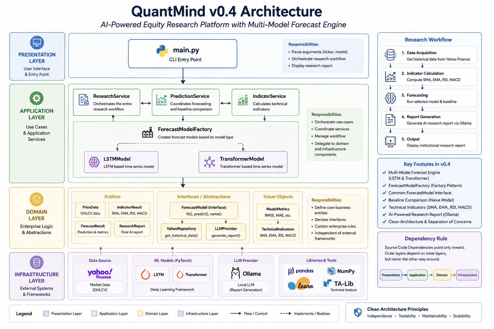
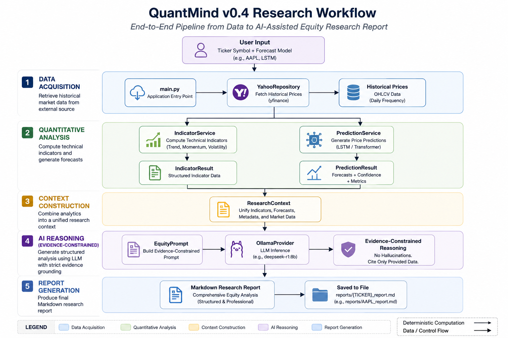

<div align="center">

# QuantMind

### *Where Quantitative Finance Meets AI Engineering*

**An open-source platform for explainable AI-powered quantitative investment research.**

QuantMind integrates **financial econometrics**, **technical analysis**, **deep learning**, **large language models**, and **Clean Architecture** into a unified equity-research workflow.


</div>

---

## System Architecture

The following diagram presents the implemented architecture of **QuantMind v0.4**. It shows how the Presentation, Application, Domain, and Infrastructure layers collaborate while keeping quantitative computation, forecasting, and AI reasoning separate.

<p align="center">
  
</p>

<p align="center">
  <em>Figure 1. QuantMind v0.4 System Architecture</em>
</p>

---

## At a Glance

**Current release:** `v0.4 — Multi-Model Forecast Engine`

QuantMind currently provides:

- deterministic technical analysis using SMA, EMA, RSI, and MACD;
- return-based forecasting using LSTM and Transformer models;
- a shared forecasting contract and centralized model factory;
- consistent evaluation against a naive zero-return baseline;
- local LLM reasoning through Ollama;
- evidence-constrained Markdown equity research reports;
- a Clean Architecture foundation designed for RAG, agents, APIs, and deployment.

### Current Status

| Component | Status |
|---|:---:|
| Yahoo Finance market-data integration | ✅ |
| SMA, EMA, RSI, and MACD | ✅ |
| LSTM return forecasting | ✅ |
| Transformer return forecasting | ✅ |
| Shared `ForecastModel` interface | ✅ |
| `ForecastModelFactory` | ✅ |
| `PredictionService` | ✅ |
| Baseline comparison | ✅ |
| Dynamic model-aware reporting | ✅ |
| Evidence-constrained prompting | ✅ |
| Financial Knowledge Engine (RAG) | 🚧 Planned |
| LangGraph multi-agent workflow | 🚧 Planned |
| FastAPI platform | 🚧 Planned |
| Cloud deployment and CI/CD | 🚧 Planned |
| MCP integration | 🚧 Planned |

---

## Table of Contents

- [Project Overview](#project-overview)
- [Why QuantMind?](#why-quantmind)
- [Project Goals](#project-goals)
- [Engineering Highlights](#engineering-highlights)
- [Research Philosophy](#research-philosophy)
- [The Three Research Engines](#the-three-research-engines)
- [Clean Architecture](#clean-architecture)
- [Forecast Engine](#forecast-engine)
- [Research Workflow](#research-workflow)
- [Model Evaluation](#model-evaluation)
- [Evidence-Constrained AI](#evidence-constrained-ai)
- [Technology Stack](#technology-stack)
- [Project Structure](#project-structure)
- [Engineering Decisions](#engineering-decisions)
- [Architecture Evolution](#architecture-evolution)
- [Roadmap](#roadmap)
- [Quick Start](#quick-start)
- [Configuration](#configuration)
- [Example Output](#example-output)
- [Documentation](#documentation)
- [Contributing](#contributing)
- [License](#license)
- [Disclaimer](#disclaimer)
- [Beyond the Code](#beyond-the-code)

---

## Project Overview

QuantMind is an open-source **AI Quant Research Platform** designed to demonstrate how quantitative finance, machine learning, and modern AI engineering can work together within one maintainable research system.

Unlike many financial AI projects that tightly couple data retrieval, indicators, forecasting models, and LLM prompts, QuantMind deliberately separates these responsibilities into independent architectural components.

This separation makes the platform:

- easier to understand;
- easier to test;
- easier to extend;
- less dependent on individual technologies;
- more suitable for incremental evolution.

The current release combines structured market data, deterministic technical indicators, return-based deep-learning forecasts, model evaluation, and evidence-constrained LLM reasoning to generate a professional Markdown equity research report.

QuantMind is not intended to be an automated trading system. Its focus is **explainable research, predictive analytics, transparent model evaluation, and investment decision support**.

---

## Why QuantMind?

Many open-source finance projects focus primarily on one of two areas:

1. increasingly complex prediction models; or
2. large language models that summarize financial information.

QuantMind takes a different approach.

The central objective is not simply to produce a forecast. It is to demonstrate **how an AI-assisted quantitative research platform should be engineered**.

The project treats software architecture as a first-class design concern. Quantitative calculations, statistical forecasting, AI reasoning, and external infrastructure are separated through stable interfaces and application services.

As a result:

- forecasting models can be replaced without rewriting the research workflow;
- external data providers can evolve without changing domain logic;
- LLM providers can be exchanged without changing quantitative calculations;
- future RAG and multi-agent capabilities can be added to an existing foundation rather than forcing a redesign.

The architecture—not any single model—is the project's primary long-term asset.

---

## Project Goals

QuantMind has three long-term goals.

### 1. Build an Extensible AI Research Platform

New models, providers, retrieval systems, agents, and interfaces should be introduced without destabilizing the existing application.

### 2. Promote Explainable Investment Research

Quantitative evidence should be computed explicitly, evaluated objectively, and communicated clearly. The LLM should explain evidence rather than replace it.

### 3. Demonstrate Modern AI Software Engineering

The repository is intended to demonstrate Clean Architecture, SOLID principles, dependency inversion, model abstraction, factory-based construction, baseline evaluation, and disciplined prompt design in a realistic financial application.

---

## Engineering Highlights

| Engineering Area | Implementation |
|---|---|
| Software architecture | Clean Architecture |
| Design principles | SOLID and separation of concerns |
| Design patterns | Factory Pattern and Dependency Injection |
| Market data | Yahoo Finance repository |
| Technical analysis | SMA, EMA, RSI, and MACD |
| Forecasting | LSTM and Transformer |
| Forecast contract | Shared `ForecastModel` interface |
| Model creation | `ForecastModelFactory` |
| Application orchestration | `ResearchService`, `IndicatorService`, `PredictionService` |
| AI runtime | Ollama |
| LLM reasoning | Qwen with evidence-constrained prompting |
| Evaluation | RMSE, MAE, and naive baseline comparison |
| Output | Structured Markdown equity research report |
| Documentation | Versioned architecture and workflow diagrams |

---

## Research Philosophy

QuantMind follows one core principle:

> **Separate deterministic mathematics, statistical forecasting, and AI reasoning into independent responsibilities.**

```text
Historical Market Data
          │
          ▼
Deterministic Quantitative Analysis
          │
          ▼
Statistical Forecasting
          │
          ▼
Evidence-Constrained AI Reasoning
          │
          ▼
Markdown Equity Research Report
```

Each stage answers a different question.

| Stage | Research Question |
|---|---|
| Technical analysis | What is the current quantitative market configuration? |
| Forecasting | What next-period return does the model estimate? |
| Model evaluation | Does the model improve on a simple benchmark? |
| AI reasoning | How should the supplied quantitative evidence be interpreted? |

This design keeps calculations reproducible, forecasts measurable, and explanations traceable to supplied evidence.

---

## The Three Research Engines

QuantMind can be understood as three cooperating research engines.

### 1. Quantitative Analysis Engine

The Quantitative Analysis Engine converts historical market prices into deterministic technical evidence.

Current indicators:

- Simple Moving Average (SMA);
- Exponential Moving Average (EMA);
- Relative Strength Index (RSI);
- Moving Average Convergence Divergence (MACD).

Given identical market data and parameters, these calculations return identical results.

### 2. Forecast Engine

The Forecast Engine estimates next-day simple returns using interchangeable deep-learning models.

Current implementations:

- LSTM;
- Transformer.

The system forecasts returns and then converts the predicted return into a mechanically implied price for human interpretation.

### 3. AI Research Engine

The AI Research Engine receives structured market, indicator, forecast, and evaluation results. It produces a professional research report through an evidence-constrained prompt and a local Ollama model.

The LLM acts as an analyst—not as the source of quantitative calculations.

---

## Clean Architecture

QuantMind follows a four-layer Clean Architecture.

```text
Presentation Layer
└── main.py

Application Layer
├── ResearchService
├── IndicatorService
└── PredictionService

Domain Layer
├── Entities
├── ForecastModel interface
└── Repository interfaces

Infrastructure Layer
├── YahooRepository
├── OllamaProvider
├── ForecastModelFactory
├── LSTMModel
└── TransformerModel
```

### Presentation Layer

`main.py` is the **Composition Root**. It selects concrete implementations and assembles the application through dependency injection.

### Application Layer

Application services coordinate use cases:

- `ResearchService` orchestrates the end-to-end equity research workflow;
- `IndicatorService` calculates technical indicators;
- `PredictionService` requests and returns model forecasts.

### Domain Layer

The Domain layer contains stable concepts and contracts:

- `ResearchContext`;
- `IndicatorResult`;
- `PredictionResult`;
- `ForecastModel`;
- `PriceRepository`.

### Infrastructure Layer

Infrastructure provides external and implementation-specific behavior:

- Yahoo Finance market-data retrieval;
- Ollama LLM access;
- LSTM and Transformer implementations;
- model construction through `ForecastModelFactory`.

Application logic depends on abstractions rather than implementation details. This keeps external technologies replaceable.

---

## Forecast Engine

QuantMind v0.4 introduces a reusable multi-model Forecast Engine.

```text
ForecastModelFactory
        │
        ├── LSTMModel
        └── TransformerModel
                │
                ▼
        ForecastModel
          (Interface)
                │
                ▼
        PredictionService
                │
                ▼
        PredictionResult
```

Every forecasting implementation follows the same contract:

```python
from abc import ABC, abstractmethod

class ForecastModel(ABC):

    @abstractmethod
    def fit_predict(self, prices, forecast_horizon=1):
        ...
```

The application does not depend directly on LSTM or Transformer classes. It depends on the shared forecasting abstraction.

### Switching Models

Select the model in `main.py`:

```python
MODEL_NAME = "transformer"
```

or:

```python
MODEL_NAME = "lstm"
```

No changes are required in:

- `ResearchService`;
- `PredictionService`;
- `ResearchContext`;
- `EquityPrompt`;
- report generation.

### Adding a New Model

A new model requires only:

1. implementing the `ForecastModel` interface; and
2. registering the implementation in `ForecastModelFactory`.

This is a practical demonstration of the **Open/Closed Principle**: the platform is open for extension but closed for unnecessary modification.

---

## Research Workflow

The following diagram shows what happens when QuantMind runs.

<p align="center">
  
</p>

<p align="center">
  <em>Figure 2. QuantMind v0.4 Research Workflow</em>
</p>

The runtime workflow consists of six stages.

### 1. Data Acquisition

`YahooRepository` retrieves historical market prices.

### 2. Quantitative Analysis

`IndicatorService` calculates SMA, EMA, RSI, and MACD.

### 3. Forecasting

`PredictionService` calls the selected `ForecastModel` implementation and returns a structured `PredictionResult`.

### 4. Context Construction

`ResearchService` combines market data, indicator results, and forecast results into `ResearchContext`.

### 5. Evidence-Constrained Reasoning

`EquityPrompt` transforms the structured context into a disciplined financial research prompt.

### 6. Report Generation

`OllamaProvider` produces a Markdown equity research report containing:

- Executive Summary;
- Trend Analysis;
- Momentum Analysis;
- Model-Specific Forecast Analysis;
- Signal Alignment;
- Risk Assessment;
- Overall Research Outlook.

Each stage has one responsibility, and each output becomes structured input for the next stage.

---

## Model Evaluation

A model is not considered useful merely because it generates a prediction.

QuantMind evaluates every forecasting implementation using a common methodology.

| Metric | Purpose |
|---|---|
| Validation RMSE | Measures the scale of historical validation errors in price units |
| Validation MAE | Measures the average absolute historical validation error |
| Naive baseline RMSE | Benchmark based on a zero-return forecast |
| Improvement over baseline | Measures relative RMSE reduction |
| Forecast direction | Classifies the estimated return as Bullish, Neutral, or Bearish |

The naive zero-return baseline is important because financial returns are difficult to forecast. A sophisticated model should demonstrate measurable value beyond a simple benchmark.

Small improvements are reported transparently and interpreted cautiously.

Validation RMSE and MAE are aggregate historical error measures. They are not treated as confidence intervals or formal prediction intervals.

---

## Evidence-Constrained AI

Large language models can produce convincing explanations even when the available evidence is incomplete.

QuantMind therefore applies an **Evidence-Constrained AI** approach.

All quantitative calculations and forecasts are completed before the LLM is called. The model receives structured evidence and is instructed to reason only from that evidence.

The prompt prevents unsupported claims such as:

- inventing support or resistance levels;
- claiming moving-average crossovers without historical observations;
- inferring acceleration, deceleration, strengthening, or weakening from one snapshot;
- classifying MACD magnitude without an explicit benchmark;
- interpreting RMSE or MAE as prediction intervals;
- claiming statistical significance without formal statistical testing;
- treating a very small forecasted return as a strong directional signal;
- fabricating company fundamentals, news, or macroeconomic facts.

The objective is not to maximize creativity. It is to improve:

- explainability;
- transparency;
- reproducibility;
- analytical discipline.

---

## Technology Stack

| Layer | Technology | Responsibility |
|---|---|---|
| Programming language | Python | Core application development |
| Data processing | Pandas and NumPy | Market-data transformation |
| Deep learning | PyTorch | LSTM and Transformer forecasting |
| Market data | Yahoo Finance | Historical price retrieval |
| LLM runtime | Ollama | Local inference |
| LLM | Qwen | Evidence-based report generation |
| Architecture | Clean Architecture | Separation of concerns |
| Version control | Git and GitHub | Source management |
| Documentation | Markdown and PNG diagrams | Public and technical documentation |

Technologies are isolated behind interfaces wherever practical, allowing future replacements with minimal impact on application logic.

---

## Project Structure

```text
ai-quant-research-platform/
│
├── app/
│   ├── application/
│   │   ├── llm/
│   │   ├── prompts/
│   │   ├── services/
│   │   ├── agents/
│   │   └── workflows/
│   │
│   ├── domain/
│   │   ├── entities/
│   │   ├── forecast/
│   │   ├── indicators/
│   │   ├── repositories/
│   │   └── services/
│   │
│   └── infrastructure/
│       ├── llm/
│       ├── market_data/
│       ├── ml/
│       ├── cloud/
│       ├── mcp/
│       ├── storage/
│       └── vector_db/
│
├── docs/
│   ├── 01_introduction/
│   ├── 02_architecture/
│   ├── 03_developer_guide/
│   ├── 04_research/
│   ├── 05_release_notes/
│   └── images/
│       ├── architecture_v0.4.png
│       └── workflow_v0.4.png
│
├── reports/
├── tests/
├── main.py
├── test.py
├── requirements.txt
└── README.md
```

| Directory | Responsibility |
|---|---|
| `app/application` | Use-case orchestration and prompts |
| `app/domain` | Entities, interfaces, and stable business concepts |
| `app/infrastructure` | External providers and concrete implementations |
| `docs` | Architecture, research methodology, developer guides, and release notes |
| `reports` | Generated research output |
| `tests` | Test and validation code |

Reserved directories support the planned RAG, agent, storage, MCP, and cloud capabilities without forcing immediate implementation.

---

## Engineering Decisions

| Decision | Rationale |
|---|---|
| Forecast returns rather than prices | Returns generally have more suitable statistical properties for time-series modeling |
| Present an implied price | A price is easier for human readers to interpret, while the model target remains return |
| Compare with a naive baseline | A model must demonstrate value beyond a simple forecast |
| Use a shared `ForecastModel` interface | Forecast implementations remain interchangeable |
| Use `ForecastModelFactory` | Model construction and selection are centralized |
| Inject `PredictionService` into `ResearchService` | Forecasting remains a separate application capability |
| Keep LLM reasoning separate from calculations | Quantitative results remain deterministic and auditable |
| Constrain the prompt | Financial claims remain grounded in supplied evidence |
| Use Clean Architecture | Business logic remains independent of frameworks and providers |
| Avoid unnecessary renaming | Stability is prioritized when a rename provides no material architectural value |

---

## Architecture Evolution

QuantMind has evolved incrementally, with each version adding one major architectural capability.

```text
v0.1  AI Research Pipeline MVP
  │
  ▼
v0.2  Technical Indicator Engine
  │
  ▼
v0.3  Return-Based LSTM Forecasting
  │
  ▼
v0.4  Multi-Model Forecast Engine
  │
  ▼
v0.5  Financial Knowledge Engine (RAG)
  │
  ▼
v0.6  LangGraph Multi-Agent Research
  │
  ▼
v0.7  FastAPI Service Platform
  │
  ▼
v0.8  Cloud Deployment and CI/CD
  │
  ▼
v0.9  MCP Integration
  │
  ▼
v1.0  Production AI Quant Research Platform
```

Each release is intended to extend the existing architecture rather than replace it.

---

## Roadmap

### v0.5 — Financial Knowledge Engine

Planned capabilities:

- SEC 10-K retrieval;
- SEC 10-Q retrieval;
- earnings-call transcript ingestion;
- financial-news retrieval;
- document parsing and chunking;
- embeddings;
- vector storage;
- Retrieval-Augmented Generation;
- evidence-grounded fundamental analysis.

### v0.6 — Multi-Agent Research Team

Planned specialist roles:

- Technical Analyst;
- Forecast Analyst;
- Fundamental Analyst;
- Risk Analyst;
- Portfolio Analyst;
- Chief Investment Officer.

LangGraph will coordinate the agents while preserving traceable, modular reasoning.

### v0.7 — AI Research Platform

Planned capabilities:

- FastAPI backend;
- interactive dashboard;
- REST API;
- report history;
- portfolio analysis;
- model selection;
- authentication.

### v0.8 — Cloud Deployment and CI/CD

Planned capabilities:

- Docker;
- GitHub Actions;
- automated testing;
- continuous integration;
- cloud deployment;
- monitoring.

### v0.9 — Model Context Protocol

Planned integrations:

- financial databases;
- document repositories;
- portfolio systems;
- external AI tools;
- enterprise knowledge bases.

### v1.0 — Production AI Quant Research Platform

The long-term objective is a unified platform integrating:

- quantitative finance;
- financial econometrics;
- machine learning;
- Retrieval-Augmented Generation;
- multi-agent collaboration;
- explainable AI;
- APIs and cloud deployment;
- production-minded software engineering.

---

## Quick Start

### Prerequisites

- Python 3.12 or compatible environment;
- Git;
- Ollama installed and running.

### Clone the Repository

```bash
git clone https://github.com/sager2026/ai-quant-research-platform.git
cd ai-quant-research-platform
```

### Install Dependencies

```bash
pip install -r requirements.txt
```

### Install an Ollama Model

The current application is configured for a Qwen model. Install the exact model name used in your local `OllamaProvider` configuration.

Example:

```bash
ollama pull qwen3:8b
```

### Run QuantMind

```bash
python main.py
```

The application will:

1. retrieve historical market prices;
2. calculate technical indicators;
3. train the selected forecasting model;
4. evaluate the model against a naive baseline;
5. build a structured research context;
6. generate an AI-assisted equity research report.

---

## Configuration

### Select a Forecast Model

In `main.py`:

```python
MODEL_NAME = "transformer"
```

or:

```python
MODEL_NAME = "lstm"
```

### Select a Ticker

```python
TICKER = "AAPL"
```

### Configure Ollama

Ensure the model name passed to `OllamaProvider` matches a model installed locally.

Example:

```python
llm = OllamaProvider(
    model="qwen3:8b",
)
```

---

## Example Output

A typical run begins with:

```text
Ticker: AAPL
Forecast model: transformer
============================================================
```

The generated Markdown report includes:

```text
1. Executive Summary
2. Trend Analysis
3. Momentum Analysis
4. Transformer Forecast Analysis
5. Signal Alignment
6. Risk Assessment
7. Overall Research Outlook
```

The selected model name is propagated through the complete pipeline, so the report automatically displays either:

```text
LSTM Forecast Analysis
```

or:

```text
Transformer Forecast Analysis
```

The report also includes:

- current price;
- SMA, EMA, RSI, and MACD;
- predicted next-day return;
- mechanically implied next-day price;
- validation RMSE and MAE;
- naive baseline RMSE;
- improvement over baseline;
- model-aware risk interpretation;
- an educational-use disclaimer.

---

## Documentation

The README is the public homepage of QuantMind. Detailed technical documentation is maintained under `docs/`.

| Documentation Area | Location |
|---|---|
| Project overview and philosophy | `docs/01_introduction/` |
| Clean Architecture and design decisions | `docs/02_architecture/` |
| Developer guides | `docs/03_developer_guide/` |
| Forecasting and evaluation methodology | `docs/04_research/` |
| Release history | `docs/05_release_notes/` |

### Current README Figures

| Diagram | Purpose |
|---|---|
| `docs/images/architecture_v0.4.png` | Current Clean Architecture overview |
| `docs/images/workflow_v0.4.png` | Current runtime research workflow |

Earlier diagrams may remain in `docs/images/` as project artifacts, but the README intentionally embeds only the two figures needed to explain the current release.

---

## Contributing

Contributions are welcome in areas such as:

- quantitative finance;
- financial econometrics;
- forecasting models;
- prompt engineering;
- RAG;
- LangGraph and AI agents;
- software architecture;
- tests;
- documentation;
- performance optimization.

A typical contribution workflow:

1. fork the repository;
2. create a feature branch;
3. implement and test the change;
4. document architectural implications;
5. open a pull request.

Contributions should preserve the project's separation of responsibilities and evidence-first research philosophy.

---

## License

This project is licensed under the **MIT License**.

See the repository license file for the full terms.

---

## Disclaimer

QuantMind is intended solely for:

- research;
- education;
- software engineering demonstration.

Nothing generated by QuantMind constitutes:

- investment advice;
- financial advice;
- a trading recommendation;
- portfolio-management advice;
- a guarantee of future market performance.

Forecasts are statistical estimates derived from historical data. Model performance may change across securities, sample periods, market regimes, and implementation choices.

Users remain solely responsible for any investment decisions.

---

## Beyond the Code

QuantMind began with a simple research pipeline:

```text
Market Data
    │
    ▼
LLM
    │
    ▼
Report
```

It has evolved into a platform with:

- deterministic quantitative analysis;
- return-based LSTM and Transformer forecasting;
- shared model abstractions;
- factory-based model selection;
- objective baseline evaluation;
- evidence-constrained AI reasoning;
- versioned architecture documentation.

The project is not an attempt to predict markets with certainty.

It is an exploration of how quantitative finance, machine learning, large language models, and sound software engineering can be combined into research systems that are:

- explainable;
- extensible;
- reproducible;
- maintainable.

> **QuantMind is not designed to replace investment judgment. It is designed to improve the transparency, reproducibility, and engineering quality of AI-assisted investment research.**

---

<div align="center">

## QuantMind

### *Where Quantitative Finance Meets AI Engineering*

**Building explainable AI for quantitative investment research.**

**Current release:** `v0.4 — Multi-Model Forecast Engine`

</div>
