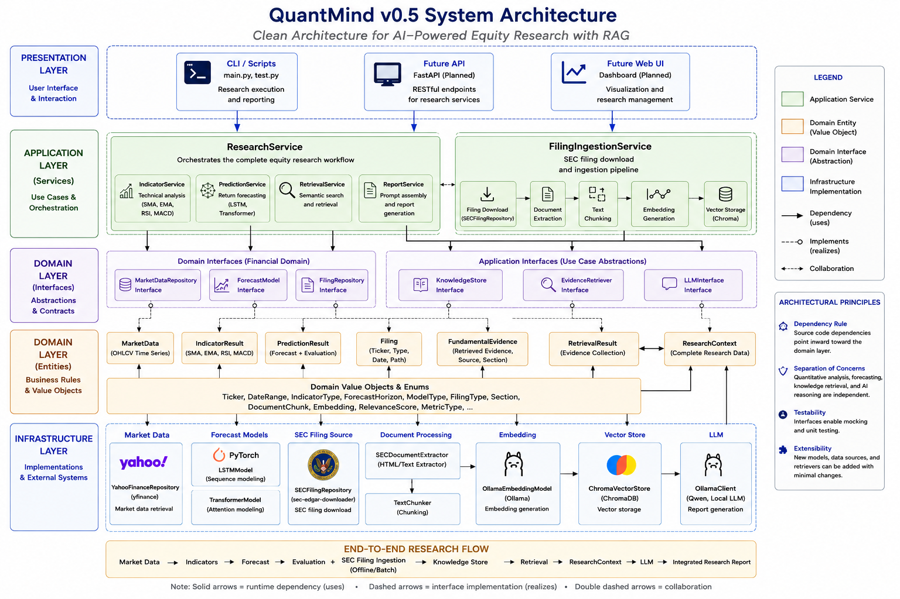
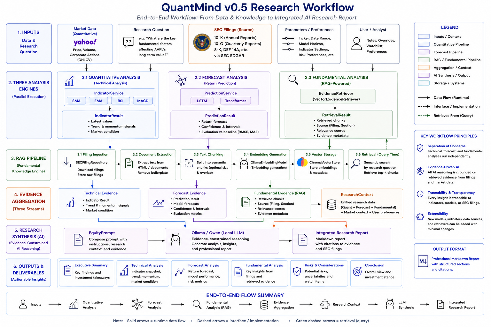

<div align="center">

# QuantMind

### *Where Quantitative Finance Meets AI Engineering*

**An open-source platform for explainable AI-powered quantitative investment research.**

QuantMind integrates **financial econometrics**, **technical analysis**, **deep learning**, **Retrieval-Augmented Generation (RAG)**, **large language models**, and **Clean Architecture** into a unified equity-research workflow.


</div>

---

## System Architecture



---

## Research Workflow



---

## At a Glance

**Current release:** `v0.5 — Financial Knowledge Engine (RAG)`

QuantMind currently provides:

- deterministic technical analysis using SMA, EMA, RSI, and MACD;
- return-based forecasting using LSTM and Transformer models;
- a shared forecasting contract and centralized model factory;
- consistent model evaluation against a naive zero-return baseline;
- SEC 10-K filing ingestion;
- SEC document extraction and text chunking;
- local embedding generation through Ollama;
- persistent vector storage through Chroma;
- semantic retrieval of fundamental filing evidence;
- integration of technical, forecast, and fundamental evidence;
- local LLM reasoning through Ollama;
- evidence-constrained Markdown equity research reports;
- a Clean Architecture foundation designed for future agents, APIs, MCP, and cloud deployment.

### Current Status

| Component | Status |
|---|:---:|
| Yahoo Finance market-data integration | Complete |
| SMA, EMA, RSI, and MACD | Complete |
| LSTM return forecasting | Complete |
| Transformer return forecasting | Complete |
| Shared `ForecastModel` interface | Complete |
| `ForecastModelFactory` | Complete |
| `PredictionService` | Complete |
| Naive baseline comparison | Complete |
| Dynamic model-aware reporting | Complete |
| Evidence-constrained prompting | Complete |
| SEC 10-K filing ingestion | Complete |
| SEC document extraction | Complete |
| Text chunking | Complete |
| Ollama embedding generation | Complete |
| Chroma vector storage | Complete |
| Semantic filing-evidence retrieval | Complete |
| Financial Knowledge Engine (RAG) | Complete |
| Integrated quantitative + fundamental reporting | Complete |
| SEC 10-Q research | Planned |
| Earnings-call transcript ingestion | Planned |
| Financial-news retrieval | Planned |
| LangGraph multi-agent workflow | Planned |
| FastAPI platform | Planned |
| Cloud deployment and CI/CD | Planned |
| MCP integration | Planned |

---

## Project Overview

QuantMind is an open-source AI Quant Research Platform designed to combine quantitative finance and modern AI engineering in a transparent and extensible research system.

The current release combines:

- structured market data;
- deterministic technical indicators;
- return-based deep-learning forecasts;
- model evaluation;
- SEC filing ingestion;
- semantic evidence retrieval;
- Retrieval-Augmented Generation;
- evidence-constrained LLM reasoning.

The result is an integrated professional Markdown equity research report.

QuantMind v0.5 introduces a **Financial Knowledge Engine based on Retrieval-Augmented Generation (RAG)**.

SEC filing evidence is retrieved independently from the quantitative pipeline and incorporated into the research context as a separate fundamental evidence stream.

This allows QuantMind to distinguish between:

1. deterministic technical evidence;
2. model-based forecast evidence;
3. retrieved fundamental evidence;
4. generative interpretation.

QuantMind is **not intended to be an automated trading system**.

Its focus is:

- explainable investment research;
- predictive analytics;
- transparent model evaluation;
- evidence retrieval;
- AI-assisted research synthesis;
- investment decision support.

---

## Why QuantMind?

Many AI-finance demonstrations follow a simple pattern:

```text
Download prices
      ↓
Calculate indicators
      ↓
Send everything to an LLM
      ↓
Generate a recommendation
```

QuantMind takes a different approach.

It treats quantitative analysis, forecasting, financial knowledge retrieval, and generative reasoning as separate engineering responsibilities.

```text
Technical Evidence -----------+
                              |
Forecast Evidence ------------+----> ResearchContext
                              |
Fundamental Evidence ---------+
                                      |
                                      v
                                 EquityPrompt
                                      |
                                      v
                                  Local LLM
                                      |
                                      v
                           Integrated Research Report
```

This makes the system easier to:

- test;
- extend;
- debug;
- evaluate;
- explain;
- replace component by component.

---

## Research Philosophy

QuantMind follows one core principle:

> **Separate deterministic mathematics, statistical forecasting, retrieved knowledge, and generative AI reasoning into independent responsibilities.**

```text
Historical Market Data
        |
        +----> Deterministic Quantitative Analysis
        |
        +----> Statistical Forecasting

SEC Filings
        |
        +----> Retrieval-Augmented Knowledge
                        |
                        v
              Structured Research Context
                        |
                        v
           Evidence-Constrained AI Reasoning
                        |
                        v
             Markdown Research Report
```

Each stage answers a different research question.

| Stage | Research Question |
|---|---|
| Technical analysis | What is the current quantitative market configuration? |
| Forecasting | What next-period return does the model estimate? |
| Model evaluation | Does the model improve on a simple benchmark? |
| Fundamental retrieval | What relevant evidence exists in the company's filings? |
| AI reasoning | How should these separate evidence streams be interpreted together? |

This design keeps calculations reproducible, forecasts measurable, retrieved evidence traceable, and LLM explanations grounded in supplied information.

---

## Engineering Highlights

| Engineering Area | Implementation |
|---|---|
| Software architecture | Clean Architecture |
| Design principles | SOLID, dependency inversion, separation of concerns |
| Design patterns | Factory Pattern and Dependency Injection |
| Market data | Yahoo Finance repository |
| Technical analysis | SMA, EMA, RSI, and MACD |
| Forecasting | LSTM and Transformer |
| Forecast contract | Shared `ForecastModel` interface |
| Model creation | `ForecastModelFactory` |
| Application orchestration | `ResearchService`, `IndicatorService`, `PredictionService`, `FilingIngestionService` |
| Financial knowledge | Retrieval-Augmented Generation (RAG) |
| Filing source | SEC filings |
| Document processing | SEC document extraction and text chunking |
| Embeddings | Ollama embedding model |
| Vector database | Chroma |
| Knowledge abstraction | `KnowledgeStore` |
| Retrieval abstraction | `EvidenceRetriever` |
| Fundamental evidence | `FundamentalEvidence` and `RetrievalResult` |
| AI runtime | Ollama |
| LLM reasoning | Qwen with evidence-constrained prompting |
| Evaluation | RMSE, MAE, and naive baseline comparison |
| Output | Integrated Markdown equity research report |
| Documentation | Versioned architecture and workflow documentation |

---

# The Three Research Evidence Streams

QuantMind v0.5 integrates three distinct research evidence streams.

## 1. Technical Analysis

Technical analysis is deterministic.

```text
Historical Prices
       ↓
IndicatorService
       ↓
SMA
EMA
RSI
MACD
       ↓
IndicatorResult
```

The LLM does not calculate these indicators.

It receives the calculated values as structured evidence.

This keeps quantitative computation outside the generative model.

---

## 2. Forecast Analysis

Forecasting is handled independently from technical analysis.

```text
Historical Prices
       ↓
PredictionService
       ↓
ForecastModel
       ↓
   ┌─────────────┐
   │             │
   ▼             ▼
 LSTM       Transformer
   │             │
   └──────┬──────┘
          ↓
   PredictionResult
```

Both models implement a shared forecasting contract.

This allows model implementations to be replaced without changing the higher-level research workflow.

The forecasting subsystem evaluates predictions using:

- validation RMSE;
- validation MAE;
- naive zero-return baseline RMSE;
- improvement over baseline.

This prevents the report from treating a model forecast as meaningful simply because a prediction exists.

---

## 3. Fundamental Analysis through RAG

v0.5 introduces fundamental evidence derived from SEC filings.

The knowledge pipeline is separated into two distinct processes:

### Knowledge Preparation

```text
SEC Filing
    ↓
SECFilingRepository
    ↓
Filing
    ↓
FilingIngestionService
    ↓
KnowledgeStore
    ↓
VectorKnowledgeStore
    ↓
Document Extraction
    ↓
Text Chunking
    ↓
Ollama Embeddings
    ↓
Chroma Vector Store
```

### Research-Time Retrieval

```text
Research Question
       ↓
EvidenceRetriever
       ↓
VectorEvidenceRetriever
       ↓
Query Embedding
       ↓
Chroma Vector Search
       ↓
FundamentalEvidence
       ↓
RetrievalResult
```

The distinction is important:

> **Ingestion prepares the knowledge base. Retrieval uses the knowledge base during research.**

Technical analysis and forecasting do not depend on RAG.

They remain independent evidence-producing pipelines.

---

# Financial Knowledge Engine (RAG)

The v0.5 Financial Knowledge Engine enables QuantMind to retrieve relevant evidence from SEC filings before generating a research report.

## RAG Pipeline

```text
                     KNOWLEDGE PREPARATION

SEC Filing
    ↓
SECFilingRepository
    ↓
Filing
    ↓
FilingIngestionService
    ↓
VectorKnowledgeStore
    ↓
SECDocumentExtractor
    ↓
TextChunker
    ↓
OllamaEmbeddingModel
    ↓
ChromaVectorStore
    ↓
Persistent Vector Knowledge


                     RESEARCH EXECUTION

Research Question
    ↓
VectorEvidenceRetriever
    ↓
OllamaEmbeddingModel
    ↓
ChromaVectorStore
    ↓
Relevant Filing Chunks
    ↓
FundamentalEvidence
    ↓
RetrievalResult
```

The current implementation has been tested with SEC 10-K filings.

Future versions can extend the same architecture to additional sources such as:

- 10-Q filings;
- earnings-call transcripts;
- financial news;
- other structured or unstructured financial documents.

---

# Clean Architecture

QuantMind follows Clean Architecture principles.

```text
Presentation
     ↓
Application
     ↓
Domain
     ↑
Infrastructure
```

Dependencies point toward abstractions rather than concrete infrastructure implementations.

The architecture separates:

- business concepts;
- application orchestration;
- external data access;
- machine-learning implementations;
- vector databases;
- embedding models;
- LLM providers.

---

## Domain Layer

The Domain layer contains core financial entities and domain abstractions.

Examples include:

```text
ResearchContext
IndicatorResult
PredictionResult
Filing
FundamentalEvidence
RetrievalResult
PriceRepository
FilingRepository
ForecastModel
```

The Domain layer does not know about:

- Yahoo Finance;
- SEC HTTP access;
- Chroma;
- Ollama;
- Qwen;
- PyTorch infrastructure details.

---

## Application Layer

The Application layer coordinates use cases.

Key services include:

```text
ResearchService
IndicatorService
PredictionService
FilingIngestionService
```

Application-level abstractions include:

```text
KnowledgeStore
EvidenceRetriever
LLMInterface
```

`ResearchService` orchestrates the online research workflow.

`FilingIngestionService` is a separate use case responsible for preparing the financial knowledge base.

These services are parallel application capabilities rather than one being nested inside the other.

---

## Infrastructure Layer

The Infrastructure layer implements external technologies and concrete adapters.

Examples include:

```text
YahooRepository
SECFilingRepository
SECDocumentExtractor
TextChunker
OllamaEmbeddingModel
ChromaVectorStore
VectorKnowledgeStore
VectorEvidenceRetriever
OllamaProvider
LSTMForecastModel
TransformerForecastModel
```

This means infrastructure technologies can be replaced while preserving higher-level application logic.

For example:

```text
EvidenceRetriever
       ▲
       │ implements
       │
VectorEvidenceRetriever
```

and:

```text
KnowledgeStore
       ▲
       │ implements
       │
VectorKnowledgeStore
```

Similarly:

```text
FilingRepository
       ▲
       │ implements
       │
SECFilingRepository
```

This is Dependency Inversion in practice.

---

# Research Workflow

A typical QuantMind v0.5 research request combines three independent evidence streams.

```text
                        MARKET DATA

                            │
             ┌──────────────┴──────────────┐
             │                             │
             ▼                             ▼
     IndicatorService              PredictionService
             │                             │
             ▼                             ▼
     IndicatorResult               PredictionResult
             │                             │
             │                             │
             │                      RESEARCH QUESTION
             │                             │
             │                             ▼
             │                    EvidenceRetriever
             │                             │
             │                             ▼
             │                         Chroma
             │                             │
             │                             ▼
             │                    RetrievalResult
             │                             │
             └──────────────┬──────────────┘
                            │
                            ▼
                     ResearchContext
                            │
                            ▼
                       EquityPrompt
                            │
                            ▼
                      Ollama / Qwen
                            │
                            ▼
                Integrated Research Report
```

`ResearchContext` is the integration boundary.

It combines:

```text
ticker
current_price
history
indicators
prediction
retrieval
```

The LLM therefore receives already-structured evidence rather than being responsible for retrieving or calculating everything itself.

---

# Evidence-Constrained AI Reasoning

QuantMind deliberately limits what the LLM is allowed to infer.

The prompt distinguishes:

### Deterministic Evidence

Examples:

- current price relative to SMA;
- current price relative to EMA;
- current RSI;
- current MACD configuration.

### Model-Based Evidence

Examples:

- predicted next-day return;
- implied next-day price;
- forecast direction;
- validation RMSE;
- validation MAE;
- baseline comparison.

### Retrieved Fundamental Evidence

Examples:

- business risks described in SEC filings;
- regulatory exposure;
- supply-chain risks;
- competitive pressures;
- other evidence explicitly contained in retrieved filing passages.

The prompt instructs the model not to fabricate unsupported facts or relationships between these evidence streams.

---

# Forecasting Architecture

QuantMind supports multiple forecasting models through a shared interface.

```text
PredictionService
       ↓
ForecastModel
       ↑
 ┌─────┴───────────┐
 │                 │
 ▼                 ▼
LSTMForecastModel  TransformerForecastModel
```

Model creation is centralized:

```text
ForecastModelFactory
       ↓
MODEL_NAME
       ↓
"lstm" or "transformer"
```

The application layer therefore does not need model-specific conditional logic.

Changing the model can be as simple as:

```python
MODEL_NAME = "transformer"
```

or:

```python
MODEL_NAME = "lstm"
```

---

# Model Evaluation

QuantMind evaluates forecasting models against a simple benchmark.

The naive benchmark assumes:

```text
next-day return = 0
```

The forecasting model is then compared against this baseline using validation RMSE.

```text
Forecast Model RMSE
        vs.
Naive Baseline RMSE
```

The report also receives:

```text
Validation RMSE
Validation MAE
Naive Baseline RMSE
Improvement over Baseline
```

A small improvement over the baseline is not automatically interpreted as strong predictive power.

---

# Technology Stack

| Category | Technology |
|---|---|
| Language | Python |
| Market data | Yahoo Finance / `yfinance` |
| Data processing | pandas, NumPy |
| Deep learning | PyTorch |
| Forecasting models | LSTM, Transformer |
| Financial documents | SEC filings |
| RAG | Custom Clean Architecture RAG pipeline |
| Embeddings | Ollama |
| Vector database | Chroma |
| Local LLM runtime | Ollama |
| LLM | Qwen |
| Architecture | Clean Architecture |
| Version control | Git / GitHub |

---

# Project Structure

```text
ai-quant-research-platform/
│
├── app/
│   │
│   ├── application/
│   │   │
│   │   ├── knowledge/
│   │   │   └── knowledge_store.py
│   │   │
│   │   ├── retrieval/
│   │   │   └── evidence_retriever.py
│   │   │
│   │   ├── prompts/
│   │   │   └── equity_prompt.py
│   │   │
│   │   └── services/
│   │       ├── research_service.py
│   │       ├── indicator_service.py
│   │       ├── prediction_service.py
│   │       └── filing_ingestion_service.py
│   │
│   ├── domain/
│   │   │
│   │   ├── entities/
│   │   │   ├── research_context.py
│   │   │   ├── indicator_result.py
│   │   │   ├── prediction_result.py
│   │   │   ├── filing.py
│   │   │   ├── fundamental_evidence.py
│   │   │   └── retrieval_result.py
│   │   │
│   │   ├── indicators/
│   │   │   ├── interfaces/
│   │   │   └── calculators/
│   │   │
│   │   └── repositories/
│   │       ├── price_repository.py
│   │       └── filing_repository.py
│   │
│   └── infrastructure/
│       │
│       ├── llm/
│       │   └── ollama_provider.py
│       │
│       ├── market_data/
│       │   └── yahoo_repository.py
│       │
│       ├── ml/
│       │   ├── forecast_model_factory.py
│       │   └── ...
│       │
│       └── rag/
│           ├── sec_filing_repository.py
│           ├── sec_document_extractor.py
│           ├── text_chunker.py
│           ├── ollama_embedding_model.py
│           ├── chroma_vector_store.py
│           ├── vector_knowledge_store.py
│           └── vector_evidence_retriever.py
│
├── docs/
│   └── images/
│       ├── architecture_v0.3.png
│       ├── architecture_v0.4.png
│       ├── architecture_v0.5.png
│       ├── workflow_v0.4.png
│       └── workflow_v0.5.png
│
├── data/
│   └── chroma/                 # generated locally; ignored by Git
│
├── main.py
├── test.py
├── requirements.txt
├── .gitignore
└── README.md
```

---

# Dependency Inversion in v0.5

The RAG subsystem is deliberately designed around abstractions.

## Filing Access

```text
Application / Domain
       |
       v
FilingRepository
       ▲
       │
Infrastructure
       |
SECFilingRepository
```

The application does not depend directly on SEC-specific implementation details.

---

## Knowledge Storage

```text
Application
       |
       v
KnowledgeStore
       ▲
       │
Infrastructure
       |
VectorKnowledgeStore
```

The ingestion service depends on the abstraction rather than directly on Chroma.

---

## Evidence Retrieval

```text
Application
       |
       v
EvidenceRetriever
       ▲
       │
Infrastructure
       |
VectorEvidenceRetriever
```

`ResearchService` therefore does not need to know how embeddings or vector search work.

This allows future replacement of:

```text
Chroma
   ↓
another vector database
```

or:

```text
Ollama embeddings
   ↓
another embedding provider
```

without redesigning the research workflow.

---

# v0.5 RAG Design

The v0.5 RAG subsystem consists of two major workflows.

## 1. Ingestion

```text
SECFilingRepository
        ↓
      Filing
        ↓
FilingIngestionService
        ↓
   KnowledgeStore
        ↓
VectorKnowledgeStore
        ↓
SECDocumentExtractor
        ↓
    TextChunker
        ↓
OllamaEmbeddingModel
        ↓
ChromaVectorStore
```

## 2. Retrieval

```text
Research Question
        ↓
EvidenceRetriever
        ↓
VectorEvidenceRetriever
        ↓
OllamaEmbeddingModel
        ↓
ChromaVectorStore
        ↓
FundamentalEvidence
        ↓
RetrievalResult
```

These workflows are intentionally separate.

Documents can be ingested once and queried many times.

---

# Example Research Question

A v0.5 research request can include a fundamental question such as:

```text
What are Apple's major business risks?
```

The RAG subsystem retrieves relevant SEC filing passages.

Those passages are combined with technical and forecasting evidence before the LLM generates the final report.

---

# Example Report Structure

QuantMind v0.5 produces an integrated report with eight sections:

```text
1. Executive Summary

2. Trend Analysis

3. Momentum Analysis

4. Forecast Analysis

5. Fundamental Evidence Analysis

6. Cross-Evidence Assessment

7. Risk Assessment

8. Overall Research Outlook
```

The final report explicitly distinguishes between:

- deterministic indicator evidence;
- model-based forecast evidence;
- retrieved fundamental evidence.

---

# Quick Start

## 1. Clone the repository

```bash
git clone https://github.com/sager2026/ai-quant-research-platform.git
cd ai-quant-research-platform
```

---

## 2. Create a virtual environment

Windows:

```bash
python -m venv .venv
.venv\Scripts\activate
```

macOS / Linux:

```bash
python -m venv .venv
source .venv/bin/activate
```

---

## 3. Install dependencies

```bash
pip install -r requirements.txt
```

---

## 4. Install and start Ollama

QuantMind uses Ollama for local LLM inference and local embedding generation.

The current configuration uses:

```text
qwen3:8b
```

for research synthesis and:

```text
embeddinggemma
```

for embeddings.

Make sure the required models are available in your local Ollama environment before running the application.

---

## 5. SEC User-Agent

SEC requests should identify the application and provide a valid contact address.

When configuring `SECFilingRepository`, replace the placeholder:

```python
user_agent="QuantMind your-email@example.com"
```

with your own contact email.

Do not commit personal credentials or private configuration to the repository.

---

## 6. Build the Local Filing Knowledge Base

The v0.5 test workflow demonstrates SEC filing ingestion and retrieval.

```bash
python test.py
```

The ingestion process creates a local Chroma database under:

```text
data/chroma/
```

This directory contains generated vector-store data and is intentionally excluded from Git.

---

## 7. Run QuantMind

```bash
python main.py
```

The current example configuration runs research for:

```text
Ticker: AAPL
Forecast model: transformer
Research question: What are Apple's major business risks?
```

The model can be changed in `main.py` by changing:

```python
MODEL_NAME = "transformer"
```

to:

```python
MODEL_NAME = "lstm"
```

---

# Architecture Evolution

QuantMind is being developed incrementally.

```text
v0.1
AI Market Research MVP
        ↓
v0.2
Technical Indicator Engine
        ↓
v0.3
Deep-Learning Forecasting
        ↓
v0.4
Multi-Model Forecast Engine
        ↓
v0.5
Financial Knowledge Engine
Retrieval-Augmented Generation
        ↓
Future
Agentic Research Platform
```

Each version extends the architecture without discarding the responsibilities established in previous versions.

---

# Version History

## v0.1 — AI Market Research MVP

Introduced:

- Yahoo Finance market data;
- Ollama LLM integration;
- AI-generated market analysis;
- Markdown report generation;
- initial Clean Architecture structure.

---

## v0.2 — Technical Indicator Engine

Introduced:

- SMA;
- EMA;
- RSI;
- MACD;
- `IndicatorService`;
- deterministic technical-analysis pipeline.

---

## v0.3 — Deep-Learning Forecasting

Introduced:

- LSTM forecasting;
- `PredictionService`;
- `PredictionResult`;
- validation RMSE and MAE;
- naive baseline comparison;
- forecast-aware research prompts.

---

## v0.4 — Multi-Model Forecast Engine

Introduced:

- shared `ForecastModel` abstraction;
- LSTM and Transformer implementations;
- `ForecastModelFactory`;
- model-independent `PredictionService`;
- centralized model selection;
- scalable forecasting architecture.

---

## v0.5 — Financial Knowledge Engine (RAG)

Introduced:

- SEC filing repository abstraction;
- SEC filing ingestion;
- `Filing` domain entity;
- `FundamentalEvidence`;
- `RetrievalResult`;
- `KnowledgeStore`;
- `EvidenceRetriever`;
- SEC document extraction;
- text chunking;
- Ollama embeddings;
- Chroma vector storage;
- vector-backed knowledge storage;
- semantic evidence retrieval;
- integration of RAG evidence into `ResearchContext`;
- integrated technical, forecast, and fundamental research synthesis.

---

# Roadmap

## v0.6 — Agentic Research Workflow

Planned areas include:

- LangGraph orchestration;
- explicit workflow state;
- research nodes;
- conditional routing;
- reusable research tools;
- more structured AI reasoning.

---

## Future Financial Knowledge Extensions

The v0.5 RAG architecture can be extended to:

- SEC 10-Q filings;
- earnings-call transcripts;
- financial news;
- additional financial documents;
- richer metadata filtering;
- hybrid retrieval;
- reranking;
- citation validation.

---

## Future Platform Engineering

Planned capabilities include:

- FastAPI backend;
- web research dashboard;
- portfolio analysis;
- multi-agent research teams;
- MCP integration;
- cloud deployment;
- CI/CD;
- observability;
- automated testing;
- model registry and experiment tracking.

---

# Design Goals

QuantMind is designed around five long-term goals.

### 1. Explainability

Quantitative calculations, model forecasts, retrieved evidence, and AI reasoning should remain distinguishable.

### 2. Modularity

Individual components should be replaceable without redesigning the whole platform.

### 3. Testability

Core research logic should be testable independently of external providers.

### 4. Extensibility

The architecture should support additional models, data sources, retrieval engines, and agents.

### 5. Research Integrity

The system should distinguish between:

- facts;
- calculations;
- model predictions;
- retrieved evidence;
- AI interpretation.

---

# Beyond the Code

QuantMind is intended to demonstrate more than the ability to train a forecasting model or call an LLM API.

The project focuses on the engineering problems involved in building an AI-powered financial research platform:

- defining clean architectural boundaries;
- separating domain logic from infrastructure;
- applying Dependency Inversion;
- designing model-independent forecasting services;
- evaluating predictive models against meaningful baselines;
- building a reusable RAG subsystem;
- separating ingestion from retrieval;
- representing retrieved evidence as structured domain data;
- combining heterogeneous evidence streams;
- constraining generative reasoning;
- preserving explainability across the research pipeline.

The goal is to evolve QuantMind from a quantitative research prototype into a scalable **AI-native investment research platform**.

---

# Disclaimer

QuantMind is a research and educational project.

It does not provide investment advice, financial advice, trading recommendations, or guaranteed investment outcomes.

Forecasts and AI-generated interpretations may be inaccurate and should not be used as the sole basis for investment decisions.

---

<div align="center">

### QuantMind v0.5

**Where Quantitative Finance Meets AI Engineering**

*Technical Analysis · Deep Learning · RAG · Financial Knowledge · Local LLMs · Clean Architecture*

</div>