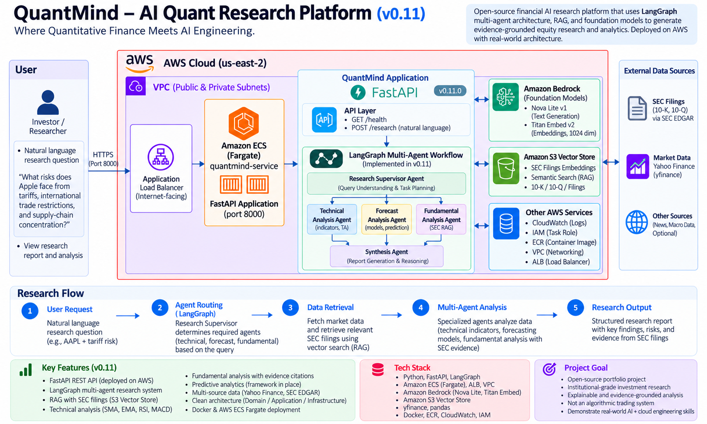
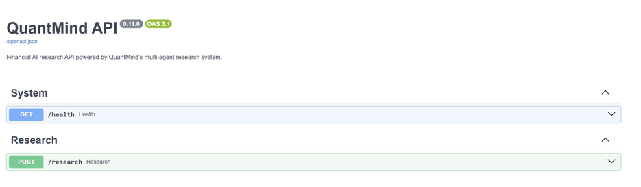
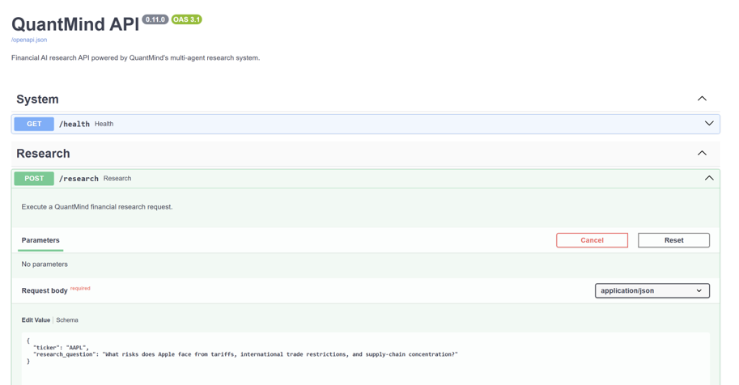
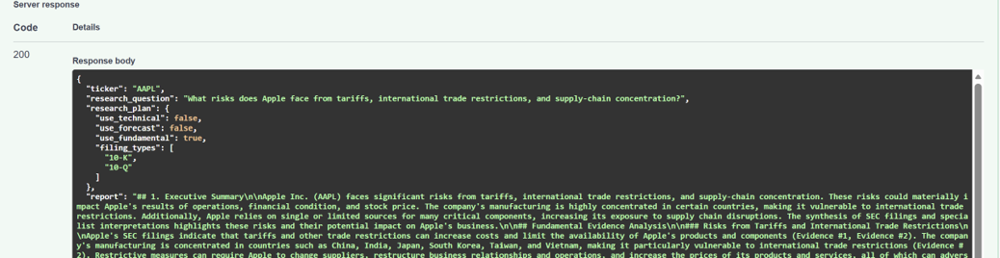
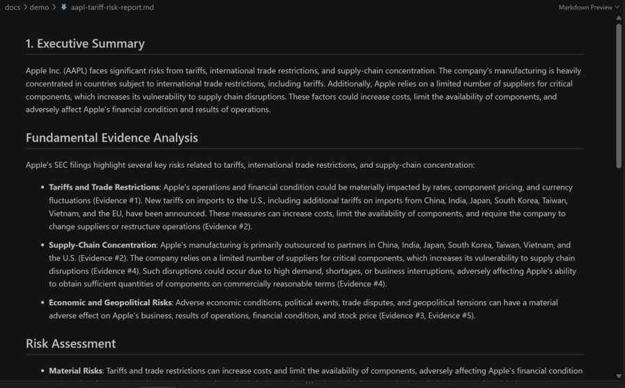
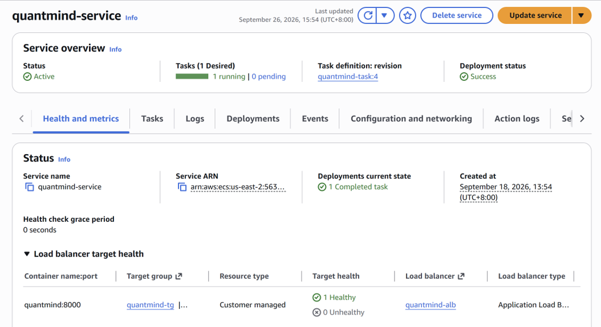

# QuantMind – AI Quant Research Platform

> **Where Quantitative Finance Meets AI Engineering.**

QuantMind is an open-source **Financial AI Research Platform** that combines quantitative finance, financial econometrics, technical analysis, deep-learning forecasting, SEC filing retrieval, retrieval-augmented generation (RAG), and LLM-driven multi-agent reasoning in one research workflow.

The platform is designed for **AI-assisted investment research, explainable financial intelligence, and decision support** rather than autonomous trading.

---

## Current Milestone — v0.11 AWS Cloud Deployment

Version **0.11** turns QuantMind into a cloud-deployed Financial AI research system with a production-style AWS architecture.

### v0.11 highlights

- Dockerized FastAPI application
- Amazon ECR container registry
- Amazon ECS on AWS Fargate
- Internet-facing Application Load Balancer
- VPC with public and private subnets
- IAM task-role separation
- Amazon CloudWatch logging
- Amazon Bedrock with **Nova Lite**
- Amazon Titan Text Embeddings V2 (**1024 dimensions**)
- Amazon S3 Vectors for SEC filing retrieval
- Real SEC 10-K / 10-Q evidence retrieval
- LangGraph multi-agent research orchestration
- Natural-language `POST /research` API
- Evidence-grounded research reports
- CLI, FastAPI, and MCP presentation interfaces
- Demo-on-demand cloud operation to control idle infrastructure cost

The verified v0.11 release image is deployed through ECS task definition `quantmind-task:4`.

---

# Demo

The v0.11 demo accepts a natural-language equity research question and converts it into a structured research plan.

Example:

```json
{
  "ticker": "AAPL",
  "research_question": "What risks does Apple face from tariffs, international trade restrictions, and supply-chain concentration?"
}
```

For this question, the Research Supervisor selected:

```json
{
  "use_technical": false,
  "use_forecast": false,
  "use_fundamental": true,
  "filing_types": [
    "10-K",
    "10-Q"
  ]
}
```

The Fundamental Research Agent then retrieved relevant Apple SEC filing evidence from Amazon S3 Vectors and produced an evidence-grounded report.

> **Live AWS demo available on request.**
>
> The public cloud endpoint is intentionally not published permanently. Screenshots and sample outputs are included below so the system can be evaluated while the Fargate service is scaled down.

## v0.11 Architecture



## Public FastAPI Interface



## Natural-Language Research Request



## Dynamic Research Routing



## Evidence-Grounded SEC Research Report



## AWS ECS Deployment



### Sample artifacts

- [AAPL tariff and supply-chain risk report](docs/demo/aapl-tariff-risk-report.md)
- [Full API response JSON](docs/demo/aapl-tariff-risk-response.json)

### v0.11 demo-data scope

The current cloud SEC corpus is intentionally small and controlled:

```text
AAPL
├── 10-K
└── 10-Q
```

The v0.11 AWS vector index contains a filtered set of Apple SEC filing chunks embedded with Titan Text Embeddings V2.

The research architecture itself is ticker-parameterized. Automated ingestion and expansion to additional issuers are planned for v0.12.

---

# Architecture

QuantMind follows Clean Architecture:

```text
Presentation
    ↓
Application
    ↓
Domain
    ↕
Infrastructure
```

External interfaces do not own the financial research workflow.

```text
CLI
FastAPI
MCP
  ↓
ResearchApplicationService
  ↓
LangGraph Research Workflow
  ↓
ResearchResult
```

## Replaceable infrastructure providers

QuantMind uses interfaces and factories so local and AWS runtimes can use different implementations without changing application logic.

```text
LLMInterface
├── OllamaProvider        (local)
└── BedrockProvider       (AWS)

EmbeddingInterface
├── OllamaEmbeddingModel  (local)
└── BedrockEmbeddingModel (AWS / Titan V2)

VectorStoreInterface
├── ChromaVectorStore     (local)
└── S3VectorStore         (AWS)
```

This keeps cloud services outside the domain and application layers.

---

# Research Workflow

The research engine is **stateful, conditional, multi-agent, and intentionally sequential**.

```text
Natural-Language Research Question
  ↓
ResearchApplicationService
  ↓
ResearchState
  ↓
LangGraph
  ↓
ResearchSupervisor
  ↓
ResearchPlan
  ↓
Conditional Routing
  ↓
Selected Specialist Agents
  ↓
Technical / Forecast / Fundamental Results
  ↓
Synthesis Agent
  ↓
Final Research Report
  ↓
ResearchResult
```

Conditional execution determines **which research branches run**.

Sequential execution determines **the order in which selected branches run**.

The workflow deliberately avoids uncontrolled parallel fan-out so state transitions, evidence flow, tool execution, and agent behavior remain easier to inspect, test, and debug.

---

# Research Supervisor

The `ResearchSupervisor` interprets the natural-language research objective and generates a structured `ResearchPlan`.

It determines whether the request requires:

```text
Technical analysis
Forecast analysis
Fundamental analysis
SEC 10-K evidence
SEC 10-Q evidence
```

Example:

```python
ResearchPlan(
    use_technical=False,
    use_forecast=False,
    use_fundamental=True,
    filing_types=[
        "10-K",
        "10-Q",
    ],
)
```

This separates probabilistic planning from deterministic workflow execution:

```text
Natural-Language Question
  ↓
LLM Planning
  ↓
ResearchPlan
  ↓
Deterministic LangGraph Routing
```

---

# Multi-Agent Research System

QuantMind uses specialist agents to interpret evidence produced by deterministic services.

## Technical Research Agent

```text
Market Data
  ↓
IndicatorService
  ↓
SMA / EMA / RSI / MACD
  ↓
TechnicalResearchAgent
  ↓
TechnicalAgentResult
```

## Forecast Research Agent

```text
Market Data
  ↓
PredictionService
  ↓
ForecastModelFactory
  ↓
LSTM / Transformer
  ↓
ForecastResearchAgent
  ↓
ForecastAgentResult
```

## Fundamental Research Agent

```text
Research Question
  ↓
EvidenceRetriever
  ↓
Embedding Model
  ↓
Vector Store
  ↓
RetrievalResult
  ↓
FundamentalResearchAgent
  ↓
FundamentalAgentResult
```

## Synthesis Research Agent

```text
ResearchState
  ↓
ResearchContext
  ↓
SynthesisResearchAgent
  ↓
Final Research Report
```

---

# Fundamental Research & RAG

QuantMind includes an evidence-grounded fundamental research pipeline using SEC filings.

Supported filing types:

```text
SEC 10-K
SEC 10-Q
```

## AWS v0.11 retrieval path

```text
Research Question
  ↓
Titan Text Embeddings V2
  ↓
1024-dimensional query embedding
  ↓
Amazon S3 Vectors
  ↓
semantic search
  ↓
relevant SEC filing chunks
  ↓
VectorEvidenceRetriever
  ↓
FundamentalResearchAgent
  ↓
Nova Lite
  ↓
evidence-grounded interpretation
```

The v0.11 cloud corpus was migrated into S3 Vectors using the same Titan V2 embedding configuration used at query time.

Normal research execution does **not** re-download or re-embed SEC filings.

Automated SEC ingestion is planned for v0.12.

---

# Evidence-Grounded Synthesis

QuantMind distinguishes factual evidence from agent interpretation.

```text
Raw / Structured Evidence
        +
Specialist-Agent Interpretation
  ↓
Synthesis Agent
  ↓
Final Research Report
```

Evidence is treated as the factual grounding layer.

Specialist-agent output is treated as interpretation rather than new factual evidence.

LLM output remains probabilistic and should be independently verified.

---

# Application Interfaces

QuantMind exposes the same research engine through three presentation interfaces.

## CLI

```text
main.py
  ↓
ResearchApplicationService
  ↓
QuantMind Research Engine
  ↓
ResearchResult
  ↓
Console
```

Useful for local development, debugging, and direct human execution.

## FastAPI

```text
HTTP Client
  ↓
FastAPI
  ↓
ResearchApplicationService
  ↓
QuantMind Research Engine
  ↓
ResearchResponse
  ↓
HTTP / JSON
```

### Health check

```http
GET /health
```

Example:

```json
{
  "status": "ok",
  "service": "QuantMind"
}
```

### Research request

```http
POST /research
```

Example:

```json
{
  "ticker": "AAPL",
  "research_question": "What risks does Apple face from tariffs, international trade restrictions, and supply-chain concentration?"
}
```

FastAPI deliberately exposes stable public schemas rather than internal `ResearchState`.

## MCP

QuantMind also exposes the research engine through a local Model Context Protocol server.

```text
AI Host / LLM
  ↓
MCP Client
  ↓
QuantMind MCP Server
  ↓
research_equity
  ↓
ResearchApplicationService
  ↓
QuantMind Research Engine
```

Primary MCP tool:

```text
research_equity(
    ticker: str,
    research_question: str
)
```

The current MCP implementation uses **stdio transport** and remains a thin presentation adapter. It does not contain research logic.

---

# AWS v0.11 Deployment

The verified cloud path is:

```text
Internet
  ↓
Application Load Balancer
  ↓
Amazon ECS / Fargate
  ↓
FastAPI
  ↓
ResearchApplicationService
  ↓
LangGraph
  ↓
Research Agents
  ↓
Amazon Bedrock + Amazon S3 Vectors
  ↓
Research Report
```

## Network layout

```text
VPC
├── Public Subnets
│   └── Application Load Balancer
│
└── Private Subnets
    └── ECS / Fargate
```

The Fargate task runs in private subnets and receives traffic through the ALB.

## IAM separation

```text
ecsTaskExecutionRole
  ↓
ECR image pull
CloudWatch log delivery
task startup infrastructure

quantmind-task-role
  ↓
application runtime permissions
Bedrock inference
S3 Vectors retrieval
```

Application code does not contain long-lived AWS credentials. On Fargate, `boto3` obtains temporary credentials from the ECS Task Role.

## Observability

Application logs are sent to:

```text
CloudWatch Logs
  ↓
/ecs/quantmind
```

The v0.11 release verification included:

```text
public GET /health       → HTTP 200
public POST /research    → HTTP 200
ALB target health        → healthy
CloudWatch error scan    → clean
```

---

# Demo-on-Demand Operation

The AWS demo is intentionally operated on demand to avoid paying for idle Fargate compute.

Turn the application on:

```powershell
aws ecs update-service `
    --cluster quantmind-cluster `
    --service quantmind-service `
    --desired-count 1 `
    --profile quantmind `
    --region us-east-2 `
    --no-cli-pager
```

Wait until stable:

```powershell
aws ecs wait services-stable `
    --cluster quantmind-cluster `
    --services quantmind-service `
    --profile quantmind `
    --region us-east-2
```

Turn it off:

```powershell
aws ecs update-service `
    --cluster quantmind-cluster `
    --service quantmind-service `
    --desired-count 0 `
    --profile quantmind `
    --region us-east-2 `
    --no-cli-pager
```

The ALB, NAT Gateway, ECR, vector index, and other persistent AWS resources remain provisioned unless explicitly removed.

---

# Technical Analysis

QuantMind provides deterministic technical indicators including:

- Simple Moving Average (SMA)
- Exponential Moving Average (EMA)
- Relative Strength Index (RSI)
- Moving Average Convergence Divergence (MACD)

```text
Market Data
  ↓
Price Series
  ↓
IndicatorService
├── SMA
├── EMA
├── RSI
└── MACD
  ↓
IndicatorResult
```

Technical evidence is produced only when required by the `ResearchPlan`.

---

# Forecasting

QuantMind supports deep-learning forecasting through:

```text
LSTM
Transformer
```

There is currently **no ARIMA forecasting implementation** in the active platform architecture.

```text
PredictionService
  ↓
ForecastModel Interface
  ↓
ForecastModelFactory
  ↓
LSTM or Transformer
  ↓
PredictionResult
```

Current forecasting output includes:

```text
forecast horizon
predicted return
predicted price
direction
validation RMSE
validation MAE
baseline RMSE
improvement over baseline
baseline-beating status
```

---

# Application Boundary

`ResearchApplicationService` is the stable application-level entry point shared by CLI, FastAPI, and MCP.

```text
Presentation Adapter
  ↓
ResearchApplicationService
  ↓
Initial ResearchState
  ↓
LangGraph
  ↓
Completed ResearchState
  ↓
ResearchResult
```

This prevents presentation code from depending directly on LangGraph internals.

---

# ResearchResult vs. Public Models

QuantMind separates application output from presentation-specific output.

```text
ResearchResult
= stable application-level result

ResearchResponse
= public FastAPI / HTTP representation

ResearchToolResult
= public MCP representation
```

---

# ResearchState

QuantMind uses a typed `ResearchState` as shared workflow state.

```text
ResearchState
├── ticker
├── research_question
├── research_plan
├── history
├── current_price
├── indicators
├── prediction
├── retrieval
├── technical_agent_result
├── forecast_agent_result
├── fundamental_agent_result
└── report
```

`ResearchState` represents the information required during workflow execution.

---

# ResearchContext

`ResearchState` and `ResearchContext` serve different purposes.

```text
ResearchState
= complete workflow execution state

ResearchContext
= curated evidence and specialist interpretations
  required for final synthesis
```

---

# Configuration & Bootstrap

Concrete dependencies are assembled in:

```text
app/bootstrap/research_factory.py
```

Runtime configuration is centralized in:

```text
app/config/settings.py
```

The composition root selects providers according to configuration rather than constructing cloud infrastructure inside presentation code.

---

# Project Structure

```text
ai-quant-research-platform/
├── app/
│   ├── application/
│   │   ├── agents/
│   │   ├── embeddings/
│   │   ├── llm/
│   │   ├── prompts/
│   │   ├── retrieval/
│   │   ├── services/
│   │   ├── vectorstores/
│   │   └── workflow/
│   ├── bootstrap/
│   ├── config/
│   ├── domain/
│   │   ├── entities/
│   │   ├── forecast/
│   │   ├── indicators/
│   │   └── repositories/
│   ├── infrastructure/
│   │   ├── embeddings/
│   │   ├── llm/
│   │   ├── market_data/
│   │   ├── ml/
│   │   ├── rag/
│   │   └── vectorstores/
│   └── presentation/
│       ├── api/
│       └── mcp/
├── docs/
│   └── demo/
├── scripts/
├── tests/
├── main.py
├── Dockerfile
├── requirements.txt
├── requirements-docker.txt
└── README.md
```

---

# Running QuantMind Locally

## Install runtime dependencies

```powershell
python -m pip install -r requirements.txt
```

## Run CLI research

```powershell
python main.py
```

## Run FastAPI

```powershell
python -m uvicorn app.presentation.api.app:app --reload
```

Swagger UI:

```text
http://127.0.0.1:8000/docs
```

## Run MCP Server

```powershell
python -m app.presentation.mcp.server
```

The default MCP server uses stdio transport.

---

# Testing

Automated regression tests live under:

```text
tests/
```

Run the complete automated suite:

```powershell
python -m pytest tests -v
```

Manual real-system checks live separately under:

```text
scripts/manual_regression/
```

v0.11 cloud verification additionally tested the complete runtime path through:

```text
Docker
  ↓
ECR
  ↓
ECS / Fargate
  ↓
ALB
  ↓
FastAPI
  ↓
LangGraph
  ↓
Bedrock
  ↓
Titan V2
  ↓
S3 Vectors
  ↓
real SEC evidence
```

---

# Design Principles

QuantMind follows these architectural principles:

- **Clean Architecture** — presentation, application, domain, and infrastructure concerns remain separated.
- **Single application boundary** — CLI, FastAPI, and MCP reuse `ResearchApplicationService`.
- **Evidence before interpretation** — deterministic services and retrieval produce evidence before LLM agents interpret it.
- **Typed state and contracts** — workflow state, application results, HTTP schemas, and MCP schemas are explicit.
- **Conditional orchestration** — only required research branches execute.
- **Sequential multi-agent execution** — selected branches execute in an inspectable order.
- **Replaceable infrastructure** — LLM providers, embedding models, vector stores, forecasting models, and market-data repositories remain swappable.
- **Offline / online separation** — SEC ingestion is separate from normal research execution.
- **Explainable research** — specialist reasoning is grounded in observable evidence.
- **Multi-interface reuse** — one research engine can serve humans, software clients, and AI systems.
- **Cloud credential isolation** — AWS runtime credentials are provided by IAM roles rather than application source code.
- **Cost-aware operation** — the cloud demo can scale to zero when not required.

---

# Roadmap

```text
v0.1   Initial AI market-research MVP
v0.2   Technical indicators
v0.3   Forecasting foundation
v0.4   Deep-learning forecasting
v0.5   SEC filings + RAG
v0.6   LangGraph research workflow
v0.7   Agentic research planning
v0.8   Multi-agent research system
v0.9   FastAPI + productization
v0.10  MCP integration
v0.11  AWS deployment + Bedrock + S3 Vectors

v0.12  ML Engineering + MLOps
v0.13  Earnings-call / financial-news ingestion
        + AI evaluation / grounding / provenance
v0.14  Portfolio intelligence + web dashboard
v1.0   Production-grade Financial AI platform
```

## v0.12 — ML Engineering & MLOps

Planned v0.12 work includes:

- Amazon SageMaker training, evaluation, and deployment workflows
- model lifecycle management
- model registry and pipelines
- CI/CD with GitHub Actions
- automated evaluation and deployment
- monitoring and drift detection
- CloudWatch alarms and operational monitoring
- retraining workflows
- autoscaling and cost optimization
- VPC endpoints and reduced NAT dependence
- automated SEC ingestion
- expansion to a multi-company SEC corpus
- stronger separation of ingestion and inference permissions
- blue/green or canary deployment strategies

The v0.12 goal is to evolve QuantMind from a working cloud research platform into a more complete **ML engineering and MLOps system**.

---

# Technology Stack

```text
Python
pandas / NumPy
PyTorch
scikit-learn
Yahoo Finance
Ollama
Amazon Bedrock
Amazon Nova Lite
Amazon Titan Text Embeddings V2
LangGraph
ChromaDB
Amazon S3 Vectors
SEC EDGAR
FastAPI
Uvicorn
Pydantic
Model Context Protocol (MCP)
Docker
Amazon ECR
Amazon ECS / Fargate
Application Load Balancer
Amazon VPC
AWS IAM
Amazon CloudWatch
pytest
```

---

# Project Goal

QuantMind is being developed as an open-source **Financial AI research system** demonstrating how quantitative finance, financial econometrics, machine learning, RAG, multi-agent reasoning, APIs, AI interoperability, and cloud engineering can be combined within a clean and extensible architecture.

The goal is **not** to automate trading decisions.

The goal is to build a transparent, inspectable research platform capable of supporting:

```text
Equity Research
Quantitative Analysis
Technical Analysis
Forecasting
Fundamental Research
SEC Filing Analysis
Portfolio Research
AI-Assisted Investment Decision Support
External AI Agent Integration
```

---

## Disclaimer

QuantMind is an educational and research project.

It does not provide investment advice, brokerage services, or autonomous trading recommendations.

Financial forecasts, LLM outputs, and research conclusions should be independently verified before use in real-world investment decisions.
