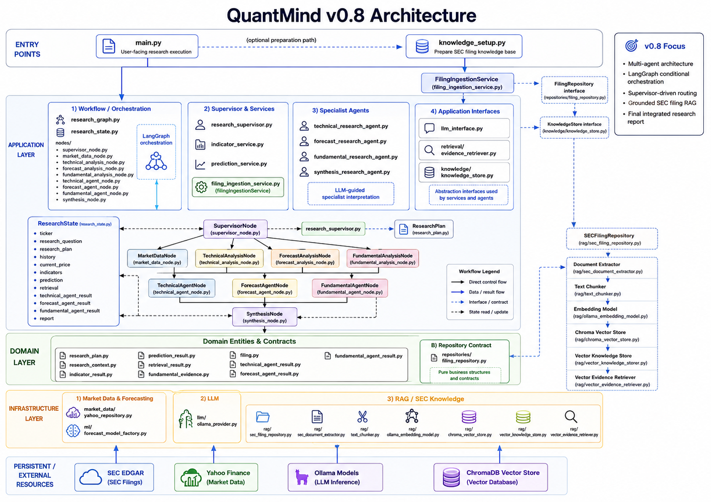
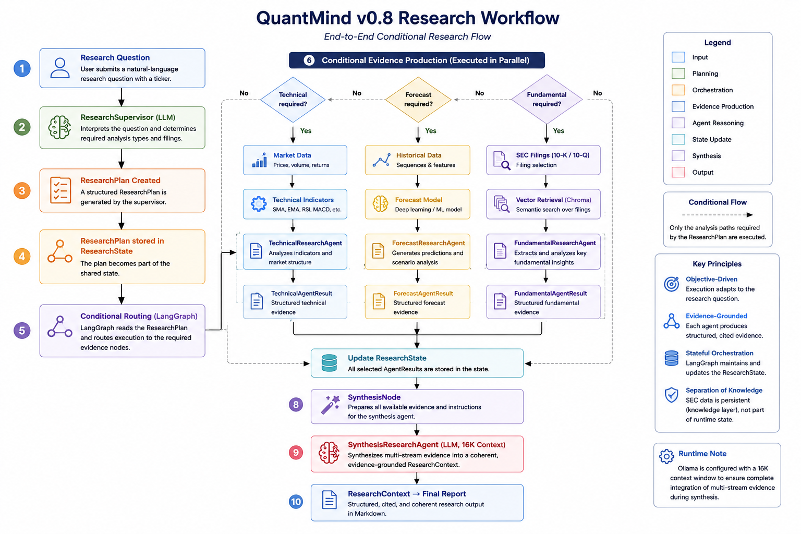

# QuantMind – AI Quant Research Platform

> **Where Quantitative Finance Meets AI Engineering.**

QuantMind is an open-source **Financial AI Research Platform** that combines quantitative finance, financial econometrics, technical analysis, machine-learning forecasting, SEC filing retrieval, and LLM-driven multi-agent reasoning into a unified research workflow.

The platform is designed for **AI-assisted investment research, explainable financial intelligence, and decision support** rather than autonomous trading.

---

## Current Milestone — v0.8 Multi-Agent Research System

Version 0.8 evolves QuantMind from a supervisor-driven conditional workflow into a **multi-agent research system**.

The current system includes:

- LLM Research Supervisor
- Structured `ResearchPlan`
- Conditional LangGraph routing
- Technical evidence generation
- Transformer-based forecast evidence
- SEC 10-K / 10-Q RAG
- Technical Research Agent
- Forecast Research Agent
- Fundamental Research Agent
- Synthesis Research Agent
- Structured specialist-agent results
- Typed `ResearchState`
- Curated `ResearchContext`
- Persistent Chroma knowledge base
- Separate knowledge-ingestion and online-research workflows
- Evidence-grounded final synthesis
- Ollama / Qwen local LLM integration

---

# Architecture



The v0.8 architecture separates four different concerns:

```text
Research Planning
        ↓
Evidence Production
        ↓
Specialist-Agent Interpretation
        ↓
Final Synthesis
```

The core execution model is:

```text
Research Question
        ↓
ResearchSupervisor
        ↓
ResearchPlan
        ↓
Conditional LangGraph Routing
        ↓
Selected Evidence Pipelines
        ↓
Specialist Research Agents
        ↓
Structured Agent Results
        ↓
ResearchState
        ↓
SynthesisNode
        ↓
SynthesisResearchAgent
        ↓
ResearchContext
        ↓
Final Research Report
```

This separation keeps deterministic computation, retrieved evidence, probabilistic reasoning, and final synthesis conceptually distinct.

---

# Research Supervisor

The `ResearchSupervisor` interprets the research objective and decides which research capabilities should execute.

It uses an LLM to determine whether the request requires:

```text
Technical analysis
Forecast analysis
Fundamental analysis
SEC 10-K evidence
SEC 10-Q evidence
```

The result is converted into a structured domain entity:

```python
ResearchPlan(
    use_technical=True,
    use_forecast=False,
    use_fundamental=False,
    filing_types=[],
)
```

This separates probabilistic planning from deterministic workflow execution:

```text
Natural-Language Question
        ↓
LLM Planning
        ↓
ResearchPlan
        ↓
Deterministic LangGraph Routing
```

---

# ResearchPlan

`ResearchPlan` is a Domain entity representing the Supervisor's structured research decision.

Conceptually:

```text
ResearchPlan
├── use_technical
├── use_forecast
├── use_fundamental
└── filing_types
```

Example:

```python
ResearchPlan(
    use_technical=True,
    use_forecast=True,
    use_fundamental=True,
    filing_types=[
        "10-K",
        "10-Q",
    ],
)
```

The LangGraph workflow consumes the plan and selects only the required research branches.

---

# ResearchState

QuantMind uses a typed `ResearchState` as the shared coordination state of the LangGraph workflow.

```text
ResearchState
├── Input
│   ├── ticker
│   └── research_question
├── Planning
│   └── research_plan
├── Market Data
│   ├── history
│   └── current_price
├── Evidence
│   ├── indicators
│   ├── prediction
│   └── retrieval
├── Specialist Interpretation
│   ├── technical_agent_result
│   ├── forecast_agent_result
│   └── fundamental_agent_result
└── Output
    └── report
```

`ResearchState` represents **everything the workflow knows during execution**.

The state is progressively enriched as selected nodes execute.

```text
Initial State
    ↓
Supervisor
    + ResearchPlan
    ↓
Evidence Nodes
    + structured evidence
    ↓
Specialist Agents
    + structured interpretations
    ↓
Synthesis
    + final report
```

---

# Multi-Agent Research System

Version 0.8 introduces specialized research agents for each analytical domain.

## Technical Research Agent

```text
MarketDataNode
        ↓
TechnicalAnalysisNode
        ↓
IndicatorService
        ↓
IndicatorResult
        ↓
TechnicalAgentNode
        ↓
TechnicalResearchAgent
        ↓
TechnicalAgentResult
```

The Technical Research Agent interprets deterministic indicators while remaining constrained by the supplied evidence.

## Forecast Research Agent

```text
MarketDataNode
        ↓
ForecastAnalysisNode
        ↓
PredictionService
        ↓
PredictionResult
        ↓
ForecastAgentNode
        ↓
ForecastResearchAgent
        ↓
ForecastAgentResult
```

The Forecast Research Agent interprets structured model output and validation metrics without treating forecasts as observed facts.

## Fundamental Research Agent

```text
FundamentalAnalysisNode
        ↓
EvidenceRetriever
        ↓
RetrievalResult
        ↓
FundamentalAgentNode
        ↓
FundamentalResearchAgent
        ↓
FundamentalAgentResult
```

Evidence retrieval remains outside the reasoning agent so retrieval quality and LLM interpretation remain independently observable.

## Synthesis Research Agent

```text
ResearchState
        ↓
SynthesisNode
        ↓
ResearchContext
        ↓
SynthesisResearchAgent
        ↓
EquityPrompt
        ↓
LLM
        ↓
Final Report
```

The Synthesis Research Agent combines available specialist interpretations while checking them against underlying evidence.

---

# Research Workflow



The v0.8 workflow is **stateful, conditional, multi-agent, and intentionally sequential**.

Conditional execution determines **which branches run**.

Sequential execution determines **the order in which selected branches run**.

The current design intentionally avoids parallel execution so that multi-agent reasoning can remain easy to inspect and debug.

Conceptually:

```text
Research Question
        ↓
ResearchSupervisor
        ↓
ResearchPlan
        ↓
Conditional Routing
        ↓
┌───────────────────────────────────────────────┐
│ Technical selected?                          │
│   Market Data → Indicators → Technical Agent │
│                                               │
│ Forecast selected?                           │
│   Market Data → Forecast → Forecast Agent    │
│                                               │
│ Fundamental selected?                        │
│   SEC Retrieval → Fundamental Agent          │
└───────────────────────────────────────────────┘
        ↓
Synthesis Research Agent
        ↓
Research Report
```

---

# Conditional Execution

Version 0.6 introduced LangGraph orchestration with a predetermined analytical workflow.

Version 0.7 introduced objective-dependent planning.

Version 0.8 adds specialist-agent interpretation to each selected research branch.

```text
v0.6

Question
   ↓
Fixed Research Workflow
   ↓
Technical + Forecast + Fundamental
   ↓
Synthesis
```

```text
v0.7

Question
   ↓
LLM Research Supervisor
   ↓
ResearchPlan
   ↓
Conditional Workflow
   ↓
Selected Evidence
   ↓
Synthesis
```

```text
v0.8

Question
   ↓
LLM Research Supervisor
   ↓
ResearchPlan
   ↓
Conditional Evidence Pipelines
   ↓
Specialist Research Agents
   ↓
Structured Agent Results
   ↓
Synthesis Research Agent
```

---

# Technical Analysis

QuantMind provides deterministic technical-analysis calculations including:

- Simple Moving Average (SMA)
- Exponential Moving Average (EMA)
- Relative Strength Index (RSI)
- Moving Average Convergence Divergence (MACD)

Technical indicators are coordinated by the application-layer `IndicatorService`.

```text
Market Data
    ↓
Price Series
    ↓
IndicatorService
    ├── SMA
    ├── EMA
    ├── RSI
    └── MACD
    ↓
IndicatorResult
```

Technical evidence is produced only when required by the `ResearchPlan`.

---

# Forecasting

QuantMind includes a forecasting abstraction that separates application logic from individual forecasting models.

```text
PredictionService
        ↓
ForecastModel Interface
        ↓
ForecastModelFactory
        ↓
Selected Forecast Model
```

The current platform includes Transformer-based time-series forecasting.

The forecasting pipeline produces a structured `PredictionResult`:

```text
Historical Prices
        ↓
Forecast Model
        ↓
Predicted Return
        ↓
Implied Price
        ↓
Validation Metrics
        ↓
PredictionResult
```

Current validation output includes:

- Forecast horizon
- Predicted return
- Predicted price
- Direction classification
- Validation RMSE
- Validation MAE
- Naive baseline RMSE
- Improvement over baseline
- Baseline-beating status

The forecasting abstraction allows additional models to be added without changing application orchestration.

---

# Fundamental Research & RAG

QuantMind includes an evidence-grounded fundamental research pipeline using SEC filings.

Supported filing types:

```text
SEC 10-K
SEC 10-Q
```

The knowledge-ingestion pipeline is:

```text
SEC EDGAR
    ↓
SECFilingRepository
    ↓
SECDocumentExtractor
    ↓
TextChunker
    ↓
Embedding Model
    ↓
Chroma Vector Store
```

The knowledge base stores filing metadata including:

```text
ticker
filing_type
filing_date
section
source
chunk_index
```

Current embeddings are generated locally using Ollama-compatible embedding infrastructure.

---

# Knowledge Ingestion vs. Research Runtime

Version 0.8 separates SEC knowledge ingestion from online research execution.

## Knowledge Ingestion

```text
SEC Filing
    ↓
prepare_knowledge()
    ↓
Parse
    ↓
Chunk
    ↓
Embed
    ↓
Persistent Chroma Knowledge Base
```

## Research Runtime

```text
Research Question
    ↓
ResearchSupervisor
    ↓
Fundamental selected?
    ↓
EvidenceRetriever
    ↓
Existing Chroma Knowledge
    ↓
FundamentalResearchAgent
```

This avoids downloading, parsing, and embedding SEC filings every time a research question is asked.

---

# Filing-Type-Aware Retrieval

The Research Supervisor can select the filing types appropriate for the research objective.

Examples:

```text
"What are Apple's recent business risks?"
        ↓
10-Q
```

```text
"What are Apple's long-term structural business risks?"
        ↓
10-K + 10-Q
```

```text
"Give me an integrated outlook using fundamental evidence."
        ↓
10-K + 10-Q
```

The LLM does not directly query Chroma.

Instead:

```text
LLM Supervisor
      ↓
ResearchPlan
      ↓
filing_types
      ↓
Application Code
      ↓
EvidenceRetriever
      ↓
Chroma Metadata Filter
      ↓
Relevant SEC Evidence
```

This keeps infrastructure access deterministic and controlled.

---

# Evidence-Grounded Retrieval

The research question is embedded and compared with stored SEC filing chunks.

```text
Research Question
        ↓
Embedding Model
        ↓
Query Embedding
        ↓
Chroma Similarity Search
        ↓
Metadata Filtering
        ↓
Relevant Filing Chunks
        ↓
FundamentalEvidence
        ↓
RetrievalResult
```

Each evidence object retains source metadata so information remains traceable to the underlying filing.

---

# ResearchContext

`ResearchState` and `ResearchContext` serve different purposes.

```text
ResearchState
= everything required by the workflow during execution

ResearchContext
= curated evidence and specialist interpretations
  required by final synthesis
```

The current `ResearchContext` can contain:

```text
ticker
research_question
current_price

indicators
prediction
retrieval

technical_agent_result
forecast_agent_result
fundamental_agent_result
```

Full price history remains workflow working data and is not automatically sent into the final LLM prompt.

---

# Evidence-Grounded Multi-Agent Synthesis

The final synthesis layer receives two kinds of information:

```text
Raw / Structured Evidence
        +
Specialist-Agent Interpretation
```

The intended hierarchy is:

```text
Underlying Evidence
        ↓
Specialist Interpretation
        ↓
Synthesis Agent
        ↓
Final Research Report
```

Evidence is treated as the factual grounding layer.

Specialist-agent output is treated as interpretation rather than new factual evidence.

The synthesis prompt includes constraints intended to reduce unsupported claims involving:

- Statistical significance
- Economic significance
- Forecast confidence
- Technical-indicator extrapolation
- SEC risk disclosures
- Causal inference
- Cross-evidence overinterpretation

LLM output remains probabilistic and should be independently verified.

---

# LLM Runtime Context

Integrated multi-agent synthesis requires a larger runtime context than simple single-stream analysis.

QuantMind currently configures the Ollama provider with:

```text
num_ctx = 16384
```

During v0.8 testing, the underlying Qwen model supported a larger context window, while Ollama was initially running with a 4096-token runtime context.

The smaller runtime context caused integrated synthesis to omit earlier technical and forecast evidence even though:

```text
LangGraph routing       correct
ResearchState           complete
ResearchContext         complete
EquityPrompt             complete
```

Increasing the runtime context restored complete multi-stream synthesis.

This illustrates an important AI-systems principle:

```text
Correct application code
        ≠
Correct AI-system behavior
```

Inference-runtime configuration is part of system architecture.

---

# Deterministic vs. Probabilistic Components

QuantMind deliberately separates deterministic system behavior from probabilistic LLM reasoning.

```text
Probabilistic
────────────────────────────────
Research-question interpretation
Research planning
Specialist-agent interpretation
Final language synthesis
```

```text
Deterministic
────────────────────────────────
ResearchPlan representation
LangGraph routing
Market-data retrieval
Indicator calculation
Forecast execution
SEC retrieval
Metadata filtering
ResearchState propagation
Structured agent-result storage
```

This separation supports more explainable and controllable AI research workflows.

---

# Clean Architecture

QuantMind is organized around four primary architectural layers.

## Presentation

Responsible for application entry points and user interaction.

```text
main.py
knowledge_setup.py
```

## Application

Coordinates use cases, research planning, evidence production, specialist reasoning, and workflow execution.

Examples:

```text
ResearchSupervisor

TechnicalResearchAgent
ForecastResearchAgent
FundamentalResearchAgent
SynthesisResearchAgent

IndicatorService
PredictionService
FilingIngestionService
EvidenceRetriever

LangGraph Workflow
LangGraph Nodes
```

## Domain

Contains core entities and interfaces.

Examples:

```text
ResearchPlan
ResearchContext
IndicatorResult
PredictionResult
RetrievalResult
FundamentalEvidence

TechnicalAgentResult
ForecastAgentResult
FundamentalAgentResult

ForecastModel
PriceRepository
FilingRepository
```

## Infrastructure

Implements external integrations and technical services.

Examples:

```text
Yahoo Finance
Ollama
Qwen
SEC EDGAR
Chroma
Embedding Models
Forecast Models
```

The intended dependency direction is:

```text
Presentation
     ↓
Application
     ↓
Domain

Infrastructure
     ↑
implements interfaces required by inner layers
```

---

# Project Structure

A simplified view of the v0.8 structure:

```text
ai-quant-research-platform/
├── app/
│   ├── application/
│   │   ├── agents/
│   │   │   ├── technical_research_agent.py
│   │   │   ├── forecast_research_agent.py
│   │   │   ├── fundamental_research_agent.py
│   │   │   └── synthesis_research_agent.py
│   │   ├── llm/
│   │   │   └── llm_interface.py
│   │   ├── prompts/
│   │   │   └── equity_prompt.py
│   │   ├── retrieval/
│   │   │   └── evidence_retriever.py
│   │   ├── services/
│   │   │   ├── indicator_service.py
│   │   │   ├── prediction_service.py
│   │   │   ├── filing_ingestion_service.py
│   │   │   └── research_supervisor.py
│   │   └── workflow/
│   │       ├── research_graph.py
│   │       ├── research_state.py
│   │       └── nodes/
│   │           ├── supervisor_node.py
│   │           ├── market_data_node.py
│   │           ├── technical_analysis_node.py
│   │           ├── technical_agent_node.py
│   │           ├── forecast_analysis_node.py
│   │           ├── forecast_agent_node.py
│   │           ├── fundamental_analysis_node.py
│   │           ├── fundamental_agent_node.py
│   │           └── synthesis_node.py
│   ├── domain/
│   │   ├── entities/
│   │   │   ├── research_plan.py
│   │   │   ├── research_context.py
│   │   │   ├── indicator_result.py
│   │   │   ├── prediction_result.py
│   │   │   ├── retrieval_result.py
│   │   │   ├── fundamental_evidence.py
│   │   │   ├── technical_agent_result.py
│   │   │   ├── forecast_agent_result.py
│   │   │   └── fundamental_agent_result.py
│   │   ├── forecast/
│   │   ├── indicators/
│   │   └── repositories/
│   └── infrastructure/
│       ├── llm/
│       │   └── ollama_provider.py
│       ├── market_data/
│       │   └── yahoo_repository.py
│       ├── ml/
│       │   └── forecast_model_factory.py
│       └── rag/
│           ├── sec_filing_repository.py
│           ├── sec_document_extractor.py
│           ├── text_chunker.py
│           ├── ollama_embedding_model.py
│           ├── chroma_vector_store.py
│           ├── vector_knowledge_store.py
│           └── vector_evidence_retriever.py
├── docs/
│   └── images/
│       ├── architecture_v0.7.png
│       ├── architecture_v0.8.png
│       ├── workflow_v0.7.png
│       └── workflow_v0.8.png
├── data/
│   └── chroma/
├── knowledge_setup.py
├── main.py
├── test_10q_retrieval.py
├── test_supervisor.py
├── test_technical_agent.py
├── test_forecast_agent.py
├── test_fundamental_agent.py
├── requirements.txt
└── README.md
```

---

# Technology Stack

| Area | Technology |
|---|---|
| Language | Python |
| Architecture | Clean Architecture |
| Agent Orchestration | LangGraph |
| Local LLM | Ollama |
| Research LLM | Qwen |
| Runtime Context | 16K tokens |
| Embeddings | Ollama / EmbeddingGemma |
| Vector Database | Chroma |
| Market Data | Yahoo Finance / yfinance |
| Fundamental Data | SEC EDGAR |
| Quantitative Analysis | pandas |
| Machine Learning | PyTorch |
| Forecasting | Time-Series / Transformer Models |
| Report Format | Markdown |

---

# Current Research Capabilities

| Capability | Status |
|---|---|
| Yahoo Finance market data | Implemented |
| SMA / EMA | Implemented |
| RSI | Implemented |
| MACD | Implemented |
| Forecast abstraction | Implemented |
| Forecast model factory | Implemented |
| Transformer forecasting | Implemented |
| Forecast validation metrics | Implemented |
| SEC 10-K ingestion | Implemented |
| SEC 10-Q ingestion | Implemented |
| SEC document extraction | Implemented |
| Text chunking | Implemented |
| Local embeddings | Implemented |
| Chroma vector storage | Implemented |
| Semantic RAG retrieval | Implemented |
| Filing-type-aware retrieval | Implemented |
| LLM Research Supervisor | Implemented |
| Structured `ResearchPlan` | Implemented |
| Typed `ResearchState` | Implemented |
| Conditional LangGraph execution | Implemented |
| Technical Research Agent | Implemented |
| Forecast Research Agent | Implemented |
| Fundamental Research Agent | Implemented |
| Synthesis Research Agent | Implemented |
| Structured specialist-agent results | Implemented |
| Multi-agent coordination | Implemented |
| Evidence-grounded synthesis | Implemented |
| Persistent knowledge/runtime separation | Implemented |
| Earnings-call transcript ingestion | Planned |
| Financial-news retrieval | Planned |
| Portfolio analysis | Planned |
| FastAPI research API | Planned |
| Web dashboard | Planned |
| Cloud deployment | Planned |
| CI/CD | Planned |
| Production observability | Planned |
| Automated agent evaluation | Planned |

---

# Version Evolution

## v0.1 — AI Market Research MVP

Introduced:

- Clean Architecture
- Yahoo Finance market data
- Ollama LLM integration
- AI-generated market analysis
- Markdown research reports

## v0.2 — Technical Analysis

Introduced:

- Indicator abstraction
- SMA
- EMA
- RSI
- MACD
- `IndicatorService`

## v0.3 — Forecasting Architecture

Introduced:

- Forecast model abstraction
- `PredictionService`
- Structured `PredictionResult`
- Separation of forecasting logic from application orchestration

## v0.4 — Multi-Model Forecasting

Introduced:

- Forecast model factory
- Multiple forecasting implementations
- Model selection without changing application logic
- Validation and baseline comparison

## v0.5 — Fundamental RAG

Introduced:

- SEC 10-K ingestion
- Filing repository abstraction
- SEC document extraction
- Text chunking
- Local embeddings
- Chroma vector database
- Semantic evidence retrieval
- Evidence-grounded fundamental analysis

## v0.6 — LangGraph Research Workflow

Introduced:

- `ResearchState`
- LangGraph orchestration
- Market-data node
- Technical-analysis node
- Forecast-analysis node
- Fundamental-analysis node
- Synthesis node
- Stateful research execution

Version 0.6 transformed QuantMind from a conventional application-service pipeline into a graph-based research workflow.

## v0.7 — Agentic Research Planning

Introduced:

- LLM Research Supervisor
- Structured `ResearchPlan`
- `ResearchPlan` stored in `ResearchState`
- Conditional LangGraph routing
- Selective technical analysis
- Selective forecasting
- Selective fundamental research
- SEC 10-Q support
- Filing-type-aware RAG
- 10-K / 10-Q research selection
- Adaptive evidence synthesis
- Objective-dependent research workflows

Version 0.7 transformed the LangGraph workflow from predetermined graph execution into an **LLM-planned conditional research system**.

## v0.8 — Multi-Agent Research System

Introduced:

- `TechnicalResearchAgent`
- `ForecastResearchAgent`
- `FundamentalResearchAgent`
- `SynthesisResearchAgent`
- `TechnicalAgentResult`
- `ForecastAgentResult`
- `FundamentalAgentResult`
- Agent-node adapters for LangGraph
- Evidence-production / interpretation separation
- Structured specialist reasoning stored in `ResearchState`
- Curated `ResearchContext` for synthesis
- Multi-agent evidence-grounded synthesis
- Persistent SEC knowledge/runtime separation
- Explicit 16K Ollama context configuration for integrated synthesis
- Multi-branch regression testing

Version 0.8 transforms QuantMind from a conditional evidence workflow into a **supervisor-coordinated multi-agent financial research system**.

---

# Example Supervisor Behavior

The Supervisor has been tested against different research objectives.

## Technical question

```text
Question:
Is Apple technically oversold?

use_technical:   True
use_forecast:    False
use_fundamental: False
filing_types:    []
```

## Recent fundamental question

```text
Question:
What are Apple's recent business risks?

use_technical:   False
use_forecast:    False
use_fundamental: True
filing_types:    ['10-Q']
```

## Long-term structural question

```text
Question:
What are Apple's long-term structural business risks?

use_technical:   False
use_forecast:    False
use_fundamental: True
filing_types:    ['10-K', '10-Q']
```

## Integrated multi-agent question

```text
Question:
Give me an integrated outlook for Apple using
technical, forecast, and fundamental evidence.

use_technical:   True
use_forecast:    True
use_fundamental: True
filing_types:    ['10-K', '10-Q']
```

These cases demonstrate that one platform can construct different research workflows from the user's research objective.

---

# Running QuantMind

## Requirements

QuantMind currently assumes:

- Python installed
- Ollama installed and running
- Required Ollama models available locally
- Python dependencies installed
- Fundamental SEC knowledge prepared before fundamental queries

Install Python dependencies:

```bash
pip install -r requirements.txt
```

Make sure Ollama is running and required models are available.

## Prepare SEC Knowledge

SEC knowledge ingestion is separate from the online research runtime.

For example:

```bash
python knowledge_setup.py
```

The ingestion process persists embeddings and filing metadata in Chroma.

Once knowledge is available, normal research execution does not re-ingest the filings.

## Run Research

```bash
python main.py
```

The CLI configuration is defined near the top of `main.py`:

```python
TICKER = "AAPL"

MODEL_NAME = "transformer"

RESEARCH_QUESTION = (
    "Give me an integrated outlook for Apple using "
    "technical, forecast, and fundamental evidence."
)
```

Changing the research question allows the Supervisor to construct a different research plan automatically.

---

# Testing

QuantMind v0.8 includes independent tests for planning, retrieval, and each specialist research agent.

## Research Supervisor

```bash
python test_supervisor.py
```

Validates technical-only, fundamental-only, long-term fundamental, and integrated routing decisions.

## 10-Q Retrieval

```bash
python test_10q_retrieval.py
```

Validates metadata-aware retrieval from SEC 10-Q evidence.

## Technical Research Agent

```bash
python test_technical_agent.py
```

Validates deterministic technical evidence → specialist interpretation.

## Forecast Research Agent

```bash
python test_forecast_agent.py
```

Validates structured forecast evidence → specialist interpretation.

## Fundamental Research Agent

```bash
python test_fundamental_agent.py
```

Validates retrieved SEC evidence → specialist interpretation with evidence references.

The v0.8 workflow has also been tested end-to-end for:

```text
Technical-only research
Forecast-only research
Fundamental-only research
Integrated technical + forecast + fundamental research
```

---

# Design Principles

QuantMind is developed around the following engineering principles.

## 1. Explainability

Quantitative calculations, model outputs, retrieved evidence, specialist interpretations, and final LLM synthesis remain conceptually separate.

## 2. Evidence Grounding

Research reports should be based on structured quantitative evidence and retrieved source documents rather than unsupported generation.

## 3. Separation of Concerns

Domain logic is separated from application orchestration and infrastructure integrations.

## 4. Extensibility

New forecasting models, indicators, retrieval sources, LLM providers, and research agents should be addable without redesigning the entire platform.

## 5. Controlled Agentic Behavior

LLMs make semantic planning and interpretation decisions, while application code controls deterministic execution and infrastructure access.

## 6. Stateful Orchestration

`ResearchState` provides explicit workflow state rather than hidden conversational memory.

## 7. Evidence vs. Interpretation

Evidence acquisition and LLM interpretation are separate responsibilities so retrieval quality and reasoning quality can be evaluated independently.

## 8. Research Before Trading

QuantMind is designed for investment research, analytical experimentation, and decision support — not autonomous order execution.

---

# Roadmap

The current architecture provides the foundation for increasingly production-oriented Financial AI engineering.

```text
v0.8
Multi-Agent Research System
        ↓
v0.9
FastAPI + Productization
        ↓
v0.10
AWS Deployment
Docker / ECR
Cloud Infrastructure
CI/CD
Monitoring
IAM / Security
        ↓
v0.11
AI-System Evaluation
Grounding Validation
Provenance
Agent Evaluation
Production Observability
        ↓
v1.0
Production-Grade Financial AI Platform
```

Additional planned capabilities include:

- Earnings-call transcript ingestion
- Financial-news retrieval
- Expanded financial-statement analytics
- Portfolio analytics
- Risk decomposition
- FastAPI service layer
- Interactive research dashboard
- MCP-compatible research tools
- Docker containerization
- AWS deployment
- Automated testing
- CI/CD
- Cloud monitoring
- Model monitoring
- Grounding evaluation
- Evidence provenance
- Failure recovery

---

# Project Vision

QuantMind is intended to evolve from an AI-assisted quantitative research application into a modular **Financial AI Research Platform**.

The long-term objective is to combine:

```text
Quantitative Finance
        +
Financial Econometrics
        +
Machine Learning
        +
Deep Learning
        +
Fundamental Research
        +
Retrieval-Augmented Generation
        +
LLM Reasoning
        +
Agentic Workflows
        +
Production AI Engineering
        =
Explainable Financial Intelligence
```

The platform emphasizes research transparency, modular architecture, evidence grounding, and separation of probabilistic AI reasoning from deterministic financial computation.

---

# Disclaimer

QuantMind is an experimental research and educational project.

It is not intended to provide investment advice, trading recommendations, or guarantees of financial performance.

All generated analysis should be independently verified before being used for financial decision-making.
