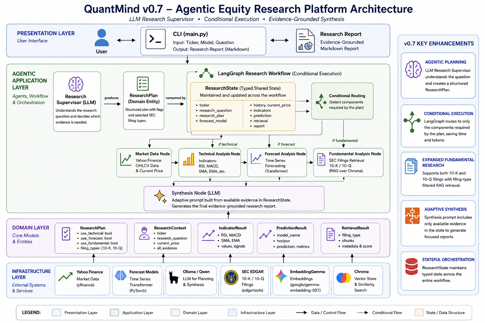
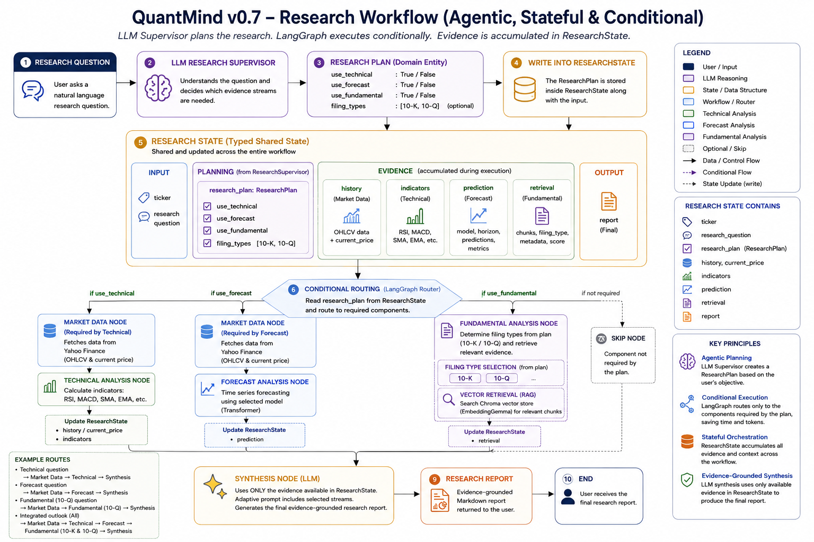

# QuantMind – AI Quant Research Platform

> **Where Quantitative Finance Meets AI Engineering.**

QuantMind is an open-source **AI Quant Research Platform** that integrates quantitative finance, financial econometrics, technical analysis, machine-learning forecasting, SEC filing retrieval, and LLM-driven reasoning into a unified investment research workflow.

The platform is designed as an **explainable research system rather than an algorithmic trading engine**. Its objective is to combine deterministic quantitative analytics with evidence-grounded AI reasoning while maintaining clear architectural boundaries between domain logic, application orchestration, infrastructure, and language-model capabilities.

QuantMind currently supports:

- Market-data acquisition
- Technical indicator analysis
- Time-series forecasting
- Transformer-based return forecasting
- SEC 10-K and 10-Q ingestion
- Embedding-based semantic retrieval
- Evidence-grounded RAG
- LangGraph stateful orchestration
- LLM-based research planning
- Conditional research execution
- Adaptive multi-evidence synthesis
- Markdown equity research reports

---

# Current Version

## QuantMind v0.7 – Agentic Research Planning & Conditional Execution

Version 0.7 introduces an **LLM Research Supervisor** that interprets a natural-language research objective and creates a structured `ResearchPlan`.

Instead of executing every analytical component for every question, QuantMind can now determine which evidence streams are relevant and conditionally execute only the required research components.

For example:

```text
Question:
"Is Apple technically oversold?"

ResearchPlan:
use_technical   = True
use_forecast    = False
use_fundamental = False
filing_types    = []

Execution:
Market Data
    ↓
Technical Analysis
    ↓
Synthesis
```

A fundamentally oriented question produces a different research path:

```text
Question:
"What are Apple's recent business risks?"

ResearchPlan:
use_technical   = False
use_forecast    = False
use_fundamental = True
filing_types    = ["10-Q"]

Execution:
10-Q Retrieval
    ↓
Fundamental Analysis
    ↓
Synthesis
```

An integrated research objective can activate all available evidence streams:

```text
Question:
"Give me an integrated outlook for Apple using
technical, forecast, and fundamental evidence."

ResearchPlan:
use_technical   = True
use_forecast    = True
use_fundamental = True
filing_types    = ["10-K", "10-Q"]
```

This represents the transition from a fixed research pipeline toward an **agentic research architecture**.

---

# Core Agentic Model

QuantMind v0.7 follows the conceptual model:

```text
LLM + Tools + State + Control Loop
        =
Reasoning + Action + Memory + Workflow
```

Within QuantMind:

```text
LLM Research Supervisor
        ↓
Reasoning
"What analysis is required?"

ResearchPlan
        ↓
Structured Decision

ResearchState
        ↓
Shared Workflow State

LangGraph
        ↓
Conditional Control / Orchestration

Research Nodes
        ↓
Actions / Analytical Tools

Synthesis LLM
        ↓
Evidence-Grounded Research Report
```

The LLM does not directly control infrastructure such as the vector database or market-data provider.

Instead, the LLM produces structured decisions, while deterministic application code translates those decisions into controlled workflow execution.

---

# System Architecture



QuantMind follows **Clean Architecture principles**, separating business concepts from application orchestration and infrastructure implementations.

```text
Presentation Layer
        ↓
Agentic Application Layer
        ↓
Domain Layer
        ↕
Infrastructure Layer
```

The architecture allows forecasting models, LLM providers, market-data providers, retrieval systems, and future research agents to evolve independently.

---

# Agentic Application Layer

The v0.7 application layer contains the orchestration logic responsible for transforming a research question into an executable research workflow.

Major components include:

```text
ResearchSupervisor
ResearchPlan
ResearchState
LangGraph Research Workflow
Conditional Routing
Technical Analysis Node
Forecast Analysis Node
Fundamental Analysis Node
Synthesis Node
```

The central sequence is:

```text
Research Question
        ↓
Research Supervisor
        ↓
ResearchPlan
        ↓
ResearchState
        ↓
Conditional LangGraph Routing
        ↓
Selected Research Components
        ↓
Evidence-Grounded Synthesis
```

---

# Research Supervisor

The `ResearchSupervisor` is responsible for interpreting the research objective.

It uses an LLM to decide whether the request requires:

```text
Technical analysis
Forecast analysis
Fundamental analysis
SEC 10-K evidence
SEC 10-Q evidence
```

The result is converted into a structured domain entity:

```python
ResearchPlan(
    use_technical=True,
    use_forecast=False,
    use_fundamental=False,
    filing_types=[],
)
```

This separates probabilistic LLM reasoning from deterministic workflow execution.

```text
Natural-Language Question
          ↓
      LLM Reasoning
          ↓
     ResearchPlan
          ↓
Deterministic Routing
```

---

# ResearchPlan

`ResearchPlan` is a Domain entity representing the Supervisor's structured research decision.

Conceptually:

```text
ResearchPlan
├── use_technical
├── use_forecast
├── use_fundamental
└── filing_types
```

Example:

```python
ResearchPlan(
    use_technical=True,
    use_forecast=True,
    use_fundamental=True,
    filing_types=[
        "10-K",
        "10-Q",
    ],
)
```

The LangGraph workflow consumes this plan and routes execution accordingly.

---

# ResearchState

QuantMind uses a typed `ResearchState` as the shared state of the LangGraph workflow.

Conceptually:

```text
ResearchState
│
├── Input
│   ├── ticker
│   └── research_question
│
├── Planning
│   └── research_plan
│
├── Market Data
│   ├── history
│   └── current_price
│
├── Technical Evidence
│   └── indicators
│
├── Forecast Evidence
│   └── prediction
│
├── Fundamental Evidence
│   └── retrieval
│
└── Output
    └── report
```

`ResearchPlan` is therefore a Domain entity while an instance of it is stored inside `ResearchState` during workflow execution.

The state is progressively enriched as selected nodes execute.

```text
Initial State
    │
    ├── ticker
    └── research_question
            ↓
Supervisor
            ↓
    + research_plan
            ↓
Selected Analysis Nodes
            ↓
    + analytical evidence
            ↓
Synthesis
            ↓
    + final report
```

---

# Research Workflow



The v0.7 workflow is **stateful and conditional**.

The Research Supervisor first interprets the question and generates a `ResearchPlan`.

LangGraph then reads that plan from `ResearchState` and routes execution to the required components.

Conceptually:

```text
Research Question
        ↓
LLM Research Supervisor
        ↓
ResearchPlan
        ↓
stored in ResearchState
        ↓
Conditional Routing
        │
        ├──────── Technical required?
        │              ↓
        │         Market Data
        │              ↓
        │      Technical Indicators
        │
        ├──────── Forecast required?
        │              ↓
        │         Market Data
        │              ↓
        │       Forecast Model
        │
        └──────── Fundamental required?
                       ↓
                 Filing Selection
                  ┌────┴────┐
                  ↓         ↓
                10-K      10-Q
                  └────┬────┘
                       ↓
                Vector Retrieval
                       ↓
               Fundamental Evidence

Selected evidence
        ↓
Adaptive Synthesis
        ↓
Research Report
```

---

# Conditional Execution

Version 0.6 introduced LangGraph orchestration, but the analytical workflow was predetermined.

Version 0.7 introduces **objective-dependent execution**.

```text
v0.6

Question
   ↓
Fixed Research Workflow
   ↓
Technical + Forecast + Fundamental
   ↓
Synthesis
```

```text
v0.7

Question
   ↓
LLM Research Supervisor
   ↓
ResearchPlan
   ↓
Conditional Workflow
   ↓
Only Relevant Analysis
   ↓
Synthesis
```

This distinction is central to QuantMind's evolution toward an agentic research system.

---

# Technical Analysis

QuantMind provides deterministic technical-analysis calculations including:

- Simple Moving Average (SMA)
- Exponential Moving Average (EMA)
- Relative Strength Index (RSI)
- Moving Average Convergence Divergence (MACD)

Technical indicators are implemented behind domain interfaces and coordinated by the application-layer `IndicatorService`.

```text
Market Data
    ↓
Price Series
    ↓
IndicatorService
    ↓
SMA
EMA
RSI
MACD
    ↓
IndicatorResult
```

Technical evidence is executed only when required by the `ResearchPlan`.

---

# Forecasting

QuantMind includes a forecasting abstraction that separates application logic from individual forecasting models.

```text
PredictionService
        ↓
ForecastModel Interface
        ↓
ForecastModelFactory
        ↓
Selected Forecast Model
```

The current platform includes time-series forecasting infrastructure and Transformer-based forecasting.

The model predicts a future return and produces a structured `PredictionResult` containing forecast information and validation metrics.

Conceptually:

```text
Historical Prices
        ↓
Forecast Model
        ↓
Predicted Return
        ↓
Implied Price
        ↓
Validation Metrics
        ↓
PredictionResult
```

The forecasting layer can be extended with additional models without changing the application service.

---

# Fundamental Research & RAG

QuantMind includes an evidence-grounded fundamental research pipeline using SEC filings.

Version 0.7 supports both:

```text
SEC 10-K
SEC 10-Q
```

The ingestion pipeline is:

```text
SEC EDGAR
    ↓
SECFilingRepository
    ↓
SECDocumentExtractor
    ↓
TextChunker
    ↓
Embedding Model
    ↓
Chroma Vector Store
```

Current embeddings are generated locally using Ollama-compatible embedding infrastructure.

The knowledge base stores filing metadata including:

```text
ticker
filing_type
filing_date
section
source
chunk_index
```

---

# Filing-Type-Aware Retrieval

Version 0.7 extends retrieval so the Research Supervisor can determine which filing type is appropriate for the research objective.

Examples:

```text
"What are Apple's recent business risks?"
        ↓
10-Q
```

```text
"What are Apple's long-term structural business risks?"
        ↓
10-K
```

```text
"Give me an integrated fundamental outlook."
        ↓
10-K + 10-Q
```

The LLM does not directly query Chroma.

Instead:

```text
LLM Supervisor
      ↓
ResearchPlan
      ↓
filing_types = ["10-Q"]
      ↓
Application Code
      ↓
EvidenceRetriever
      ↓
Chroma Metadata Filter
      ↓
10-Q Evidence
```

This keeps infrastructure access deterministic and controlled.

---

# Evidence-Grounded Retrieval

The user's research question is converted into an embedding and compared against stored filing chunks.

```text
Research Question
        ↓
Embedding Model
        ↓
Query Embedding
        ↓
Chroma Similarity Search
        ↓
Metadata Filtering
        ↓
Relevant Filing Chunks
        ↓
FundamentalEvidence
        ↓
RetrievalResult
```

Each evidence object retains source metadata so retrieved information remains traceable to the underlying SEC filing.

---

# Adaptive Synthesis

Version 0.7 makes synthesis compatible with selectively executed research.

`ResearchContext` can contain any combination of:

```text
Technical Evidence
Forecast Evidence
Fundamental Evidence
```

depending on the `ResearchPlan`.

For example:

```text
Technical Question

ResearchContext
├── indicators       ✓
├── prediction       -
└── retrieval        -
```

or:

```text
Fundamental Question

ResearchContext
├── indicators       -
├── prediction       -
└── retrieval        ✓
```

or:

```text
Integrated Question

ResearchContext
├── indicators       ✓
├── prediction       ✓
└── retrieval        ✓
```

The synthesis prompt is constructed from the evidence available in `ResearchState`, enabling the LLM to generate a focused research report.

---

# Deterministic vs. Probabilistic Components

QuantMind deliberately separates deterministic system behavior from probabilistic LLM reasoning.

```text
Probabilistic
────────────────────────
Research question interpretation
Research planning
Final language synthesis


Deterministic
────────────────────────
ResearchPlan representation
LangGraph routing
Market-data retrieval
Indicator calculation
Forecast execution
SEC retrieval
Metadata filtering
ResearchState propagation
```

This separation is important for building explainable and controllable AI research systems.

---

# Clean Architecture

QuantMind is organized around four primary architectural layers.

## Presentation

Responsible for application entry points and user interaction.

```text
main.py
```

## Application

Coordinates use cases, research planning, workflow execution, retrieval, forecasting, and LLM interactions.

Examples:

```text
ResearchSupervisor
IndicatorService
PredictionService
FilingIngestionService
EvidenceRetriever
LangGraph Workflow
```

## Domain

Contains core business entities and interfaces.

Examples:

```text
ResearchPlan
ResearchContext
IndicatorResult
PredictionResult
RetrievalResult
FundamentalEvidence
ForecastModel
PriceRepository
FilingRepository
```

## Infrastructure

Implements external integrations and technical services.

Examples:

```text
Yahoo Finance
Ollama
Qwen
SEC EDGAR
Chroma
Embedding Models
Forecast Models
```

The intended dependency direction is:

```text
Presentation
     ↓
Application
     ↓
Domain
     ↑
Infrastructure
```

---

# Project Structure

A simplified view of the current project structure:

```text
ai-quant-research-platform/
│
├── app/
│   │
│   ├── application/
│   │   │
│   │   ├── llm/
│   │   │   └── llm_interface.py
│   │   │
│   │   ├── knowledge/
│   │   │
│   │   ├── prompts/
│   │   │   └── equity_prompt.py
│   │   │
│   │   ├── retrieval/
│   │   │   └── evidence_retriever.py
│   │   │
│   │   ├── services/
│   │   │   ├── indicator_service.py
│   │   │   ├── prediction_service.py
│   │   │   ├── filing_ingestion_service.py
│   │   │   └── research_supervisor.py
│   │   │
│   │   └── workflow/
│   │       ├── research_graph.py
│   │       ├── research_state.py
│   │       │
│   │       └── nodes/
│   │           ├── supervisor_node.py
│   │           ├── market_data_node.py
│   │           ├── technical_analysis_node.py
│   │           ├── forecast_analysis_node.py
│   │           ├── fundamental_analysis_node.py
│   │           └── synthesis_node.py
│   │
│   ├── domain/
│   │   │
│   │   ├── entities/
│   │   │   ├── research_plan.py
│   │   │   ├── research_context.py
│   │   │   ├── indicator_result.py
│   │   │   ├── prediction_result.py
│   │   │   ├── retrieval_result.py
│   │   │   ├── fundamental_evidence.py
│   │   │   └── filing.py
│   │   │
│   │   ├── forecast/
│   │   ├── indicators/
│   │   └── repositories/
│   │
│   └── infrastructure/
│       │
│       ├── llm/
│       │   └── ollama_provider.py
│       │
│       ├── market_data/
│       │   └── yahoo_repository.py
│       │
│       ├── ml/
│       │   └── forecast_model_factory.py
│       │
│       └── rag/
│           ├── sec_filing_repository.py
│           ├── sec_document_extractor.py
│           ├── text_chunker.py
│           ├── ollama_embedding_model.py
│           ├── chroma_vector_store.py
│           ├── vector_knowledge_store.py
│           └── vector_evidence_retriever.py
│
├── docs/
│   └── images/
│       ├── architecture_v0.3.png
│       ├── architecture_v0.4.png
│       ├── architecture_v0.5.png
│       ├── architecture_v0.6.png
│       ├── architecture_v0.7.png
│       ├── workflow_v0.4.png
│       ├── workflow_v0.5.png
│       ├── workflow_v0.6.png
│       └── workflow_v0.7.png
│
├── data/
│   └── chroma/
│
├── knowledge_setup.py
├── main.py
├── test_10q_retrieval.py
├── test_supervisor.py
├── requirements.txt
└── README.md
```

---

# Technology Stack

| Area | Technology |
|---|---|
| Language | Python |
| Architecture | Clean Architecture |
| Agent Orchestration | LangGraph |
| Local LLM | Ollama |
| Research LLM | Qwen |
| Embeddings | Ollama / EmbeddingGemma |
| Vector Database | Chroma |
| Market Data | Yahoo Finance / yfinance |
| Fundamental Data | SEC EDGAR |
| Quantitative Analysis | pandas |
| Machine Learning | PyTorch |
| Forecasting | Time-Series / Transformer Models |
| Report Format | Markdown |

---

# Current Research Capabilities

| Capability | Status |
|---|---|
| Yahoo Finance market data | Implemented |
| SMA / EMA | Implemented |
| RSI | Implemented |
| MACD | Implemented |
| Forecast abstraction | Implemented |
| Forecast model factory | Implemented |
| Transformer forecasting | Implemented |
| Forecast validation metrics | Implemented |
| SEC 10-K ingestion | Implemented |
| SEC 10-Q ingestion | Implemented |
| SEC document extraction | Implemented |
| Text chunking | Implemented |
| Local embeddings | Implemented |
| Chroma vector storage | Implemented |
| Semantic RAG retrieval | Implemented |
| Filing-type-aware retrieval | Implemented |
| Evidence-grounded synthesis | Implemented |
| LangGraph workflow | Implemented |
| Typed ResearchState | Implemented |
| LLM Research Supervisor | Implemented |
| Structured ResearchPlan | Implemented |
| Conditional research execution | Implemented |
| Adaptive synthesis | Implemented |
| Multi-agent coordination | Planned |
| Earnings-call transcript ingestion | Planned |
| Financial-news retrieval | Planned |
| Portfolio analysis | Planned |
| FastAPI research API | Planned |
| Web dashboard | Planned |
| Cloud deployment | Planned |
| CI/CD | Planned |

---

# Version Evolution

## v0.1 – AI Market Research MVP

Introduced:

- Clean Architecture
- Yahoo Finance market data
- Ollama LLM integration
- AI-generated market analysis
- Markdown research reports

---

## v0.2 – Technical Analysis

Introduced:

- Indicator abstraction
- SMA
- EMA
- RSI
- MACD
- `IndicatorService`

---

## v0.3 – Forecasting Architecture

Introduced:

- Forecast model abstraction
- `PredictionService`
- Structured `PredictionResult`
- Separation of forecasting logic from application orchestration

---

## v0.4 – Multi-Model Forecasting

Introduced:

- Forecast model factory
- Multiple forecasting implementations
- Model selection without changing application logic
- Validation and baseline comparison

---

## v0.5 – Fundamental RAG

Introduced:

- SEC 10-K ingestion
- Filing repository abstraction
- SEC document extraction
- Text chunking
- Local embeddings
- Chroma vector database
- Semantic evidence retrieval
- Evidence-grounded fundamental analysis

---

## v0.6 – LangGraph Research Workflow

Introduced:

- `ResearchState`
- LangGraph orchestration
- Market-data node
- Technical-analysis node
- Forecast-analysis node
- Fundamental-analysis node
- Synthesis node
- Stateful research execution

Version 0.6 transformed QuantMind from a conventional application-service pipeline into a graph-based research workflow.

---

## v0.7 – Agentic Research Planning

Introduced:

- LLM Research Supervisor
- Structured `ResearchPlan`
- ResearchPlan stored in `ResearchState`
- Conditional LangGraph routing
- Selective technical analysis
- Selective forecasting
- Selective fundamental research
- SEC 10-Q support
- Filing-type-aware RAG
- 10-K / 10-Q research selection
- Adaptive evidence synthesis
- Objective-dependent research workflows

Version 0.7 transforms the LangGraph workflow from a predetermined graph execution into an **LLM-planned conditional research system**.

---

# Example Supervisor Behavior

The Supervisor has been tested against different research objectives.

### Technical question

```text
Question:
Is Apple technically oversold?

use_technical:   True
use_forecast:    False
use_fundamental: False
filing_types:    []
```

### Recent fundamental question

```text
Question:
What are Apple's recent business risks?

use_technical:   False
use_forecast:    False
use_fundamental: True
filing_types:    ['10-Q']
```

### Long-term fundamental question

```text
Question:
What are Apple's long-term structural business risks?

use_technical:   False
use_forecast:    False
use_fundamental: True
filing_types:    ['10-K']
```

### Integrated research question

```text
Question:
Give me an integrated outlook for Apple using
technical, forecast, and fundamental evidence.

use_technical:   True
use_forecast:    True
use_fundamental: True
filing_types:    ['10-K', '10-Q']
```

These cases demonstrate that the same research platform can construct different workflows based on the user's research objective.

---

# Running QuantMind

## Requirements

QuantMind currently assumes:

- Python installed
- Ollama installed and running
- Required Ollama models available locally
- Python dependencies installed

Install Python dependencies:

```bash
pip install -r requirements.txt
```

Make sure Ollama is running and the required models are available.

Then run:

```bash
python main.py
```

The current CLI configuration is defined near the top of `main.py`:

```python
TICKER = "AAPL"

MODEL_NAME = "transformer"

RESEARCH_QUESTION = (
    "Give me an integrated outlook for Apple using "
    "technical, forecast, and fundamental evidence."
)
```

Changing the research question allows the Supervisor to construct a different research plan automatically.

---

# Testing the Research Supervisor

The Supervisor can be tested independently:

```bash
python test_supervisor.py
```

The test demonstrates how different natural-language questions produce different structured research plans.

---

# Testing 10-Q Retrieval

Quarterly filing retrieval can be tested independently:

```bash
python test_10q_retrieval.py
```

This verifies that QuantMind can retrieve evidence specifically from SEC 10-Q filings using metadata-aware vector search.

---

# Design Principles

QuantMind is being developed around several core engineering principles:

### 1. Explainability

Quantitative calculations, model outputs, retrieved evidence, and LLM synthesis remain conceptually separate.

### 2. Evidence Grounding

LLM research reports should be based on structured quantitative evidence and retrieved source documents rather than unsupported generation.

### 3. Separation of Concerns

Domain logic is separated from application orchestration and infrastructure integrations.

### 4. Extensibility

New forecasting models, indicators, retrieval sources, LLM providers, and research agents should be addable without redesigning the entire platform.

### 5. Controlled Agentic Behavior

LLMs make semantic decisions, while application code controls execution of external tools and infrastructure.

### 6. Stateful Orchestration

`ResearchState` provides explicit workflow state rather than relying on hidden conversational memory.

### 7. Research Before Trading

QuantMind is designed for investment research, analytical experimentation, and decision support—not autonomous order execution.

---

# Roadmap

The current architecture provides the foundation for increasingly sophisticated AI-assisted investment research.

Potential future capabilities include:

```text
QuantMind v0.7
Agentic Research Supervisor
        ↓
Multi-Agent Research Team
        ↓
Specialized Research Agents
        │
        ├── Technical Agent
        ├── Forecast Agent
        ├── Fundamental Agent
        ├── News Agent
        └── Portfolio Agent
        ↓
Agent Coordination
        ↓
Cross-Agent Evidence Synthesis
        ↓
Investment Research Copilot
```

Additional planned capabilities include:

- Multi-agent coordination
- Earnings-call transcript ingestion
- Financial-news retrieval
- Expanded financial-statement analytics
- Portfolio analytics
- Risk decomposition
- FastAPI service layer
- Interactive research dashboard
- MCP-compatible research tools
- Cloud deployment
- Automated testing
- CI/CD

---

# Project Vision

QuantMind is intended to evolve from an AI-assisted quantitative research application into a modular **Financial AI Research Platform**.

The long-term objective is to combine:

```text
Quantitative Finance
        +
Financial Econometrics
        +
Machine Learning
        +
Deep Learning
        +
Fundamental Research
        +
Retrieval-Augmented Generation
        +
LLM Reasoning
        +
Agentic Workflows
        =
Explainable Financial Intelligence
```

The platform emphasizes research transparency, modular architecture, evidence grounding, and the separation of probabilistic AI reasoning from deterministic financial computation.

---

# Disclaimer

QuantMind is an experimental research and educational project.

It is not intended to provide investment advice, trading recommendations, or guarantees of financial performance.

All generated analysis should be independently verified before being used for financial decision-making.