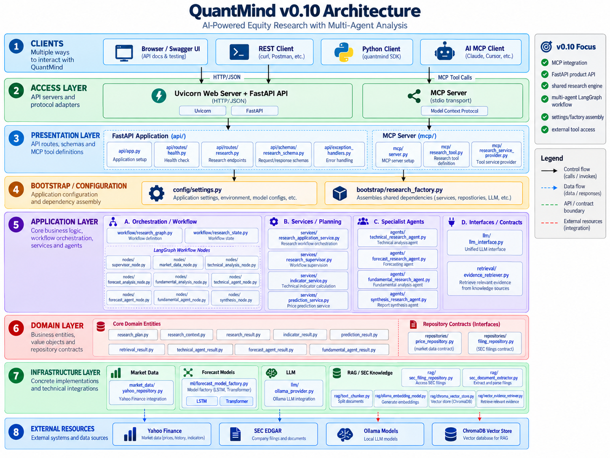
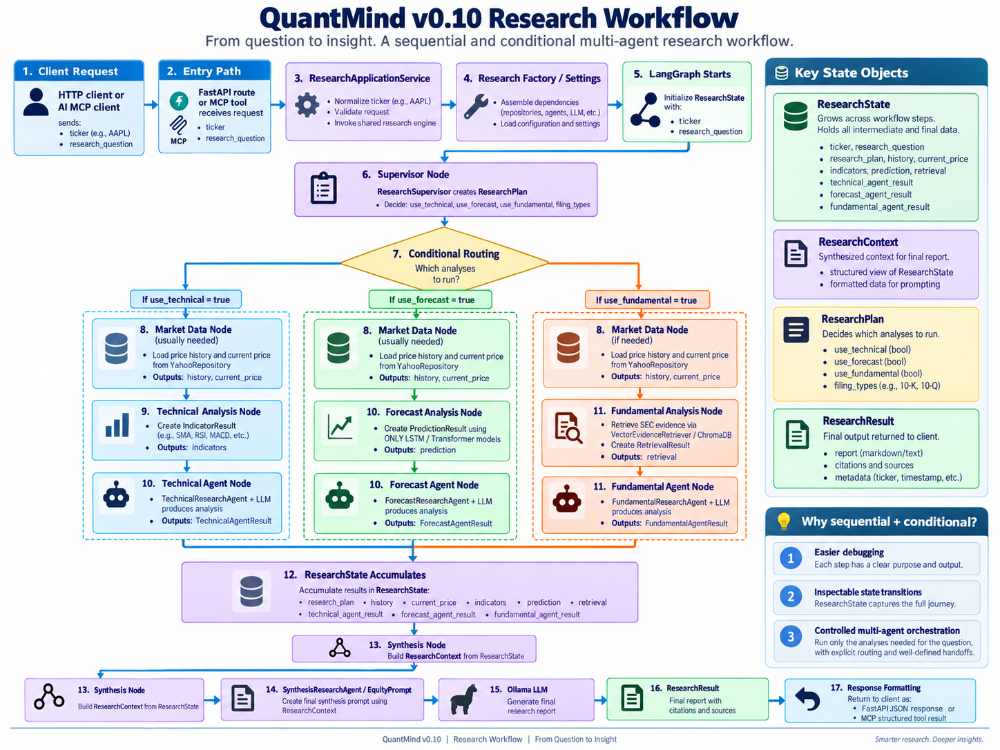

# QuantMind – AI Quant Research Platform

> **Where Quantitative Finance Meets AI Engineering.**

QuantMind is an open-source **Financial AI Research Platform** that combines quantitative finance, financial econometrics, technical analysis, deep-learning forecasting, SEC filing retrieval, retrieval-augmented generation (RAG), and LLM-driven multi-agent reasoning into a unified research workflow.

The platform is designed for **AI-assisted investment research, explainable financial intelligence, and decision support** rather than autonomous trading.

---

## Current Milestone — v0.10 MCP Integration

Version 0.10 extends QuantMind from a reusable FastAPI-based Financial AI application into a **multi-interface research platform that can also be discovered and invoked by external AI systems through the Model Context Protocol (MCP)**.

The v0.8 multi-agent research engine and the v0.9 `ResearchApplicationService` remain the core execution path. v0.10 adds:

- Model Context Protocol integration using `mcp==2.1.1`
- `QuantMind MCP Server`
- Discoverable `research_equity` MCP tool
- Typed MCP input / output contracts
- `ResearchToolResult` public MCP result model
- Shared `ResearchApplicationService` for CLI, FastAPI, and MCP
- MCP tool discovery through `tools/list`
- MCP tool execution through `tools/call`
- Structured MCP tool results
- MCP error-path handling
- External stdio MCP transport
- Separate MCP server process validation
- Automated MCP regression tests
- Clean separation between FastAPI and MCP presentation adapters
- Dedicated automated test suite under `tests/`
- Manual real-engine regression scripts under `scripts/manual_regression/`

The core architectural principle is now:

```text
                        External World
                             │
          ┌──────────────────┼──────────────────┐
          │                  │                  │
          ▼                  ▼                  ▼
         CLI              FastAPI              MCP
          │                  │                  │
          └──────────────────┼──────────────────┘
                             ▼
                ResearchApplicationService
                             ▼
                    QuantMind Research Engine
```

QuantMind builds the research engine once and exposes it through multiple interfaces.

---

# Architecture



QuantMind v0.10 separates external interfaces from the financial research engine.

```text
Human User                 Software Client                 AI Host / LLM
    │                            │                              │
    ▼                            ▼                              ▼
 main.py                      FastAPI                       MCP Client
 CLI Adapter                 HTTP Adapter                       │
    │                            │                              │ MCP
    │                            │                              ▼
    │                            │                   QuantMind MCP Server
    │                            │                      research_equity
    │                            │                              │
    └──────────────┬─────────────┴──────────────────────────────┘
                   ▼
        ResearchApplicationService
                   ▼
        Conditional LangGraph Workflow
                   ▼
             ResearchSupervisor
                   ▼
              ResearchPlan
                   ▼
     selected specialist research branches
                   ▼
                Synthesis
                   ▼
             ResearchResult
```

The three entry points are presentation adapters. None of them owns the financial research workflow.

---

# Research Workflow



The research engine remains **stateful, conditional, multi-agent, and intentionally sequential**.

```text
Research Request
      ↓
ResearchApplicationService
      ↓
Initial ResearchState
      ↓
LangGraph
      ↓
ResearchSupervisor
      ↓
ResearchPlan
      ↓
Conditional Routing
      ↓
Selected Research Branches
      ↓
Specialist Agent Results
      ↓
ResearchState
      ↓
SynthesisNode
      ↓
ResearchContext
      ↓
SynthesisResearchAgent
      ↓
LLM
      ↓
Final Report
      ↓
ResearchResult
```

Conditional execution determines **which analytical branches run**.

Sequential execution determines **the order in which selected branches run**.

The current workflow deliberately avoids parallel fan-out so state transitions, tool execution, evidence flow, and agent behavior remain easier to inspect, test, and debug.

---

# Application Interfaces

QuantMind v0.10 exposes the same research engine through three interfaces.

## CLI

```text
main.py
   ↓
ResearchApplicationService
   ↓
QuantMind Research Engine
   ↓
ResearchResult
   ↓
Console
```

The CLI is useful for local development, debugging, experimentation, and direct human execution.

## FastAPI

```text
HTTP Client
    ↓
Uvicorn
    ↓
FastAPI
    ↓
ResearchApplicationService
    ↓
QuantMind Research Engine
    ↓
ResearchResult
    ↓
ResearchResponse
    ↓
HTTP / JSON
```

FastAPI exposes QuantMind to conventional software clients.

## MCP

```text
AI Host / LLM
      ↓
MCP Client
      ↓
tools/list
      ↓
research_equity discovered
      ↓
tools/call
      ↓
QuantMind MCP Server
      ↓
ResearchApplicationService
      ↓
QuantMind Research Engine
      ↓
ResearchResult
      ↓
ResearchToolResult
      ↓
MCP Client
      ↓
AI Host / LLM
```

MCP exposes QuantMind as a discoverable AI research capability.

---

# MCP Integration

QuantMind v0.10 uses the **Model Context Protocol (MCP)** to expose financial research capabilities to AI-oriented clients.

The current MCP presentation package is:

```text
app/presentation/mcp/
├── __init__.py
├── research_service_provider.py
├── research_tool_schema.py
└── server.py
```

The MCP adapter is intentionally thin.

```text
MCP Client
    ↓
QuantMind MCP Server
    ↓
research_equity()
    ↓
ResearchApplicationService
```

The MCP layer does not contain technical-analysis logic, forecasting logic, RAG logic, LangGraph orchestration, or financial-research reasoning.

Those capabilities remain inside the shared QuantMind application and research engine.

---

# MCP Tool — `research_equity`

QuantMind currently exposes one primary MCP tool:

```text
research_equity(
    ticker: str,
    research_question: str
)
```

The tool accepts:

```text
ticker
research_question
```

The MCP SDK generates the discoverable input schema automatically from the Python type hints.

The public tool result is:

```text
ResearchToolResult
├── ticker
├── research_question
├── research_plan
│   ├── use_technical
│   ├── use_forecast
│   ├── use_fundamental
│   └── filing_types
└── report
```

The return lifecycle is:

```text
ResearchResult
      ↓
research_equity()
      ↓
ResearchToolResult
      ↓
MCP structured result
```

This preserves separation between the application-level result and the public MCP contract.

---

# MCP Host, Client, Server, and Tool

QuantMind follows the standard MCP responsibility model:

```text
MCP Host
├── LLM / Agent
└── MCP Client
      │
      │ MCP
      ▼
QuantMind MCP Server
      ↓
research_equity
```

Responsibilities:

```text
LLM / Agent
= reasons about whether a tool should be used

MCP Client
= handles MCP communication

MCP Server
= exposes QuantMind capabilities

MCP Tool
= one callable capability exposed by the server
```

The LLM is not the MCP client. The LLM reasons; the MCP client communicates.

---

# MCP stdio Transport

QuantMind v0.10 validates MCP communication through **stdio transport**.

```text
Parent Process
MCP Client
      │
      │ stdin / stdout pipes
      ▼
Child Process
QuantMind MCP Server
```

The MCP client can launch:

```text
python -m app.presentation.mcp.server
```

as a separate process and communicate with the server through operating-system standard-input and standard-output streams.

This provides a local MCP transport without requiring HTTP, a TCP port, or Uvicorn.

---

# FastAPI Research API

## Health Check

```http
GET /health
```

Example response:

```json
{
  "status": "ok",
  "service": "QuantMind"
}
```

## Research Request

```http
POST /research
```

Example request:

```json
{
  "ticker": "AAPL",
  "research_question": "What are Apple's recent business risks?"
}
```

Example response structure:

```json
{
  "ticker": "AAPL",
  "research_question": "What are Apple's recent business risks?",
  "research_plan": {
    "use_technical": false,
    "use_forecast": false,
    "use_fundamental": true,
    "filing_types": [
      "10-Q"
    ]
  },
  "report": "..."
}
```

The public API deliberately does not expose internal `ResearchState`.

---

# Application Boundary

`ResearchApplicationService` is the stable application-level entry point shared by CLI, FastAPI, and MCP.

```text
Presentation Adapter
        ↓
ResearchApplicationService
        ↓
Initial ResearchState
        ↓
LangGraph
        ↓
Completed ResearchState
        ↓
ResearchResult
```

This prevents presentation code from depending directly on LangGraph internals.

```text
                       ResearchApplicationService
                      ▲            ▲            ▲
                      │            │            │
                   main.py      FastAPI        MCP
```

---

# ResearchResult vs. Public Interface Models

QuantMind separates application output from presentation-specific output.

```text
ResearchResult
= stable application-level result

ResearchResponse
= public FastAPI / HTTP representation

ResearchToolResult
= public MCP tool representation
```

`ResearchResult` currently contains:

```text
ticker
research_question
research_plan
report
```

FastAPI maps it to `ResearchResponse`.

MCP maps it to `ResearchToolResult`.

---

# Research Supervisor

The `ResearchSupervisor` interprets the research objective and decides which research capabilities should execute.

It determines whether a request requires:

```text
Technical analysis
Forecast analysis
Fundamental analysis
SEC 10-K evidence
SEC 10-Q evidence
```

The decision becomes a structured `ResearchPlan`.

```python
ResearchPlan(
    use_technical=True,
    use_forecast=True,
    use_fundamental=True,
    filing_types=[
        "10-K",
        "10-Q",
    ],
)
```

This separates probabilistic planning from deterministic workflow execution:

```text
Natural-Language Question
        ↓
LLM Planning
        ↓
ResearchPlan
        ↓
Deterministic LangGraph Routing
```

---

# ResearchState

QuantMind uses a typed `ResearchState` as shared workflow state.

```text
ResearchState
├── ticker
├── research_question
├── research_plan
├── history
├── current_price
├── indicators
├── prediction
├── retrieval
├── technical_agent_result
├── forecast_agent_result
├── fundamental_agent_result
└── report
```

`ResearchState` represents **everything the workflow knows during execution**.

---

# ResearchContext

`ResearchState` and `ResearchContext` serve different purposes.

```text
ResearchState
= everything required during workflow execution

ResearchContext
= curated evidence and specialist interpretations
  required for final synthesis
```

The synthesis lifecycle is:

```text
ResearchState
     ↓
SynthesisNode
     ↓
ResearchContext
     ↓
EquityPrompt
     ↓
SynthesisResearchAgent
     ↓
LLM
     ↓
Final Report
```

---

# Multi-Agent Research System

QuantMind uses specialist agents to interpret evidence produced by deterministic services.

## Technical Research Agent

```text
MarketDataNode
        ↓
TechnicalAnalysisNode
        ↓
IndicatorService
        ↓
IndicatorResult
        ↓
TechnicalAgentNode
        ↓
TechnicalResearchAgent
        ↓
TechnicalAgentResult
```

## Forecast Research Agent

```text
MarketDataNode
        ↓
ForecastAnalysisNode
        ↓
PredictionService
        ↓
PredictionResult
        ↓
ForecastAgentNode
        ↓
ForecastResearchAgent
        ↓
ForecastAgentResult
```

## Fundamental Research Agent

```text
FundamentalAnalysisNode
        ↓
EvidenceRetriever
        ↓
RetrievalResult
        ↓
FundamentalAgentNode
        ↓
FundamentalResearchAgent
        ↓
FundamentalAgentResult
```

## Synthesis Research Agent

```text
ResearchState
        ↓
SynthesisNode
        ↓
ResearchContext
        ↓
SynthesisResearchAgent
        ↓
EquityPrompt
        ↓
LLM
        ↓
Final Report
```

---

# Technical Analysis

QuantMind provides deterministic technical indicators including:

- Simple Moving Average (SMA)
- Exponential Moving Average (EMA)
- Relative Strength Index (RSI)
- Moving Average Convergence Divergence (MACD)

```text
Market Data
    ↓
Price Series
    ↓
IndicatorService
    ├── SMA
    ├── EMA
    ├── RSI
    └── MACD
    ↓
IndicatorResult
```

Technical evidence is produced only when required by the `ResearchPlan`.

---

# Forecasting

QuantMind supports deep-learning forecasting through:

```text
LSTM
Transformer
```

There is currently **no ARIMA forecasting implementation** in the active platform architecture.

```text
PredictionService
        ↓
ForecastModel Interface
        ↓
ForecastModelFactory
        ↓
LSTM or Transformer
        ↓
PredictionResult
```

Current forecasting output includes:

```text
forecast horizon
predicted return
predicted price
direction
validation RMSE
validation MAE
baseline RMSE
improvement over baseline
baseline-beating status
```

---

# Fundamental Research & RAG

QuantMind includes an evidence-grounded fundamental research pipeline using SEC filings.

Supported filing types:

```text
SEC 10-K
SEC 10-Q
```

Offline ingestion:

```text
SEC EDGAR
    ↓
SECFilingRepository
    ↓
SECDocumentExtractor
    ↓
TextChunker
    ↓
OllamaEmbeddingModel
    ↓
Chroma Vector Store
```

Online research:

```text
Research Question
    ↓
ResearchPlan
    ↓
EvidenceRetriever
    ↓
Existing Chroma Knowledge
    ↓
FundamentalResearchAgent
```

Normal research runtime does not re-download and re-embed SEC filings.

---

# Evidence-Grounded Multi-Agent Synthesis

QuantMind distinguishes factual evidence from agent interpretation.

```text
Raw / Structured Evidence
        +
Specialist-Agent Interpretation
        ↓
Synthesis Agent
        ↓
Final Research Report
```

Evidence is treated as the factual grounding layer.

Specialist-agent output is treated as interpretation rather than new factual evidence.

LLM output remains probabilistic and should be independently verified.

---

# LLM Runtime Context

Integrated multi-agent synthesis requires sufficient runtime context.

QuantMind currently configures Ollama with:

```text
num_ctx = 16384
```

A smaller runtime context caused earlier evidence streams to be omitted during integrated synthesis even when application state and prompt construction were correct.

This reinforces an important AI-systems principle:

```text
Correct application code
        ≠
Correct AI-system behavior
```

Inference-runtime configuration is part of system architecture.

---

# Configuration & Bootstrap

Concrete dependencies are assembled in:

```text
app/bootstrap/research_factory.py
```

Runtime configuration is centralized in:

```text
app/config/settings.py
```

The composition root wires:

```text
YahooRepository
IndicatorService
ForecastModelFactory
PredictionService
OllamaEmbeddingModel
ChromaVectorStore
VectorEvidenceRetriever
OllamaProvider
LangGraph research graph
ResearchApplicationService
```

Presentation adapters do not construct infrastructure directly.

---

# Project Structure

```text
ai-quant-research-platform/
│
├── app/
│   ├── application/
│   │   ├── agents/
│   │   ├── exceptions/
│   │   ├── knowledge/
│   │   ├── llm/
│   │   ├── prompts/
│   │   ├── retrieval/
│   │   ├── services/
│   │   └── workflow/
│   │
│   ├── bootstrap/
│   │   └── research_factory.py
│   │
│   ├── config/
│   │   └── settings.py
│   │
│   ├── domain/
│   │   ├── entities/
│   │   ├── forecast/
│   │   ├── indicators/
│   │   └── repositories/
│   │
│   ├── infrastructure/
│   │   ├── llm/
│   │   ├── market_data/
│   │   ├── ml/
│   │   └── rag/
│   │
│   └── presentation/
│       ├── api/
│       └── mcp/
│           ├── __init__.py
│           ├── research_service_provider.py
│           ├── research_tool_schema.py
│           └── server.py
│
├── scripts/
│   └── manual_regression/
│       ├── check_10q_retrieval.py
│       ├── check_forecast_agent.py
│       ├── check_fundamental_agent.py
│       ├── check_supervisor.py
│       └── check_technical_agent.py
│
├── tests/
│   ├── test_api.py
│   ├── test_mcp.py
│   ├── test_mcp_stdio.py
│   └── test_settings.py
│
├── data/
│   └── chroma/
│
├── docs/
│   └── images/
│       ├── architecture_v0.10.png
│       └── workflow_v0.10.png
│
├── knowledge_setup.py
├── main.py
├── requirements.txt
├── requirements-dev.txt
└── README.md
```

---

# Running QuantMind

## Install runtime dependencies

```powershell
python -m pip install -r requirements.txt
```

## Install development dependencies

```powershell
python -m pip install -r requirements-dev.txt
```

## Run CLI research

```powershell
python main.py
```

## Run FastAPI

```powershell
python -m uvicorn app.presentation.api.app:app --reload
```

Swagger UI:

```text
http://127.0.0.1:8000/docs
```

## Run MCP Server

```powershell
python -m app.presentation.mcp.server
```

The default MCP server uses stdio transport.

---

# Testing

Automated regression tests live under:

```text
tests/
```

Run the complete automated suite:

```powershell
python -m pytest tests -v
```

Current v0.10 regression status:

```text
FastAPI tests        7
MCP tests            4
MCP stdio test       1
Settings tests       2
──────────────────────
Total               14 passing
```

The MCP suite verifies:

```text
tool registration
tool discovery
tool execution
ticker normalization
MCP error behavior
external stdio process transport
```

Real-system diagnostic checks are intentionally separated from pytest:

```text
scripts/manual_regression/
```

Examples:

```powershell
python -m scripts.manual_regression.check_supervisor
python -m scripts.manual_regression.check_technical_agent
python -m scripts.manual_regression.check_forecast_agent
python -m scripts.manual_regression.check_fundamental_agent
python -m scripts.manual_regression.check_10q_retrieval
```

---

# Dependency Policy

QuantMind maintains separate runtime and development dependency files.

Runtime:

```text
requirements.txt
```

Development:

```text
requirements-dev.txt
```

v0.10 adds:

```text
mcp==2.1.1
```

to runtime dependencies and:

```text
mcp[cli]==2.1.1
```

to development dependencies.

Dependency integrity is verified with:

```powershell
python -m pip check
```

---

# Design Principles

QuantMind follows several architectural principles:

- **Clean Architecture** — presentation, application, domain, and infrastructure concerns remain separated.
- **Single application boundary** — CLI, FastAPI, and MCP reuse `ResearchApplicationService`.
- **Evidence before interpretation** — deterministic services and retrieval produce evidence before LLM agents interpret it.
- **Typed state and contracts** — workflow state, application results, HTTP schemas, and MCP schemas are explicit.
- **Conditional orchestration** — only required research branches execute.
- **Sequential multi-agent execution** — selected branches execute in an inspectable order.
- **Replaceable infrastructure** — LLM providers, forecasting models, data repositories, and vector stores remain swappable.
- **Offline / online separation** — SEC ingestion is separate from normal research execution.
- **Explainable research** — specialist reasoning is grounded in observable evidence and structured results.
- **Multi-interface reuse** — one research engine can serve humans, conventional software, and AI systems.

---

# Roadmap

```text
v0.1  ✓ Initial AI market research MVP
v0.2  ✓ Technical indicators
v0.3  ✓ Forecasting foundation
v0.4  ✓ Deep-learning forecasting
v0.5  ✓ SEC filings + RAG
v0.6  ✓ LangGraph research workflow
v0.7  ✓ Agentic research planning
v0.8  ✓ Multi-agent research system
v0.9  ✓ FastAPI + Productization
v0.10 ✓ MCP Integration

v0.11   AWS Deployment + Docker Containerization
v0.12   CI/CD + Production Engineering
v0.13   Earnings-Call / Financial-News Ingestion
        + AI Evaluation / Grounding / Provenance
v0.14   Portfolio Intelligence + Web Dashboard
v1.0    Production-Grade Financial AI Platform
```

---

# Planned Product Expansion

QuantMind's planned product roadmap includes:

- Earnings-call transcript ingestion
- Financial-news retrieval
- Portfolio analysis
- Web dashboard
- Docker-based deployment
- AWS cloud deployment
- CI/CD and production engineering
- AI evaluation, grounding, and provenance

These capabilities are intentionally staged across future releases:

```text
v0.11
AWS deployment
Docker containerization

v0.12
CI/CD
Production engineering

v0.13
Earnings-call transcript ingestion
Financial-news retrieval
AI evaluation
Grounding
Provenance

v0.14
Portfolio intelligence
Portfolio analysis
Web dashboard

v1.0
Integrated production-grade Financial AI platform
```

This keeps the roadmap incremental while preserving the broader QuantMind product vision.

---

# Technology Stack

```text
Python
pandas / NumPy
PyTorch
scikit-learn
Yahoo Finance
Ollama
Qwen
LangGraph
ChromaDB
SEC EDGAR
FastAPI
Uvicorn
Pydantic
Model Context Protocol (MCP)
pytest
```

---

# Project Goal

QuantMind is being developed as an open-source **Financial AI research system** demonstrating how quantitative finance, financial econometrics, machine learning, RAG, multi-agent reasoning, APIs, and AI interoperability can be combined within a clean and scalable software architecture.

The goal is not to automate trading decisions.

The goal is to build a transparent, inspectable, extensible research platform capable of supporting:

```text
Equity Research
Quantitative Analysis
Technical Analysis
Forecasting
Fundamental Research
SEC Filing Analysis
Portfolio Research
AI-Assisted Investment Decision Support
External AI Agent Integration
```

---

## Disclaimer

QuantMind is an educational and research project.

It does not provide investment advice, brokerage services, or autonomous trading recommendations.

Financial forecasts, LLM outputs, and research conclusions should be independently verified before use in real-world investment decisions.
