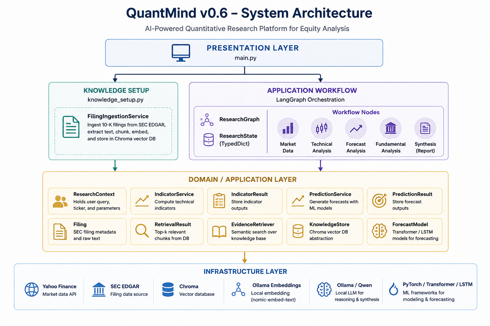
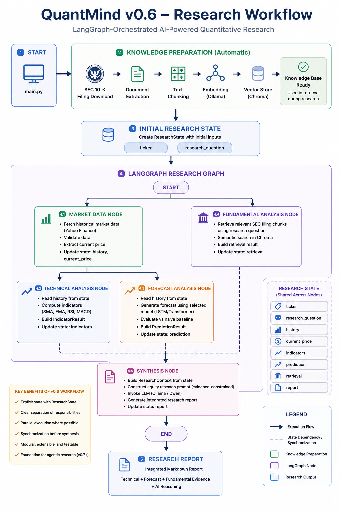

<div align="center">

# QuantMind

### *Where Quantitative Finance Meets AI Engineering*

**An open-source platform for explainable AI-powered quantitative investment research.**

QuantMind integrates **financial econometrics**, **technical analysis**, **deep learning**, **Retrieval-Augmented Generation (RAG)**, **LangGraph workflow orchestration**, **large language models**, and **Clean Architecture** into a unified equity-research workflow.


</div>

---

## System Architecture



---

## Research Workflow



---

## At a Glance

**Current release:** `v0.6 — LangGraph Research Orchestration`

QuantMind currently provides:

- deterministic technical analysis using SMA, EMA, RSI, and MACD;
- return-based forecasting using LSTM and Transformer models;
- a shared forecasting contract and centralized model factory;
- consistent model evaluation against a naive zero-return baseline;
- SEC 10-K filing ingestion;
- SEC document extraction and text chunking;
- local embedding generation through Ollama;
- persistent vector storage through Chroma;
- semantic retrieval of fundamental filing evidence;
- automatic fundamental knowledge preparation before research execution;
- integration of technical, forecast, and fundamental evidence;
- explicit research workflow state through `ResearchState`;
- LangGraph-based research orchestration;
- graph-based decomposition into market-data, technical-analysis, forecast-analysis, fundamental-analysis, and synthesis nodes;
- local LLM reasoning through Ollama;
- evidence-constrained Markdown equity research reports;
- a Clean Architecture foundation designed for future agents, APIs, MCP, and cloud deployment.

### Current Status

| Component | Status |
|---|:---:|
| Yahoo Finance market-data integration | Complete |
| SMA, EMA, RSI, and MACD | Complete |
| LSTM return forecasting | Complete |
| Transformer return forecasting | Complete |
| Shared `ForecastModel` interface | Complete |
| `ForecastModelFactory` | Complete |
| `PredictionService` | Complete |
| Naive baseline comparison | Complete |
| Dynamic model-aware reporting | Complete |
| Evidence-constrained prompting | Complete |
| SEC 10-K filing ingestion | Complete |
| SEC document extraction | Complete |
| Text chunking | Complete |
| Ollama embedding generation | Complete |
| Chroma vector storage | Complete |
| Semantic filing-evidence retrieval | Complete |
| Financial Knowledge Engine (RAG) | Complete |
| Integrated knowledge preparation | Complete |
| Integrated quantitative + fundamental reporting | Complete |
| `ResearchState` | Complete |
| LangGraph `ResearchGraph` | Complete |
| Market-data research node | Complete |
| Technical-analysis research node | Complete |
| Forecast-analysis research node | Complete |
| Fundamental-analysis research node | Complete |
| Synthesis research node | Complete |
| Graph-based research orchestration | Complete |
| SEC 10-Q research | Planned |
| Earnings-call transcript ingestion | Planned |
| Financial-news retrieval | Planned |
| Multi-agent research workflow | Planned |
| Conditional agent routing | Planned |
| FastAPI platform | Planned |
| Cloud deployment and CI/CD | Planned |
| MCP integration | Planned |

---

## Project Overview

QuantMind is an open-source AI Quant Research Platform designed to combine quantitative finance and modern AI engineering in a transparent and extensible research system.

The current release combines:

- structured market data;
- deterministic technical indicators;
- return-based deep-learning forecasts;
- model evaluation;
- SEC filing ingestion;
- semantic evidence retrieval;
- Retrieval-Augmented Generation;
- explicit graph state;
- LangGraph workflow orchestration;
- evidence-constrained LLM reasoning.

The result is an integrated professional Markdown equity research report.

QuantMind v0.5 introduced a **Financial Knowledge Engine based on Retrieval-Augmented Generation (RAG)**.

QuantMind v0.5.1 integrated fundamental knowledge preparation into the application entry path so that the latest requested SEC filing can be prepared before research execution.

QuantMind v0.6 introduces **LangGraph Research Orchestration**, replacing the previous monolithic sequential research orchestration path with an explicit stateful graph.

The research workflow now represents market data, technical analysis, forecasting, fundamental retrieval, and research synthesis as distinct graph responsibilities coordinated through a shared `ResearchState`.

This allows QuantMind to distinguish between:

1. deterministic technical evidence;
2. model-based forecast evidence;
3. retrieved fundamental evidence;
4. workflow state and orchestration;
5. generative interpretation.

QuantMind is **not intended to be an automated trading system**.

Its focus is:

- explainable investment research;
- predictive analytics;
- transparent model evaluation;
- evidence retrieval;
- AI-assisted research synthesis;
- explicit research workflow orchestration;
- investment decision support.

---

## Why QuantMind?

Many AI-finance demonstrations follow a simple pattern:

```text
Download prices
      |
Calculate indicators
      |
Send everything to an LLM
      |
Generate a recommendation
```

QuantMind takes a different approach.

It treats quantitative analysis, forecasting, financial knowledge retrieval, workflow orchestration, and generative reasoning as separate engineering responsibilities.

```text
Technical Evidence -----------+
                              |
Forecast Evidence ------------+----> ResearchState
                              |
Fundamental Evidence ---------+
                                      |
                                      v
                               ResearchContext
                                      |
                                      v
                                  EquityPrompt
                                      |
                                      v
                                   Local LLM
                                      |
                                      v
                            Integrated Research Report
```

This makes the system easier to:

- test;
- extend;
- debug;
- evaluate;
- explain;
- orchestrate;
- replace component by component.

---

## Research Philosophy

QuantMind follows one core principle:

> **Separate deterministic mathematics, statistical forecasting, retrieved knowledge, workflow orchestration, and generative AI reasoning into independent responsibilities.**

```text
Historical Market Data
        |
        +----> Deterministic Quantitative Analysis
        |
        +----> Statistical Forecasting

SEC Filings
        |
        +----> Retrieval-Augmented Knowledge

Research Question
        |
        +----> LangGraph Research Workflow
                        |
                        v
                  ResearchState
                        |
                        v
               ResearchContext
                        |
                        v
            Evidence-Constrained AI Reasoning
                        |
                        v
              Markdown Research Report
```

Each stage answers a different research question.

| Stage | Research Question |
|---|---|
| Technical analysis | What is the current quantitative market configuration? |
| Forecasting | What next-period return does the model estimate? |
| Model evaluation | Does the model improve on a simple benchmark? |
| Fundamental retrieval | What relevant evidence exists in the company's filings? |
| Workflow orchestration | Which research responsibilities can execute, and what state do they produce? |
| AI reasoning | How should these separate evidence streams be interpreted together? |

This design keeps calculations reproducible, forecasts measurable, retrieved evidence traceable, workflow execution explicit, and LLM explanations grounded in supplied information.

---

## Engineering Highlights

| Engineering Area | Implementation |
|---|---|
| Software architecture | Clean Architecture |
| Design principles | SOLID, dependency inversion, separation of concerns |
| Design patterns | Factory Pattern and Dependency Injection |
| Workflow orchestration | LangGraph |
| Workflow state | `ResearchState` |
| Research graph | `ResearchGraph` |
| Market data | Yahoo Finance repository |
| Technical analysis | SMA, EMA, RSI, and MACD |
| Forecasting | LSTM and Transformer |
| Forecast contract | Shared `ForecastModel` interface |
| Model creation | `ForecastModelFactory` |
| Application services | `IndicatorService`, `PredictionService`, `FilingIngestionService` |
| Research orchestration | LangGraph research nodes and graph |
| Financial knowledge | Retrieval-Augmented Generation (RAG) |
| Filing source | SEC filings |
| Document processing | SEC document extraction and text chunking |
| Embeddings | Ollama embedding model |
| Vector database | Chroma |
| Knowledge abstraction | `KnowledgeStore` |
| Retrieval abstraction | `EvidenceRetriever` |
| Fundamental evidence | `FundamentalEvidence` and `RetrievalResult` |
| AI runtime | Ollama |
| LLM reasoning | Qwen with evidence-constrained prompting |
| Evaluation | RMSE, MAE, and naive baseline comparison |
| Output | Integrated Markdown equity research report |
| Documentation | Versioned architecture and workflow documentation |

---

# The Three Research Evidence Streams

QuantMind integrates three distinct research evidence streams.

## 1. Technical Analysis

Technical analysis is deterministic.

```text
Historical Prices
        |
        v
 IndicatorService
        |
        +----> SMA
        +----> EMA
        +----> RSI
        +----> MACD
        |
        v
 IndicatorResult
```

The LLM does not calculate these indicators.

It receives the calculated values as structured evidence.

This keeps quantitative computation outside the generative model.

---

## 2. Forecast Analysis

Forecasting is handled independently from technical analysis.

```text
Historical Prices
        |
        v
 PredictionService
        |
        v
 ForecastModel
        |
        +--------------------+
        |                    |
        v                    v
 LSTMForecastModel   TransformerForecastModel
        |                    |
        +---------+----------+
                  |
                  v
          PredictionResult
```

Both models implement a shared forecasting contract.

This allows model implementations to be replaced without changing the higher-level research workflow.

The forecasting subsystem evaluates predictions using:

- validation RMSE;
- validation MAE;
- naive zero-return baseline RMSE;
- improvement over baseline.

This prevents the report from treating a model forecast as meaningful simply because a prediction exists.

---

## 3. Fundamental Analysis through RAG

Fundamental evidence is derived from SEC filings.

The knowledge pipeline is separated into two distinct processes:

### Knowledge Preparation

```text
SEC Filing
    |
    v
SECFilingRepository
    |
    v
Filing
    |
    v
FilingIngestionService
    |
    v
KnowledgeStore
    |
    v
VectorKnowledgeStore
    |
    +----> Document Extraction
    |
    +----> Text Chunking
    |
    +----> Ollama Embeddings
    |
    v
Chroma Vector Store
```

### Research-Time Retrieval

```text
Research Question
       |
       v
EvidenceRetriever
       |
       v
VectorEvidenceRetriever
       |
       +----> Query Embedding
       |
       +----> Chroma Vector Search
       |
       v
FundamentalEvidence
       |
       v
RetrievalResult
```

The distinction is important:

> **Ingestion prepares the knowledge base. Retrieval uses the knowledge base during research.**

Technical analysis and forecasting do not depend on RAG.

They remain independent evidence-producing pipelines coordinated by the research graph.

---

# Financial Knowledge Engine (RAG)

The Financial Knowledge Engine enables QuantMind to retrieve relevant evidence from SEC filings before generating a research report.

## RAG Pipeline

```text
                     KNOWLEDGE PREPARATION

SEC Filing
    |
    v
SECFilingRepository
    |
    v
Filing
    |
    v
FilingIngestionService
    |
    v
VectorKnowledgeStore
    |
    v
SECDocumentExtractor
    |
    v
TextChunker
    |
    v
OllamaEmbeddingModel
    |
    v
ChromaVectorStore
    |
    v
Persistent Vector Knowledge


                     RESEARCH EXECUTION

Research Question
    |
    v
VectorEvidenceRetriever
    |
    v
OllamaEmbeddingModel
    |
    v
ChromaVectorStore
    |
    v
Relevant Filing Chunks
    |
    v
FundamentalEvidence
    |
    v
RetrievalResult
```

The current implementation has been tested with SEC 10-K filings.

Future versions can extend the same architecture to additional sources such as:

- 10-Q filings;
- earnings-call transcripts;
- financial news;
- other structured or unstructured financial documents.

---

# LangGraph Research Orchestration

QuantMind v0.6 introduces an explicit graph-based research workflow using LangGraph.

The previous sequential orchestration concentrated the complete research process inside `ResearchService.research()`.

v0.6 decomposes that workflow into explicit nodes coordinated through `ResearchState`.

## ResearchState

`ResearchState` is the shared state for one graph execution.

Conceptually, it acts as a structured workspace through which research nodes exchange results.

```text
ResearchState
|
+-- ticker
+-- research_question
+-- history
+-- current_price
+-- indicators
+-- prediction
+-- retrieval
+-- report
```

`ResearchState` is not global application state.

Each graph invocation receives its own research state.

The initial state begins with:

```text
ticker
research_question
```

As the graph executes, nodes add the evidence required by later stages.

---

## Research Nodes

The v0.6 graph contains five major research nodes.

### Market Data Node

Responsible for:

- retrieving historical market data;
- validating that market data exists;
- extracting the current market price;
- placing market history into `ResearchState`.

### Technical Analysis Node

Responsible for:

- reading historical prices from state;
- invoking `IndicatorService`;
- producing `IndicatorResult`;
- adding technical evidence to state.

### Forecast Analysis Node

Responsible for:

- reading historical prices from state;
- invoking `PredictionService`;
- running the selected `ForecastModel`;
- producing `PredictionResult`;
- adding forecast evidence to state.

### Fundamental Analysis Node

Responsible for:

- reading the ticker and research question;
- invoking `EvidenceRetriever`;
- retrieving relevant SEC filing evidence;
- producing `RetrievalResult`;
- adding fundamental evidence to state.

### Synthesis Node

Responsible for:

- reading the completed evidence streams;
- constructing `ResearchContext`;
- building the evidence-constrained `EquityPrompt`;
- invoking the local LLM;
- storing the final research report in state.

---

## Graph Execution

The v0.6 workflow is represented explicitly:

```text
                         START
                           |
              +------------+------------+
              |                         |
              v                         v
        Market Data                Fundamental
              |                      Analysis
        +-----+-----+                   |
        |           |                   |
        v           v                   |
   Technical     Forecast               |
   Analysis      Analysis               |
        |           |                   |
        +-----------+---------+---------+
                              |
                              v
                          Synthesis
                              |
                              v
                             END
```

This graph captures real workflow dependencies.

Technical analysis and forecasting require market history.

Fundamental retrieval depends on the ticker and research question but does not require market history.

Synthesis requires the completed quantitative and fundamental evidence streams.

---

## Why LangGraph?

Everything performed by the current graph could also be implemented using ordinary Python control flow.

The architectural value of LangGraph is not that it makes previously impossible computation possible.

Its value is that workflow behavior becomes explicit.

```text
Python-only orchestration

ResearchService.research()
        |
        +---- local variables
        +---- implicit execution order
        +---- orchestration embedded in method


LangGraph orchestration

ResearchState
        |
        v
Explicit Nodes
        |
        v
Explicit Edges
        |
        v
StateGraph
        |
        v
Compiled Research Workflow
```

This provides a stronger foundation for future:

- branching;
- conditional routing;
- loops;
- retries;
- parallel research paths;
- agent coordination;
- human-in-the-loop workflows;
- workflow observability.

v0.6 intentionally introduces the graph foundation without artificially adding agent behavior that is not yet required.

---

# Clean Architecture

QuantMind follows Clean Architecture principles.

```text
Presentation
     |
     v
Application
     |
     v
Domain

Infrastructure implements external capabilities
used through architectural boundaries.
```

The architecture separates:

- business concepts;
- application services;
- workflow orchestration;
- external data access;
- machine-learning implementations;
- vector databases;
- embedding models;
- LLM providers.

---

## Domain Layer

The Domain layer contains core financial entities and domain abstractions.

Examples include:

```text
ResearchContext
IndicatorResult
PredictionResult
Filing
FundamentalEvidence
RetrievalResult
PriceRepository
FilingRepository
ForecastModel
```

The Domain layer does not know about:

- Yahoo Finance;
- SEC HTTP access;
- Chroma;
- Ollama;
- Qwen;
- LangGraph infrastructure details;
- PyTorch infrastructure details.

---

## Application Layer

The Application layer coordinates use cases and research workflow responsibilities.

Key services include:

```text
IndicatorService
PredictionService
FilingIngestionService
```

Application-level abstractions include:

```text
KnowledgeStore
EvidenceRetriever
LLMInterface
```

The LangGraph workflow is implemented through:

```text
ResearchState
ResearchGraph

MarketDataNode
TechnicalAnalysisNode
ForecastAnalysisNode
FundamentalAnalysisNode
SynthesisNode
```

`ResearchGraph` is the official v0.6 online research orchestrator.

`FilingIngestionService` remains a separate application use case responsible for preparing the financial knowledge base.

`ResearchService` is retained as the earlier sequential reference implementation, but the official `main.py` execution path now uses `ResearchGraph`.

---

## Infrastructure Layer

The Infrastructure layer implements external technologies and concrete adapters.

Examples include:

```text
YahooRepository
SECFilingRepository
SECDocumentExtractor
TextChunker
OllamaEmbeddingModel
ChromaVectorStore
VectorKnowledgeStore
VectorEvidenceRetriever
OllamaProvider
LSTMForecastModel
TransformerForecastModel
```

This means infrastructure technologies can be replaced while preserving higher-level application logic.

For example:

```text
EvidenceRetriever
       |
       | implemented by
       v
VectorEvidenceRetriever
```

and:

```text
KnowledgeStore
       |
       | implemented by
       v
VectorKnowledgeStore
```

Similarly:

```text
FilingRepository
       |
       | implemented by
       v
SECFilingRepository
```

This is Dependency Inversion in practice.

---

# Research Workflow

A typical QuantMind v0.6 execution contains two high-level phases.

## Phase 1 — Fundamental Knowledge Preparation

```text
main.py
   |
   v
prepare_knowledge()
   |
   v
FilingIngestionService
   |
   +----> SECFilingRepository
   |
   +----> VectorKnowledgeStore
             |
             +----> SECDocumentExtractor
             +----> TextChunker
             +----> OllamaEmbeddingModel
             +----> ChromaVectorStore
```

## Phase 2 — LangGraph Research Execution

```text
main.py
   |
   v
Initial ResearchState
   |
   v
ResearchGraph
   |
  START
   |
   +-----------------------+
   |                       |
   v                       v
Market Data          Fundamental Analysis
   |                       |
   +---------+             |
   |         |             |
   v         v             |
Technical  Forecast        |
Analysis   Analysis        |
   |         |             |
   +---------+------+------+
                    |
                    v
                Synthesis
                    |
                    v
                   END
                    |
                    v
             Research Report
```

During synthesis, the completed state is converted into `ResearchContext`.

`ResearchContext` combines:

```text
ticker
current_price
history
indicators
prediction
retrieval
```

The LLM therefore receives already-structured evidence rather than being responsible for retrieving or calculating everything itself.

---

# Evidence-Constrained AI Reasoning

QuantMind deliberately limits what the LLM is allowed to infer.

The prompt distinguishes:

### Deterministic Evidence

Examples:

- current price relative to SMA;
- current price relative to EMA;
- current RSI;
- current MACD configuration.

### Model-Based Evidence

Examples:

- predicted next-day return;
- implied next-day price;
- forecast direction;
- validation RMSE;
- validation MAE;
- baseline comparison.

### Retrieved Fundamental Evidence

Examples:

- business risks described in SEC filings;
- regulatory exposure;
- supply-chain risks;
- competitive pressures;
- other evidence explicitly contained in retrieved filing passages.

The prompt instructs the model not to fabricate unsupported facts or relationships between these evidence streams.

---

# Forecasting Architecture

QuantMind supports multiple forecasting models through a shared interface.

```text
PredictionService
       |
       v
ForecastModel
       |
       +--------------------+
       |                    |
       v                    v
LSTMForecastModel   TransformerForecastModel
```

Model creation is centralized:

```text
ForecastModelFactory
       |
       v
MODEL_NAME
       |
       +----> "lstm"
       |
       +----> "transformer"
```

The application layer therefore does not need model-specific conditional logic.

Changing the model can be as simple as:

```python
MODEL_NAME = "transformer"
```

or:

```python
MODEL_NAME = "lstm"
```

---

# Model Evaluation

QuantMind evaluates forecasting models against a simple benchmark.

The naive benchmark assumes:

```text
next-day return = 0
```

The forecasting model is then compared against this baseline using validation RMSE.

```text
Forecast Model RMSE
        vs.
Naive Baseline RMSE
```

The report also receives:

```text
Validation RMSE
Validation MAE
Naive Baseline RMSE
Improvement over Baseline
```

A small improvement over the baseline is not automatically interpreted as strong predictive power.

---

# Technology Stack

| Category | Technology |
|---|---|
| Language | Python |
| Workflow orchestration | LangGraph |
| Market data | Yahoo Finance / `yfinance` |
| Data processing | pandas, NumPy |
| Deep learning | PyTorch |
| Forecasting models | LSTM, Transformer |
| Financial documents | SEC filings |
| RAG | Custom Clean Architecture RAG pipeline |
| Embeddings | Ollama |
| Vector database | Chroma |
| Local LLM runtime | Ollama |
| LLM | Qwen |
| Architecture | Clean Architecture |
| Version control | Git / GitHub |

---

# Project Structure

```text
ai-quant-research-platform/
|
+-- app/
|   |
|   +-- application/
|   |   |
|   |   +-- knowledge/
|   |   |   +-- knowledge_store.py
|   |   |
|   |   +-- retrieval/
|   |   |   +-- evidence_retriever.py
|   |   |
|   |   +-- prompts/
|   |   |   +-- equity_prompt.py
|   |   |
|   |   +-- services/
|   |   |   +-- research_service.py
|   |   |   +-- indicator_service.py
|   |   |   +-- prediction_service.py
|   |   |   +-- filing_ingestion_service.py
|   |   |
|   |   +-- workflow/
|   |       +-- research_state.py
|   |       +-- research_graph.py
|   |       |
|   |       +-- nodes/
|   |           +-- market_data_node.py
|   |           +-- technical_analysis_node.py
|   |           +-- forecast_analysis_node.py
|   |           +-- fundamental_analysis_node.py
|   |           +-- synthesis_node.py
|   |
|   +-- domain/
|   |   |
|   |   +-- entities/
|   |   |   +-- research_context.py
|   |   |   +-- indicator_result.py
|   |   |   +-- prediction_result.py
|   |   |   +-- filing.py
|   |   |   +-- fundamental_evidence.py
|   |   |   +-- retrieval_result.py
|   |   |
|   |   +-- indicators/
|   |   |   +-- interfaces/
|   |   |   +-- calculators/
|   |   |
|   |   +-- repositories/
|   |       +-- price_repository.py
|   |       +-- filing_repository.py
|   |
|   +-- infrastructure/
|       |
|       +-- llm/
|       |   +-- ollama_provider.py
|       |
|       +-- market_data/
|       |   +-- yahoo_repository.py
|       |
|       +-- ml/
|       |   +-- forecast_model_factory.py
|       |   +-- ...
|       |
|       +-- rag/
|           +-- sec_filing_repository.py
|           +-- sec_document_extractor.py
|           +-- text_chunker.py
|           +-- ollama_embedding_model.py
|           +-- chroma_vector_store.py
|           +-- vector_knowledge_store.py
|           +-- vector_evidence_retriever.py
|
+-- docs/
|   +-- images/
|       +-- architecture_v0.3.png
|       +-- architecture_v0.4.png
|       +-- architecture_v0.5.png
|       +-- architecture_v0.6.png
|       +-- workflow_v0.4.png
|       +-- workflow_v0.5.png
|       +-- workflow_v0.6.png
|
+-- data/
|   +-- chroma/                 # generated locally; ignored by Git
|
+-- knowledge_setup.py
+-- main.py
+-- requirements.txt
+-- .gitignore
+-- README.md
```

---

# Dependency Inversion in the RAG Subsystem

The RAG subsystem is deliberately designed around abstractions.

## Filing Access

```text
Application / Domain
       |
       v
FilingRepository
       |
       | Infrastructure implementation
       v
SECFilingRepository
```

The application does not depend directly on SEC-specific implementation details.

---

## Knowledge Storage

```text
Application
       |
       v
KnowledgeStore
       |
       | Infrastructure implementation
       v
VectorKnowledgeStore
```

The ingestion service depends on the abstraction rather than directly on Chroma.

---

## Evidence Retrieval

```text
Application
       |
       v
EvidenceRetriever
       |
       | Infrastructure implementation
       v
VectorEvidenceRetriever
```

The research workflow therefore does not need to know how embeddings or vector search work.

This allows future replacement of:

```text
Chroma
   |
   v
another vector database
```

or:

```text
Ollama embeddings
   |
   v
another embedding provider
```

without redesigning the research workflow.

---

# RAG Design

The RAG subsystem consists of two major workflows.

## 1. Ingestion

```text
SECFilingRepository
        |
        v
      Filing
        |
        v
FilingIngestionService
        |
        v
KnowledgeStore
        |
        v
VectorKnowledgeStore
        |
        v
SECDocumentExtractor
        |
        v
TextChunker
        |
        v
OllamaEmbeddingModel
        |
        v
ChromaVectorStore
```

## 2. Retrieval

```text
Research Question
        |
        v
EvidenceRetriever
        |
        v
VectorEvidenceRetriever
        |
        +----> OllamaEmbeddingModel
        |
        +----> ChromaVectorStore
        |
        v
FundamentalEvidence
        |
        v
RetrievalResult
```

These workflows are intentionally separate.

The current `main.py` prepares the requested filing knowledge before executing research.

The persistent Chroma store allows the retrieval subsystem to query the resulting vector knowledge during the graph execution.

---

# Example Research Question

A research request can include a fundamental question such as:

```text
What are Apple's major business risks?
```

The RAG subsystem retrieves relevant SEC filing passages.

Those passages are combined with technical and forecasting evidence before the LLM generates the final report.

---

# Example Report Structure

QuantMind v0.6 produces an integrated report with eight sections:

```text
1. Executive Summary

2. Trend Analysis

3. Momentum Analysis

4. Forecast Analysis

5. Fundamental Evidence Analysis

6. Cross-Evidence Assessment

7. Risk Assessment

8. Overall Research Outlook
```

The final report explicitly distinguishes between:

- deterministic indicator evidence;
- model-based forecast evidence;
- retrieved fundamental evidence;
- AI-generated synthesis.

---

# Quick Start

## 1. Clone the repository

```bash
git clone https://github.com/sager2026/ai-quant-research-platform.git
cd ai-quant-research-platform
```

---

## 2. Create a virtual environment

Windows:

```bash
python -m venv .venv
.venv\Scripts\activate
```

macOS / Linux:

```bash
python -m venv .venv
source .venv/bin/activate
```

---

## 3. Install dependencies

```bash
pip install -r requirements.txt
```

---

## 4. Install and start Ollama

QuantMind uses Ollama for local LLM inference and local embedding generation.

The current configuration uses:

```text
qwen3:8b
```

for research synthesis and:

```text
embeddinggemma
```

for embeddings.

Make sure the required models are available in your local Ollama environment before running the application.

---

## 5. SEC User-Agent

SEC requests should identify the application and provide a valid contact address.

Configure the SEC User-Agent in `knowledge_setup.py` with an appropriate application identifier and contact email.

Example:

```python
SEC_USER_AGENT = "QuantMind your-email@example.com"
```

Do not commit private credentials or sensitive configuration to the repository.

---

## 6. Run QuantMind

```bash
python main.py
```

The v0.6 application performs two major operations automatically:

```text
1. Prepare fundamental SEC knowledge
2. Execute the LangGraph research workflow
```

The current example configuration runs research for:

```text
Ticker: AAPL
Forecast model: transformer
Research question: What are Apple's major business risks?
Filing type: 10-K
```

The forecasting model can be changed in `main.py` by changing:

```python
MODEL_NAME = "transformer"
```

to:

```python
MODEL_NAME = "lstm"
```

The ticker, filing type, and research question can likewise be configured in `main.py`.

---

## 7. Local Vector Knowledge

Knowledge preparation creates or updates the local Chroma database under:

```text
data/chroma/
```

This directory contains generated vector-store data and is intentionally excluded from Git.

---

# Architecture Evolution

QuantMind is being developed incrementally.

```text
v0.1
AI Market Research MVP
        |
        v
v0.2
Technical Indicator Engine
        |
        v
v0.3
Deep-Learning Forecasting
        |
        v
v0.4
Multi-Model Forecast Engine
        |
        v
v0.5
Financial Knowledge Engine
Retrieval-Augmented Generation
        |
        v
v0.5.1
Integrated Knowledge Preparation
        |
        v
v0.6
LangGraph Research Orchestration
        |
        v
v0.7+
Agentic Research Platform
```

Each version extends the architecture without discarding the responsibilities established in previous versions.

---

# Version History

## v0.1 — AI Market Research MVP

Introduced:

- Yahoo Finance market data;
- Ollama LLM integration;
- AI-generated market analysis;
- Markdown report generation;
- initial Clean Architecture structure.

---

## v0.2 — Technical Indicator Engine

Introduced:

- SMA;
- EMA;
- RSI;
- MACD;
- `IndicatorService`;
- deterministic technical-analysis pipeline.

---

## v0.3 — Deep-Learning Forecasting

Introduced:

- LSTM forecasting;
- `PredictionService`;
- `PredictionResult`;
- validation RMSE and MAE;
- naive baseline comparison;
- forecast-aware research prompts.

---

## v0.4 — Multi-Model Forecast Engine

Introduced:

- shared `ForecastModel` abstraction;
- LSTM and Transformer implementations;
- `ForecastModelFactory`;
- model-independent `PredictionService`;
- centralized model selection;
- scalable forecasting architecture.

---

## v0.5 — Financial Knowledge Engine (RAG)

Introduced:

- SEC filing repository abstraction;
- SEC filing ingestion;
- `Filing` domain entity;
- `FundamentalEvidence`;
- `RetrievalResult`;
- `KnowledgeStore`;
- `EvidenceRetriever`;
- SEC document extraction;
- text chunking;
- Ollama embeddings;
- Chroma vector storage;
- vector-backed knowledge storage;
- semantic evidence retrieval;
- integration of RAG evidence into `ResearchContext`;
- integrated technical, forecast, and fundamental research synthesis.

---

## v0.5.1 — Integrated Knowledge Preparation

Introduced:

- `knowledge_setup.py`;
- application-level fundamental knowledge preparation;
- SEC filing ingestion integrated into the normal application execution path;
- automatic preparation of requested filing knowledge before research execution;
- separation between knowledge setup and research-time retrieval.

---

## v0.6 — LangGraph Research Orchestration

Introduced:

- LangGraph workflow orchestration;
- explicit `ResearchState`;
- `ResearchGraph`;
- market-data node;
- technical-analysis node;
- forecast-analysis node;
- fundamental-analysis node;
- synthesis node;
- explicit graph dependencies;
- branching research execution;
- synchronization of independent evidence streams before synthesis;
- graph-based replacement of the previous official sequential `ResearchService` execution path;
- a workflow foundation for future agentic research.

---

# Roadmap

## v0.7 — Agentic Research Evolution

Planned areas include:

- explicit research-agent responsibilities;
- agent decision-making;
- conditional routing;
- research supervision;
- richer graph branching;
- iterative research loops;
- reusable research tools;
- structured multi-agent synthesis.

The goal is not simply to rename existing graph nodes as agents.

Future agents should introduce genuine decision-making or autonomous research responsibilities beyond the deterministic orchestration established in v0.6.

---

## Future Financial Knowledge Extensions

The RAG architecture can be extended to:

- SEC 10-Q filings;
- earnings-call transcripts;
- financial news;
- additional financial documents;
- richer metadata filtering;
- hybrid retrieval;
- reranking;
- citation validation.

---

## Future Platform Engineering

Planned capabilities include:

- FastAPI backend;
- web research dashboard;
- portfolio analysis;
- multi-agent research teams;
- MCP integration;
- cloud deployment;
- CI/CD;
- observability;
- automated testing;
- model registry and experiment tracking.

---

# Design Goals

QuantMind is designed around five long-term goals.

### 1. Explainability

Quantitative calculations, model forecasts, retrieved evidence, workflow decisions, and AI reasoning should remain distinguishable.

### 2. Modularity

Individual components should be replaceable without redesigning the whole platform.

### 3. Testability

Core research logic should be testable independently of external providers.

### 4. Extensibility

The architecture should support additional models, data sources, retrieval engines, workflow paths, and agents.

### 5. Research Integrity

The system should distinguish between:

- facts;
- calculations;
- model predictions;
- retrieved evidence;
- workflow state;
- AI interpretation.

---

# Beyond the Code

QuantMind is intended to demonstrate more than the ability to train a forecasting model or call an LLM API.

The project focuses on the engineering problems involved in building an AI-powered financial research platform:

- defining clean architectural boundaries;
- separating domain logic from infrastructure;
- applying Dependency Inversion;
- designing model-independent forecasting services;
- evaluating predictive models against meaningful baselines;
- building a reusable RAG subsystem;
- separating ingestion from retrieval;
- representing retrieved evidence as structured domain data;
- combining heterogeneous evidence streams;
- constraining generative reasoning;
- representing research execution through explicit workflow state;
- decomposing research into graph nodes with explicit dependencies;
- coordinating independent research branches;
- preserving explainability across the research pipeline.

The goal is to evolve QuantMind from a quantitative research prototype into a scalable **AI-native investment research platform**.

---

# Disclaimer

QuantMind is a research and educational project.

It does not provide investment advice, financial advice, trading recommendations, or guaranteed investment outcomes.

Forecasts and AI-generated interpretations may be inaccurate and should not be used as the sole basis for investment decisions.

---

<div align="center">

### QuantMind v0.6

**Where Quantitative Finance Meets AI Engineering**

*Technical Analysis · Deep Learning · RAG · Financial Knowledge · LangGraph · Local LLMs · Clean Architecture*

</div>