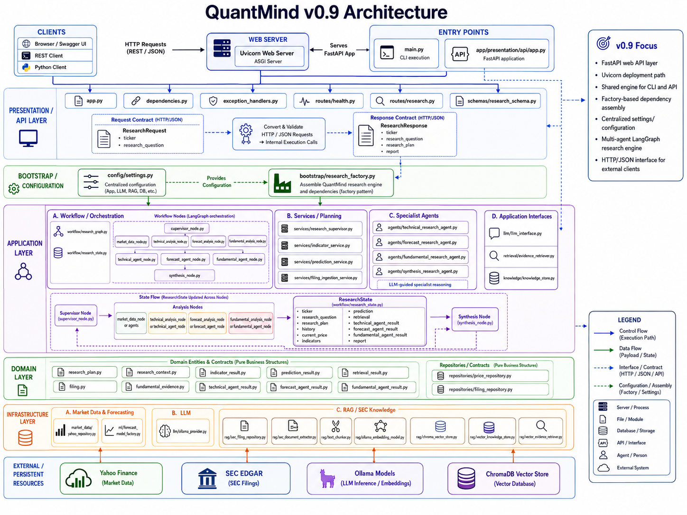
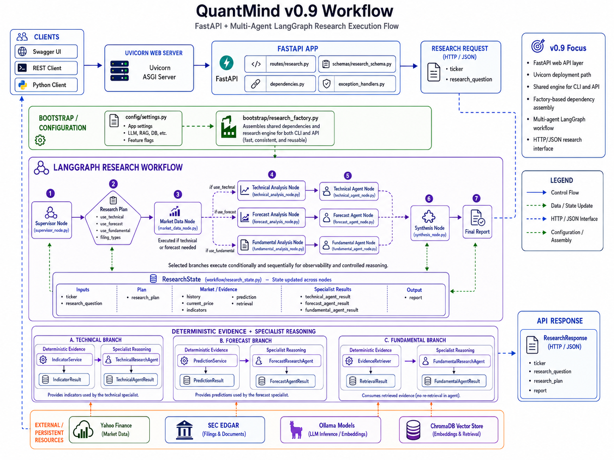

# QuantMind – AI Quant Research Platform

> **Where Quantitative Finance Meets AI Engineering.**

QuantMind is an open-source **Financial AI Research Platform** that combines quantitative finance, financial econometrics, technical analysis, machine-learning forecasting, SEC filing retrieval, retrieval-augmented generation, and LLM-driven multi-agent reasoning into a unified research workflow.

The platform is designed for **AI-assisted investment research, explainable financial intelligence, and decision support** rather than autonomous trading.

---

## Current Milestone — v0.9 FastAPI & Productization

Version 0.9 evolves QuantMind from a multi-agent research engine into a **reusable Financial AI application with a stable application boundary and HTTP API**.

The multi-agent research system introduced in v0.8 remains the core research engine. v0.9 adds:

- `ResearchApplicationService` as the reusable application boundary
- Stable `ResearchResult` output
- Composition-root dependency assembly through `research_factory.py`
- Centralized runtime `Settings`
- FastAPI HTTP presentation layer
- Uvicorn ASGI serving
- Typed request / response schemas
- `GET /health`
- `POST /research`
- HTTP 422 request validation
- Controlled application and server error handling
- FastAPI dependency injection
- Automated API tests using dependency overrides
- Configuration tests
- Separate runtime and development dependencies
- Version-pinned v0.9 dependency environment
- Shared QuantMind engine for both CLI and API execution

The result is a cleaner separation between:

```text
Presentation
    ↓
Application Boundary
    ↓
Multi-Agent Research Engine
    ↓
Domain + Infrastructure
```

---

# Architecture



QuantMind v0.9 separates the public interfaces from the financial research engine.

```text
                     External Clients
                           │
              ┌────────────┴────────────┐
              │                         │
              ▼                         ▼
           main.py                   FastAPI
             CLI                       API
              │                         │
              └────────────┬────────────┘
                           ▼
              ResearchApplicationService
                           │
                           ▼
                   LangGraph Workflow
                           │
                           ▼
                  ResearchSupervisor
                           │
                           ▼
                     ResearchPlan
                           │
              ┌────────────┼────────────┐
              ▼            ▼            ▼
          Technical     Forecast    Fundamental
           Pipeline      Pipeline      Pipeline
              │            │            │
              ▼            ▼            ▼
         Specialist   Specialist   Specialist
            Agent         Agent        Agent
              └────────────┼────────────┘
                           ▼
                       Synthesis
                           │
                           ▼
                    ResearchResult
                           │
              ┌────────────┴────────────┐
              ▼                         ▼
          CLI Output             ResearchResponse
                                      │
                                      ▼
                                  HTTP / JSON
```

The core design principle is that **`main.py` and FastAPI are parallel presentation interfaces**. Neither interface contains the financial research workflow itself.

Both call the same `ResearchApplicationService`, which executes the same QuantMind research engine.

---

# Research Workflow



The v0.9 research workflow remains **stateful, conditional, multi-agent, and intentionally sequential**.

```text
Research Question
        ↓
ResearchSupervisor
        ↓
ResearchPlan
        ↓
Conditional LangGraph Routing
        ↓
Selected Evidence Pipelines
        ↓
Specialist Research Agents
        ↓
Structured Agent Results
        ↓
ResearchState
        ↓
SynthesisNode
        ↓
ResearchContext
        ↓
SynthesisResearchAgent
        ↓
LLM
        ↓
Final Report
        ↓
ResearchResult
```

Conditional execution determines **which analytical branches run**.

Sequential execution determines **the order in which selected branches run**.

The current design intentionally avoids parallel fan-out so multi-agent execution remains easier to inspect, test, and debug.

---

# Application Interfaces

QuantMind v0.9 exposes the same research engine through two presentation interfaces.

## CLI

```text
main.py
   ↓
ResearchApplicationService
   ↓
QuantMind Research Engine
   ↓
ResearchResult
   ↓
Console
```

The CLI is useful for local development, debugging, experimentation, and direct human execution.

## FastAPI

```text
HTTP Client
    ↓
Uvicorn
    ↓
FastAPI
    ↓
ResearchApplicationService
    ↓
QuantMind Research Engine
    ↓
ResearchResult
    ↓
ResearchResponse
    ↓
HTTP / JSON
```

The API makes QuantMind callable by browsers, scripts, applications, and future external services without duplicating the research engine.

---

# FastAPI Research API

## Health Check

```http
GET /health
```

Example response:

```json
{
  "status": "ok",
  "service": "QuantMind"
}
```

## Research Request

```http
POST /research
```

Example request:

```json
{
  "ticker": "AAPL",
  "research_question": "What are Apple's recent business risks?"
}
```

Example response structure:

```json
{
  "ticker": "AAPL",
  "research_question": "What are Apple's recent business risks?",
  "research_plan": {
    "use_technical": false,
    "use_forecast": false,
    "use_fundamental": true,
    "filing_types": [
      "10-Q"
    ]
  },
  "report": "..."
}
```

The public API deliberately does not expose the internal `ResearchState`.

```text
ResearchState
     ↓
ResearchApplicationService
     ↓
ResearchResult
     ↓
FastAPI
     ↓
ResearchResponse
```

This separates internal workflow state, application-level output, and the public HTTP contract.

---

# Application Boundary

Version 0.9 introduces `ResearchApplicationService` as the stable application-level entry point.

```text
Presentation Interface
        ↓
ResearchApplicationService
        ↓
Initial ResearchState
        ↓
LangGraph
        ↓
Completed ResearchState
        ↓
ResearchResult
```

`ResearchApplicationService` prevents presentation code from depending directly on LangGraph internals.

This allows multiple interfaces to reuse the same engine:

```text
               ResearchApplicationService
                       ▲           ▲
                       │           │
                    main.py     FastAPI
```

Future interfaces such as MCP tools or additional applications can reuse the same boundary.

---

# ResearchResult vs. ResearchResponse

QuantMind separates application-level output from HTTP output.

```text
ResearchResult
= stable application-level result

ResearchResponse
= public FastAPI / HTTP representation
```

The two may contain similar information, but they belong to different architectural layers.

`ResearchResult` currently contains:

```text
ticker
research_question
research_plan
report
```

The API maps that result into a typed `ResearchResponse`.

---

# Research Supervisor

The `ResearchSupervisor` interprets the research objective and decides which research capabilities should execute.

It determines whether the request requires:

```text
Technical analysis
Forecast analysis
Fundamental analysis
SEC 10-K evidence
SEC 10-Q evidence
```

The decision is converted into a structured domain entity:

```python
ResearchPlan(
    use_technical=True,
    use_forecast=False,
    use_fundamental=False,
    filing_types=[],
)
```

This separates probabilistic planning from deterministic workflow execution:

```text
Natural-Language Question
        ↓
LLM Planning
        ↓
ResearchPlan
        ↓
Deterministic LangGraph Routing
```

---

# ResearchPlan

`ResearchPlan` represents the Supervisor's structured research decision.

```text
ResearchPlan
├── use_technical
├── use_forecast
├── use_fundamental
└── filing_types
```

Example:

```python
ResearchPlan(
    use_technical=True,
    use_forecast=True,
    use_fundamental=True,
    filing_types=[
        "10-K",
        "10-Q",
    ],
)
```

LangGraph consumes the plan and executes only the required analytical branches.

---

# ResearchState

QuantMind uses a typed `ResearchState` as shared coordination state across the LangGraph workflow.

```text
ResearchState
├── Input
│   ├── ticker
│   └── research_question
├── Planning
│   └── research_plan
├── Market Data
│   ├── history
│   └── current_price
├── Evidence
│   ├── indicators
│   ├── prediction
│   └── retrieval
├── Specialist Interpretation
│   ├── technical_agent_result
│   ├── forecast_agent_result
│   └── fundamental_agent_result
└── Output
    └── report
```

`ResearchState` represents **everything the workflow knows during execution**.

The state is progressively enriched as selected nodes run.

---

# ResearchContext

`ResearchState` and `ResearchContext` serve different purposes.

```text
ResearchState
= everything required by the workflow during execution

ResearchContext
= curated evidence and specialist interpretations
  required by final synthesis
```

The current `ResearchContext` can contain:

```text
ticker
research_question
current_price

indicators
prediction
retrieval

technical_agent_result
forecast_agent_result
fundamental_agent_result
```

Full price history remains workflow working data and is not automatically injected into the final LLM prompt.

The synthesis lifecycle is:

```text
ResearchState
     ↓
SynthesisNode
     ↓
ResearchContext
     ↓
EquityPrompt
     ↓
LLM-readable Prompt
     ↓
SynthesisResearchAgent
     ↓
Final Report
```

---

# Multi-Agent Research System

QuantMind uses specialist agents to interpret evidence produced by deterministic services.

## Technical Research Agent

```text
MarketDataNode
        ↓
TechnicalAnalysisNode
        ↓
IndicatorService
        ↓
IndicatorResult
        ↓
TechnicalAgentNode
        ↓
TechnicalResearchAgent
        ↓
TechnicalAgentResult
```

The Technical Research Agent interprets deterministic indicators while remaining constrained by supplied technical evidence.

## Forecast Research Agent

```text
MarketDataNode
        ↓
ForecastAnalysisNode
        ↓
PredictionService
        ↓
PredictionResult
        ↓
ForecastAgentNode
        ↓
ForecastResearchAgent
        ↓
ForecastAgentResult
```

The Forecast Research Agent interprets model output and validation metrics without treating forecasts as observed facts.

## Fundamental Research Agent

```text
FundamentalAnalysisNode
        ↓
EvidenceRetriever
        ↓
RetrievalResult
        ↓
FundamentalAgentNode
        ↓
FundamentalResearchAgent
        ↓
FundamentalAgentResult
```

Retrieval remains outside the reasoning agent so retrieval quality and LLM interpretation remain independently observable.

## Synthesis Research Agent

```text
ResearchState
        ↓
SynthesisNode
        ↓
ResearchContext
        ↓
SynthesisResearchAgent
        ↓
EquityPrompt
        ↓
LLM
        ↓
Final Report
```

The Synthesis Research Agent combines available specialist interpretations while checking them against underlying evidence.

---

# Technical Analysis

QuantMind provides deterministic technical-analysis calculations including:

- Simple Moving Average (SMA)
- Exponential Moving Average (EMA)
- Relative Strength Index (RSI)
- Moving Average Convergence Divergence (MACD)

Technical indicators are coordinated by the application-layer `IndicatorService`.

```text
Market Data
    ↓
Price Series
    ↓
IndicatorService
    ├── SMA
    ├── EMA
    ├── RSI
    └── MACD
    ↓
IndicatorResult
```

Technical evidence is produced only when required by the `ResearchPlan`.

---

# Forecasting

QuantMind includes a forecasting abstraction that separates application logic from individual forecasting models.

```text
PredictionService
        ↓
ForecastModel Interface
        ↓
ForecastModelFactory
        ↓
Selected Forecast Model
```

The current platform supports Transformer and LSTM forecasting implementations through the model factory.

The forecasting pipeline produces a structured `PredictionResult`.

```text
Historical Prices
        ↓
Forecast Model
        ↓
Predicted Return
        ↓
Implied Price
        ↓
Validation Metrics
        ↓
PredictionResult
```

Current validation output includes forecast horizon, predicted return, predicted price, direction classification, RMSE, MAE, naive-baseline RMSE, improvement over baseline, and baseline-beating status.

---

# Fundamental Research & RAG

QuantMind includes an evidence-grounded fundamental research pipeline using SEC filings.

Supported filing types:

```text
SEC 10-K
SEC 10-Q
```

The offline knowledge-ingestion pipeline is:

```text
SEC EDGAR
    ↓
SECFilingRepository
    ↓
SECDocumentExtractor
    ↓
TextChunker
    ↓
OllamaEmbeddingModel
    ↓
Chroma Vector Store
```

The persistent knowledge base stores filing content and metadata used by the online research runtime.

---

# Knowledge Ingestion vs. Research Runtime

QuantMind deliberately separates SEC knowledge preparation from normal research execution.

## Offline Knowledge Ingestion

```text
SEC Filing
    ↓
knowledge_setup.py
    ↓
Parse
    ↓
Chunk
    ↓
Embed
    ↓
Persistent Chroma Knowledge Base
```

## Online Research Runtime

```text
Research Question
    ↓
ResearchSupervisor
    ↓
Fundamental selected?
    ↓
EvidenceRetriever
    ↓
Existing Chroma Knowledge
    ↓
FundamentalResearchAgent
```

Normal `main.py` or FastAPI research requests do not re-download and re-embed SEC filings.

---

# Filing-Type-Aware Retrieval

The Research Supervisor can select filing types appropriate for the research objective.

```text
"What are Apple's recent business risks?"
        ↓
10-Q
```

```text
"What are Apple's long-term structural business risks?"
        ↓
10-K + 10-Q
```

The LLM does not directly query Chroma.

```text
LLM Supervisor
      ↓
ResearchPlan
      ↓
filing_types
      ↓
Application Code
      ↓
EvidenceRetriever
      ↓
Chroma Metadata Filter
      ↓
Relevant SEC Evidence
```

This keeps infrastructure access deterministic and controlled.

---

# Evidence-Grounded Retrieval

The research question is embedded and compared with stored SEC filing chunks.

```text
Research Question
        ↓
Embedding Model
        ↓
Query Embedding
        ↓
Chroma Similarity Search
        ↓
Metadata Filtering
        ↓
Relevant Filing Chunks
        ↓
FundamentalEvidence
        ↓
RetrievalResult
```

Each evidence object retains source metadata so information remains traceable to the underlying filing.

---

# Evidence-Grounded Multi-Agent Synthesis

The synthesis layer receives two kinds of information:

```text
Raw / Structured Evidence
        +
Specialist-Agent Interpretation
```

The intended hierarchy is:

```text
Underlying Evidence
        ↓
Specialist Interpretation
        ↓
Synthesis Agent
        ↓
Final Research Report
```

Evidence is treated as the factual grounding layer.

Specialist-agent output is treated as interpretation rather than new factual evidence.

LLM output remains probabilistic and should be independently verified.

---

# LLM Runtime Context

Integrated multi-agent synthesis requires a larger runtime context than simple single-stream analysis.

QuantMind currently configures the Ollama provider with:

```text
num_ctx = 16384
```

During multi-agent integration testing, a smaller Ollama runtime context caused earlier evidence streams to be omitted from final synthesis even though workflow state and prompt construction were correct.

Increasing the runtime context restored complete multi-stream synthesis.

This illustrates an important AI-systems principle:

```text
Correct application code
        ≠
Correct AI-system behavior
```

Inference-runtime configuration is part of system architecture.

---

# Configuration & Bootstrap

Version 0.9 centralizes infrastructure assembly in:

```text
app/bootstrap/research_factory.py
```

The factory acts as QuantMind's **composition root**.

```text
Settings
   ↓
research_factory.py
   ├── YahooRepository
   ├── IndicatorService
   ├── ForecastModelFactory
   ├── PredictionService
   ├── OllamaEmbeddingModel
   ├── ChromaVectorStore
   ├── VectorEvidenceRetriever
   └── OllamaProvider
            ↓
     create_research_graph()
            ↓
 ResearchApplicationService
```

Runtime configuration is centralized in:

```text
app/config/settings.py
```

Current configurable values include:

```text
forecast model
LLM model
LLM runtime context size
embedding model
Chroma path
Chroma collection
retrieval top-k
```

Environment variables can override local development defaults without changing application source code.

---

# FastAPI Dependency Injection

The FastAPI layer obtains the research engine through a dependency provider.

```text
POST /research
      ↓
Depends(get_research_service)
      ↓
ResearchApplicationService
```

The application service is cached and reused within the server process so each HTTP request does not rebuild every infrastructure dependency.

During automated tests, FastAPI dependency overrides replace the real engine with lightweight fake services.

```text
Production
FastAPI
   ↓
Real ResearchApplicationService
   ↓
QuantMind


Testing
FastAPI
   ↓
Fake Research Service
   ↓
Immediate deterministic result
```

This keeps API tests fast and independent from Ollama, SEC retrieval, market data, and forecasting.

---

# API Validation & Error Handling

Pydantic validates the public research request before the expensive research workflow executes.

```text
Request
   ↓
ResearchRequest
   ↓
Valid?
 ├── No  → HTTP 422
 └── Yes → ResearchApplicationService
```

Unexpected failures are converted into controlled HTTP responses.

```text
Known ResearchExecutionError
        ↓
HTTP 500
"Research execution failed."
```

```text
Unexpected Exception
        ↓
HTTP 500
"Internal server error."
```

Detailed diagnostics remain in server logs rather than being exposed to API clients.

---

# Deterministic vs. Probabilistic Components

QuantMind deliberately separates deterministic system behavior from probabilistic LLM reasoning.

```text
Probabilistic
────────────────────────────────
Research-question interpretation
Research planning
Specialist-agent interpretation
Final language synthesis
```

```text
Deterministic
────────────────────────────────
ResearchPlan representation
LangGraph routing
Market-data retrieval
Indicator calculation
Forecast execution
SEC retrieval
Metadata filtering
ResearchState propagation
Structured agent-result storage
API validation
Result serialization
```

This separation supports a more explainable and controllable Financial AI workflow.

---

# Clean Architecture

QuantMind is organized around four primary architectural layers plus a bootstrap/configuration layer.

## Presentation

Responsible for external entry points and public protocols.

```text
main.py
app/presentation/api/
```

FastAPI-specific concerns remain in the presentation layer:

```text
app.py
dependencies.py
exception_handlers.py
routes/
schemas/
```

## Application

Coordinates use cases, research planning, evidence production, specialist reasoning, and workflow execution.

```text
ResearchApplicationService
ResearchSupervisor

TechnicalResearchAgent
ForecastResearchAgent
FundamentalResearchAgent
SynthesisResearchAgent

IndicatorService
PredictionService
FilingIngestionService
EvidenceRetriever

LangGraph Workflow
LangGraph Nodes
```

## Domain

Contains core financial/research entities and interfaces.

```text
ResearchPlan
ResearchContext
ResearchResult
IndicatorResult
PredictionResult
RetrievalResult
FundamentalEvidence

TechnicalAgentResult
ForecastAgentResult
FundamentalAgentResult

ForecastModel
PriceRepository
FilingRepository
```

## Infrastructure

Implements external integrations and technical services.

```text
Yahoo Finance
Ollama
Qwen
SEC EDGAR
Chroma
Embedding Models
Forecast Models
```

## Bootstrap / Configuration

Assembles concrete dependencies and runtime configuration.

```text
Settings
research_factory.py
```

The intended dependency direction remains:

```text
Presentation
     ↓
Application
     ↓
Domain

Infrastructure
     ↑
implements interfaces required by inner layers
```

Bootstrap assembles the concrete implementations into the running application.

---

# Project Structure

A simplified v0.9 structure:

```text
ai-quant-research-platform/
├── app/
│   ├── application/
│   │   ├── agents/
│   │   │   ├── technical_research_agent.py
│   │   │   ├── forecast_research_agent.py
│   │   │   ├── fundamental_research_agent.py
│   │   │   └── synthesis_research_agent.py
│   │   ├── exceptions/
│   │   │   └── research_execution_error.py
│   │   ├── llm/
│   │   │   └── llm_interface.py
│   │   ├── prompts/
│   │   │   └── equity_prompt.py
│   │   ├── retrieval/
│   │   │   └── evidence_retriever.py
│   │   ├── services/
│   │   │   ├── indicator_service.py
│   │   │   ├── prediction_service.py
│   │   │   ├── filing_ingestion_service.py
│   │   │   ├── research_supervisor.py
│   │   │   └── research_application_service.py
│   │   └── workflow/
│   │       ├── research_graph.py
│   │       ├── research_state.py
│   │       └── nodes/
│   │           ├── supervisor_node.py
│   │           ├── market_data_node.py
│   │           ├── technical_analysis_node.py
│   │           ├── technical_agent_node.py
│   │           ├── forecast_analysis_node.py
│   │           ├── forecast_agent_node.py
│   │           ├── fundamental_analysis_node.py
│   │           ├── fundamental_agent_node.py
│   │           └── synthesis_node.py
│   ├── bootstrap/
│   │   └── research_factory.py
│   ├── config/
│   │   └── settings.py
│   ├── domain/
│   │   ├── entities/
│   │   │   ├── research_plan.py
│   │   │   ├── research_context.py
│   │   │   ├── research_result.py
│   │   │   ├── indicator_result.py
│   │   │   ├── prediction_result.py
│   │   │   ├── retrieval_result.py
│   │   │   ├── fundamental_evidence.py
│   │   │   ├── technical_agent_result.py
│   │   │   ├── forecast_agent_result.py
│   │   │   └── fundamental_agent_result.py
│   │   ├── forecast/
│   │   ├── indicators/
│   │   └── repositories/
│   ├── infrastructure/
│   │   ├── llm/
│   │   │   └── ollama_provider.py
│   │   ├── market_data/
│   │   │   └── yahoo_repository.py
│   │   ├── ml/
│   │   │   └── forecast_model_factory.py
│   │   └── rag/
│   │       ├── sec_filing_repository.py
│   │       ├── sec_document_extractor.py
│   │       ├── text_chunker.py
│   │       ├── ollama_embedding_model.py
│   │       ├── chroma_vector_store.py
│   │       ├── vector_knowledge_store.py
│   │       └── vector_evidence_retriever.py
│   └── presentation/
│       └── api/
│           ├── app.py
│           ├── dependencies.py
│           ├── exception_handlers.py
│           ├── routes/
│           │   ├── health.py
│           │   └── research.py
│           └── schemas/
│               └── research_schema.py
├── docs/
│   └── images/
│       ├── architecture_v0.8.png
│       ├── workflow_v0.8.png
│       ├── architecture_v0.9.png
│       └── workflow_v0.9.png
├── data/
│   └── chroma/
├── knowledge_setup.py
├── main.py
├── test_api.py
├── test_settings.py
├── test_10q_retrieval.py
├── test_supervisor.py
├── test_technical_agent.py
├── test_forecast_agent.py
├── test_fundamental_agent.py
├── requirements.txt
├── requirements-dev.txt
└── README.md
```

---

# Technology Stack

| Area | Technology |
|---|---|
| Language | Python 3.12 |
| Architecture | Clean Architecture |
| Agent Orchestration | LangGraph |
| Application API | FastAPI |
| ASGI Server | Uvicorn |
| API Schemas | Pydantic |
| Local LLM Runtime | Ollama |
| Research LLM | Qwen |
| Runtime Context | 16K tokens |
| Embeddings | Ollama / EmbeddingGemma |
| Vector Database | Chroma |
| Market Data | Yahoo Finance / yfinance |
| Fundamental Data | SEC EDGAR |
| Quantitative Analysis | pandas / NumPy |
| Machine Learning | PyTorch / scikit-learn |
| Forecasting | Transformer / LSTM |
| Testing | pytest / FastAPI TestClient |
| Report Format | Markdown |
| API Format | JSON over HTTP |

---

# Current Research & Application Capabilities

| Capability | Status |
|---|---|
| Yahoo Finance market data | Implemented |
| SMA / EMA | Implemented |
| RSI | Implemented |
| MACD | Implemented |
| Forecast abstraction | Implemented |
| Forecast model factory | Implemented |
| Transformer forecasting | Implemented |
| LSTM forecasting | Implemented |
| Forecast validation metrics | Implemented |
| SEC 10-K ingestion | Implemented |
| SEC 10-Q ingestion | Implemented |
| SEC document extraction | Implemented |
| Text chunking | Implemented |
| Local embeddings | Implemented |
| Chroma vector storage | Implemented |
| Semantic RAG retrieval | Implemented |
| Filing-type-aware retrieval | Implemented |
| LLM Research Supervisor | Implemented |
| Structured `ResearchPlan` | Implemented |
| Typed `ResearchState` | Implemented |
| Conditional LangGraph execution | Implemented |
| Technical Research Agent | Implemented |
| Forecast Research Agent | Implemented |
| Fundamental Research Agent | Implemented |
| Synthesis Research Agent | Implemented |
| Structured specialist-agent results | Implemented |
| Multi-agent coordination | Implemented |
| Evidence-grounded synthesis | Implemented |
| Persistent knowledge/runtime separation | Implemented |
| `ResearchApplicationService` | Implemented |
| Stable `ResearchResult` | Implemented |
| Centralized runtime settings | Implemented |
| Composition-root research factory | Implemented |
| FastAPI research API | Implemented |
| Uvicorn serving | Implemented |
| `/health` endpoint | Implemented |
| `/research` endpoint | Implemented |
| Typed request / response schemas | Implemented |
| HTTP validation | Implemented |
| Controlled error handling | Implemented |
| API dependency injection | Implemented |
| Automated API tests | Implemented |
| Configuration tests | Implemented |
| Pinned runtime dependencies | Implemented |
| Separate development dependencies | Implemented |
| Earnings-call transcript ingestion | Planned |
| Financial-news retrieval | Planned |
| Portfolio analysis | Planned |
| Web dashboard | Planned |
| Docker containerization | Planned |
| AWS deployment | Planned |
| CI/CD | Planned |
| Production observability | Planned |
| Automated agent evaluation | Planned |

---

# Version Evolution

## v0.1 — AI Market Research MVP

Introduced Clean Architecture, Yahoo Finance market data, Ollama LLM integration, AI-generated market analysis, and Markdown research reports.

## v0.2 — Technical Analysis

Introduced the indicator abstraction, SMA, EMA, RSI, MACD, and `IndicatorService`.

## v0.3 — Forecasting Architecture

Introduced the forecasting abstraction, `PredictionService`, structured `PredictionResult`, and separation of forecasting logic from application orchestration.

## v0.4 — Multi-Model Forecasting

Introduced the forecast model factory, multiple forecasting implementations, model selection without changing application logic, and validation / baseline comparison.

## v0.5 — Fundamental RAG

Introduced SEC 10-K ingestion, filing repository abstraction, SEC document extraction, text chunking, local embeddings, Chroma vector storage, semantic retrieval, and evidence-grounded fundamental analysis.

## v0.6 — LangGraph Research Workflow

Introduced `ResearchState`, LangGraph orchestration, analytical workflow nodes, and stateful graph-based research execution.

## v0.7 — Agentic Research Planning

Introduced the LLM Research Supervisor, structured `ResearchPlan`, conditional routing, selective analytical branches, SEC 10-Q support, filing-type-aware RAG, and objective-dependent workflows.

## v0.8 — Multi-Agent Research System

Introduced specialist research agents, structured specialist results, agent-node adapters, evidence-production / interpretation separation, curated `ResearchContext`, multi-agent evidence-grounded synthesis, persistent knowledge/runtime separation, explicit 16K Ollama context configuration, and multi-branch regression testing.

Version 0.8 transformed QuantMind from a conditional evidence workflow into a **supervisor-coordinated multi-agent financial research system**.

## v0.9 — FastAPI & Productization

Introduced:

- `ResearchApplicationService`
- `ResearchResult`
- Shared engine for CLI and HTTP interfaces
- `research_factory.py` composition root
- Environment-driven runtime `Settings`
- FastAPI application layer
- Uvicorn ASGI serving
- Typed `ResearchRequest`
- Typed `ResearchResponse`
- `GET /health`
- `POST /research`
- FastAPI dependency injection
- Application-service caching
- HTTP 422 request validation
- `ResearchExecutionError`
- Global unexpected-exception handling
- Automated API tests with fake service overrides
- Configuration default / override tests
- Runtime / development dependency separation
- Version-pinned v0.9 dependency set
- Final CLI and API regression validation

Version 0.9 transforms QuantMind from a research engine into a **reusable Financial AI application that can be called through stable programmatic interfaces**.

---

# Example Supervisor Behavior

## Technical Question

```text
Question:
Is Apple technically oversold?

use_technical:   True
use_forecast:    False
use_fundamental: False
filing_types:    []
```

## Recent Fundamental Question

```text
Question:
What are Apple's recent business risks?

use_technical:   False
use_forecast:    False
use_fundamental: True
filing_types:    ['10-Q']
```

## Long-Term Structural Question

```text
Question:
What are Apple's long-term structural business risks?

use_technical:   False
use_forecast:    False
use_fundamental: True
filing_types:    ['10-K', '10-Q']
```

## Integrated Multi-Agent Question

```text
Question:
Give me an integrated outlook for Apple using
technical, forecast, and fundamental evidence.

use_technical:   True
use_forecast:    True
use_fundamental: True
filing_types:    ['10-K', '10-Q']
```

These cases demonstrate that one platform can construct different research workflows from the user's research objective.

---

# Running QuantMind

## Requirements

QuantMind v0.9 currently assumes:

- Python 3.12
- Ollama installed and running
- Required Ollama models available locally
- Python dependencies installed
- Fundamental SEC knowledge prepared before fundamental queries

Install runtime dependencies:

```bash
python -m pip install -r requirements.txt
```

For development and tests:

```bash
python -m pip install -r requirements-dev.txt
```

Verify installed dependency compatibility:

```bash
python -m pip check
```

## Prepare SEC Knowledge

SEC knowledge ingestion is separate from the online research runtime.

```bash
python knowledge_setup.py
```

The ingestion workflow persists embeddings and filing metadata in Chroma.

Once knowledge is prepared, normal research execution does not re-ingest the filings.

## Run the CLI

```bash
python main.py
```

The CLI calls the same `ResearchApplicationService` used by the API.

## Run the FastAPI Server

```bash
python -m uvicorn app.presentation.api.app:app --reload
```

Then open:

```text
http://127.0.0.1:8000/docs
```

Swagger UI provides interactive access to the QuantMind API.

Health endpoint:

```text
http://127.0.0.1:8000/health
```

Research endpoint:

```text
POST http://127.0.0.1:8000/research
```

---

# Testing

## v0.9 API & Configuration Regression

```bash
python -m pytest test_api.py test_settings.py -v
```

The current suite validates:

```text
GET /health                                  → 200
POST /research                               → 200
ticker normalization                         → AAPL
missing ticker                               → 422
invalid research question                    → 422
unexpected internal failure                  → 500
known research execution failure             → 500
default runtime settings                     → pass
environment-variable setting overrides       → pass
```

Current v0.9 result:

```text
9 passed
```

API tests use fake application services so they do not execute Ollama, Chroma, Yahoo Finance, SEC retrieval, or forecasting.

## Existing Research-System Tests

```bash
python test_supervisor.py
python test_10q_retrieval.py
python test_technical_agent.py
python test_forecast_agent.py
python test_fundamental_agent.py
```

The research workflow has also been exercised end-to-end across technical-only, forecast-only, fundamental-only, and integrated multi-agent research scenarios.

A final v0.9 real-engine regression was also executed through:

```bash
python main.py
```

confirming that the centralized settings and factory still assemble the real QuantMind engine successfully.

---

# Dependency Management

Version 0.9 separates runtime and development dependencies.

```text
requirements.txt
= QuantMind runtime dependencies

requirements-dev.txt
= runtime dependencies + testing tools
```

Direct project dependencies are version-pinned to the environment validated for v0.9.

This is intended to make the application more reproducible before containerization and cloud deployment.

---

# Design Principles

## 1. Explainability

Quantitative calculations, model outputs, retrieved evidence, specialist interpretations, and final LLM synthesis remain conceptually separate.

## 2. Evidence Grounding

Research reports should be based on structured quantitative evidence and retrieved source documents rather than unsupported generation.

## 3. Separation of Concerns

Domain logic is separated from application orchestration, presentation protocols, and infrastructure integrations.

## 4. Extensibility

New forecasting models, indicators, retrieval sources, LLM providers, agents, and presentation interfaces should be addable without redesigning the entire platform.

## 5. Controlled Agentic Behavior

LLMs make semantic planning and interpretation decisions, while application code controls deterministic execution and infrastructure access.

## 6. Stateful Orchestration

`ResearchState` provides explicit workflow state rather than hidden conversational memory.

## 7. Evidence vs. Interpretation

Evidence acquisition and LLM interpretation are separate responsibilities so retrieval quality and reasoning quality can be evaluated independently.

## 8. Stable Application Boundary

Presentation layers call `ResearchApplicationService` rather than depending directly on LangGraph internals.

## 9. Internal vs. Public Contracts

`ResearchState`, `ResearchContext`, `ResearchResult`, and `ResearchResponse` are intentionally separate structures with different responsibilities.

## 10. Research Before Trading

QuantMind is designed for investment research, analytical experimentation, and decision support — not autonomous order execution.

---

# Roadmap

```text
v0.9
FastAPI + Productization
        ↓
v0.10
AWS Deployment
Docker / ECR
Cloud Infrastructure
CI/CD
Monitoring
IAM / Security
        ↓
v0.11
AI-System Evaluation
Grounding Validation
Provenance
Agent Evaluation
Production Observability
        ↓
v1.0
Production-Grade Financial AI Platform
```

Additional planned capabilities include earnings-call transcript ingestion, financial-news retrieval, expanded financial-statement analytics, portfolio analytics, risk decomposition, an interactive research dashboard, MCP-compatible research tools, Docker containerization, AWS deployment, automated CI/CD, cloud monitoring, model monitoring, grounding evaluation, evidence provenance, and failure recovery.

---

# Project Vision

QuantMind is intended to evolve from an AI-assisted quantitative research application into a modular **Financial AI Research Platform**.

The long-term objective is to combine:

```text
Quantitative Finance
        +
Financial Econometrics
        +
Machine Learning
        +
Deep Learning
        +
Fundamental Research
        +
Retrieval-Augmented Generation
        +
LLM Reasoning
        +
Agentic Workflows
        +
Production AI Engineering
        =
Explainable Financial Intelligence
```

The platform emphasizes research transparency, modular architecture, evidence grounding, controlled/repeatable workflows, and separation of probabilistic AI reasoning from deterministic financial computation.

---

# Disclaimer

QuantMind is an experimental research and educational project.

It is not intended to provide investment advice, trading recommendations, or guarantees of financial performance.

All generated analysis should be independently verified before being used for financial decision-making.
