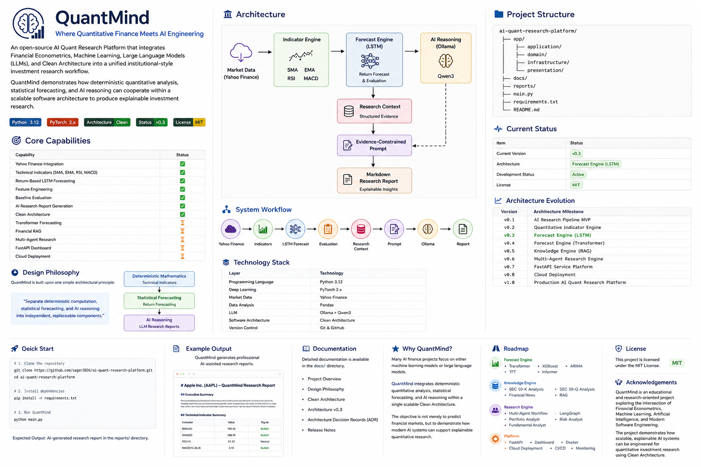

# QuantMind v0.3 Architecture

## Overview

QuantMind v0.3 introduces a return-based LSTM forecasting capability into the existing quantitative research workflow.

The platform separates three forms of computation:

```text
Deterministic Calculation
        ↓
Statistical Forecasting
        ↓
AI Reasoning
```

Technical indicators calculate observable market signals.

The forecasting subsystem estimates the next-period return.

The Large Language Model synthesizes the structured evidence into an explainable research report.

---

## Architecture Diagram



---

## System Architecture

```text
                              User
                                │
                                ▼
                            main.py
                  Presentation / Composition Root
                                │
                                ▼
                        ResearchService
                    Application Orchestrator
                                │
          ┌─────────────────────┼─────────────────────┐
          │                     │                     │
          ▼                     ▼                     ▼
  PriceRepository       IndicatorService      PredictionService
          │                     │                     │
          ▼                     ▼                     ▼
 YahooRepository         SMA / EMA / RSI        MLModel Interface
          │                    / MACD                  │
          ▼                     │                     ▼
 Yahoo Finance API       IndicatorResult          LSTMModel
                                                      │
                                                      ▼
                                             FeatureEngineering
                                                      │
                                                      ▼
                                             PredictionResult
          │                     │                     │
          └─────────────────────┴─────────────────────┘
                                │
                                ▼
                         ResearchContext
                                │
                                ▼
                          EquityPrompt
                                │
                                ▼
                         LLMInterface
                                │
                                ▼
                        OllamaProvider
                                │
                                ▼
                    Markdown Research Report
```

---

## Architectural Layers

### Presentation Layer

Primary file:

```text
main.py
```

Responsibilities:

* Select the stock ticker.
* Create concrete implementations.
* Inject dependencies into application services.
* Start the research workflow.
* Display the generated Markdown report.

`main.py` acts as the Composition Root of QuantMind.

It assembles the system but does not calculate indicators, train models, or generate AI reasoning itself.

---

### Application Layer

Primary files:

```text
app/application/services/research_service.py
app/application/services/indicator_service.py
app/application/services/prediction_service.py
app/application/prompts/equity_prompt.py
app/application/llm/llm_interface.py
```

Responsibilities:

* Coordinate the complete research workflow.
* Calculate technical indicators through `IndicatorService`.
* Request an LSTM forecast through `PredictionService`.
* Assemble structured research evidence.
* Build an evidence-constrained prompt.
* Request narrative synthesis from the LLM.

The Application Layer defines what the system does without containing external technology details.

---

### Domain Layer

Primary files:

```text
app/domain/entities/research_context.py
app/domain/entities/indicator_result.py
app/domain/entities/macd_result.py
app/domain/entities/prediction_result.py
app/domain/repositories/price_repository.py
app/domain/ml/interfaces/ml_model.py
```

Responsibilities:

* Represent the core concepts of quantitative research.
* Define contracts for market-data providers and forecasting models.
* Store indicator and forecast results.
* Provide the shared context used by the AI reasoning workflow.

The Domain Layer does not depend on:

* Yahoo Finance
* PyTorch
* Ollama
* FastAPI
* External databases

This keeps the core business concepts independent of technology choices.

---

### Infrastructure Layer

Primary files:

```text
app/infrastructure/market_data/yahoo_repository.py
app/infrastructure/ml/feature_engineering.py
app/infrastructure/ml/lstm_model.py
app/infrastructure/llm/ollama_provider.py
```

Responsibilities:

* Retrieve historical market data through `yfinance`.
* Convert price data into return sequences.
* Train and evaluate the PyTorch LSTM.
* Call the local Ollama language model.
* Adapt external technologies to interfaces defined by the core system.

Infrastructure components are replaceable implementation details.

---

## Indicator Engine

The Indicator Engine performs deterministic financial calculations.

```text
IndicatorService
        │
        ├── SMA
        ├── EMA
        ├── RSI
        └── MACD
        │
        ▼
IndicatorResult
```

The indicators are calculated directly from historical closing prices.

The LLM does not calculate indicator values.

This provides:

* reproducibility,
* mathematical consistency,
* independent testing,
* separation between quantitative calculations and AI interpretation.

---

## Forecast Engine

The v0.3 Forecast Engine uses an LSTM to estimate the next trading day's return.

```text
PredictionService
        │
        ▼
MLModel Interface
        │
        ▼
LSTMModel
        │
        ▼
PredictionResult
```

The LSTM forecasts:

```text
Next-Day Return
```

rather than directly forecasting the future price level.

The implied future price is calculated using:

```text
Implied Price
=
Current Price × (1 + Forecast Return)
```

This design preserves financial econometric rigor while providing an intuitive price value for human readers.

---

## Feature Engineering

The feature-engineering pipeline converts historical closing prices into daily return sequences.

```text
Historical Prices
        │
        ▼
Daily Returns
        │
        ▼
Standardization
        │
        ▼
Rolling Sequences
        │
        ▼
LSTM Training Data
```

The scaler is fitted only on training data to reduce look-ahead leakage.

The current implementation uses:

* daily simple returns,
* a 30-day input sequence,
* chronological training and validation sets,
* one-day forecast horizon.

---

## Model Evaluation

The LSTM is evaluated using:

* Validation RMSE
* Validation MAE
* Naive zero-return baseline RMSE
* Improvement over baseline

The baseline assumes:

```text
Forecast Return = 0
```

which is equivalent to assuming that the next price equals the current price.

A model is not treated as useful merely because it produces a forecast.

It must demonstrate value relative to an appropriate benchmark.

The AI report gives limited weight to the LSTM when its improvement over the baseline is small.

---

## ResearchContext as the Integration Contract

`ResearchContext` is the shared Domain object connecting the quantitative engines and the AI reasoning engine.

It contains:

```text
Ticker
Current Price
Historical Market Data
IndicatorResult
PredictionResult
```

The Indicator Engine, Forecast Engine, and LLM provider do not call one another directly.

Instead:

1. `ResearchService` obtains their outputs.
2. The outputs are assembled into `ResearchContext`.
3. `EquityPrompt` converts the context into structured evidence.
4. Ollama produces the final narrative.

This design reduces coupling and allows each subsystem to evolve independently.

---

## Evidence-Constrained AI Reasoning

The LLM receives structured evidence through `EquityPrompt`.

The prompt instructs the model to:

* use only supplied evidence,
* avoid unsupported company information,
* avoid unsupported support or resistance levels,
* avoid time-trend conclusions from a single indicator value,
* avoid statistical-significance claims without formal tests,
* distinguish deterministic indicators from model-based forecasts,
* treat forecasts as uncertain evidence,
* evaluate forecast quality relative to the baseline.

The LLM explains the results but does not calculate indicators or produce forecasts.

---

## End-to-End Data Flow

```text
Yahoo Finance
      │
      ▼
Historical OHLCV Data
      │
      ▼
Closing Price Series
      │
      ├────────────────────────┐
      │                        │
      ▼                        ▼
Indicator Engine        Return Transformation
      │                        │
      ▼                        ▼
IndicatorResult          LSTM Forecast
                               │
                               ▼
                        PredictionResult
      │                        │
      └─────────────┬──────────┘
                    ▼
             ResearchContext
                    │
                    ▼
              EquityPrompt
                    │
                    ▼
              OllamaProvider
                    │
                    ▼
         Markdown Research Report
```

---

## Replaceable Components

The architecture allows individual technologies to be replaced without redesigning the complete research workflow.

### Market Data

```text
YahooRepository
        ↓
PolygonRepository
        ↓
BloombergRepository
```

### Forecasting Models

```text
MLModel
├── LSTMModel
├── TransformerModel
├── XGBoostModel
├── ARIMAModel
└── Future Models
```

### LLM Providers

```text
LLMInterface
├── OllamaProvider
├── OpenAIProvider
├── ClaudeProvider
└── Future Providers
```

This demonstrates the Dependency Inversion and Open/Closed principles.

---

## Architecture Evolution

| Version | Architecture milestone                       |
| ------- | -------------------------------------------- |
| v0.1    | AI Research Pipeline MVP                     |
| v0.2    | Quantitative Indicator Engine                |
| v0.3    | Return-Based Forecast Engine with LSTM       |
| v0.4    | Multi-Model Forecast Engine with Transformer |
| v0.5    | Financial Knowledge and RAG Engine           |
| v0.6    | Multi-Agent Research Engine                  |
| v0.7    | FastAPI Service Layer and Dashboard          |
| v0.8    | Containerized Cloud Deployment               |
| v1.0    | Integrated QuantMind Platform                |

---

## Summary

QuantMind v0.3 combines:

```text
Deterministic Indicators
+
Return-Based LSTM Forecasting
+
Baseline Evaluation
+
Evidence-Constrained LLM Reasoning
```

The architecture allows the Indicator Engine, Forecast Engine, market-data provider, and AI reasoning provider to be tested, replaced, and extended independently.

This provides the foundation for introducing the Transformer model in v0.4 without redesigning the core research workflow.
